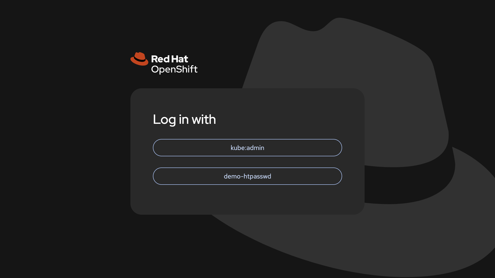
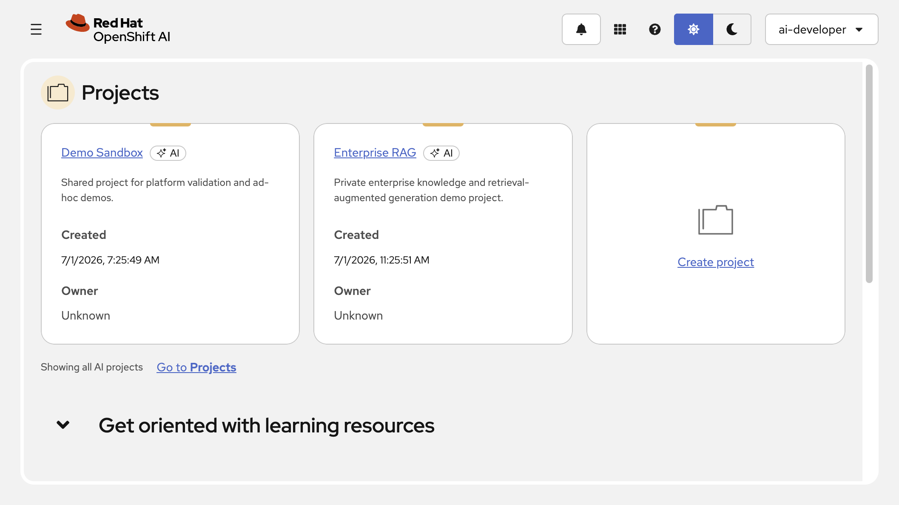
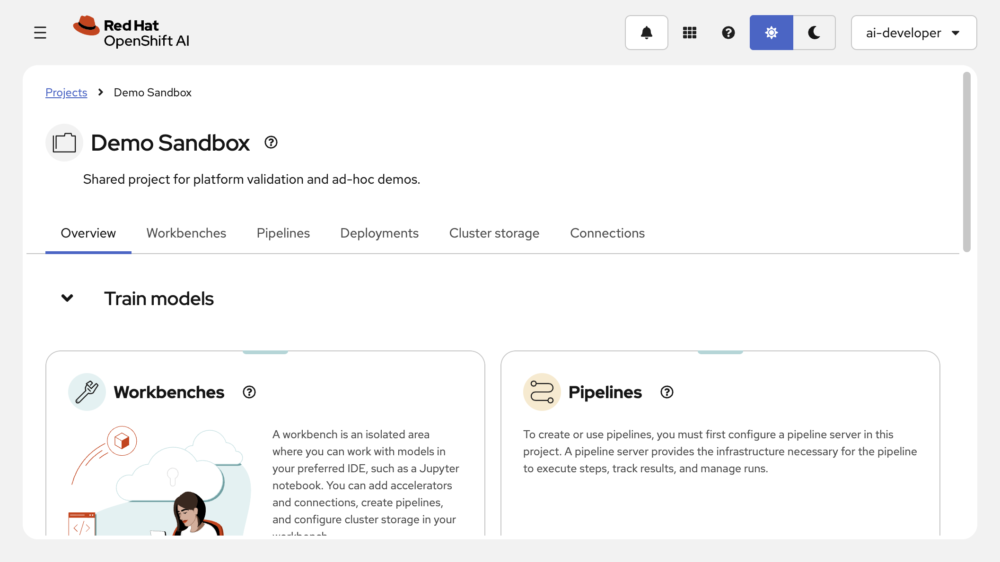
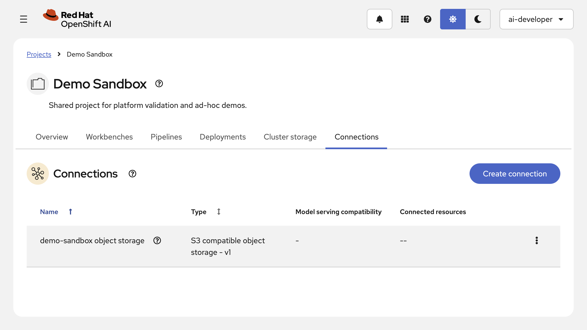
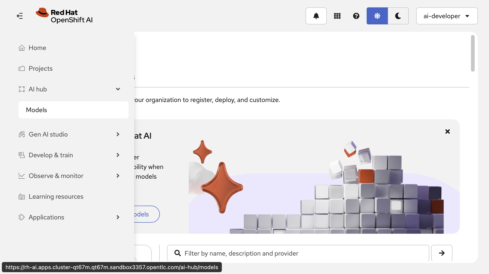
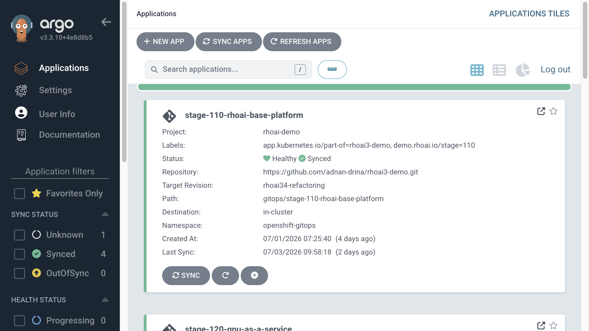

# Stage 110: RHOAI Base Platform

**Theme:** AI Platform Foundation  
**Concept:** A production-ready, GitOps-managed Private AI platform on OpenShift, with S3-compatible object storage, ready for GenAI and MLOps workloads.

---

## Why This Matters

Enterprise AI has moved past experimentation. Business leaders are no longer asking whether AI can work — they are asking how to scale it safely, control costs, and protect sensitive data. Autonomous agents, model serving, pipelines, and evaluation workflows all require a stable, governed infrastructure beneath them. Without that foundation, AI projects stall at the proof-of-concept stage.

**The infrastructure-first lesson.** Red Hat's own AI journey began with a consolidation of fragmented infrastructure onto a single hybrid cloud platform before a single model was deployed. The lesson: *"You cannot bypass the 'boring' work of standardization if you want to reach the 'exciting' work of AI innovation."* A unified OpenShift foundation — spanning on-premises data centres, cloud regions, and edge sites — eliminated the "it works here but not there" bottleneck that blocks every AI initiative. ([Red Hat, *Our journey to AI-centricity, Part 1*](https://www.redhat.com/en/blog/our-journey-ai-centricity-part-1-building-stable-foundation))

**Hybrid cloud is a business requirement, not a preference.** European enterprises in regulated sectors — banking, telecommunications, healthcare, public sector — face strict data residency, sovereignty, and compliance requirements. Sensitive inference, model fine-tuning, and audit evidence must stay on controlled infrastructure. At the same time, teams need the agility to consume cloud capacity for burst workloads and access cloud-hosted proprietary model endpoints when appropriate. Red Hat AI 3.4 delivers a metal-to-agent platform that runs consistently across bare-metal, private cloud, managed Kubernetes, and edge footprints without re-architecting for each provider. ([Red Hat, *From inference to agents: Scaling AI in the enterprise with Red Hat AI 3.4*](https://www.redhat.com/en/blog/inference-agentic-ai-scaling-enterprise-foundation-red-hat-ai-34))

**Open-source AI plus proprietary models, not either/or.** The open model ecosystem now delivers frontier-quality inference. Open models such as Llama, Qwen, Granite, and DeepSeek already power production customer service, legal document processing, and code assistance at regulated European enterprises — precisely because they run locally, with predictable costs and no API key requirement. The same platform must also integrate governed access to proprietary endpoints (GPT, Gemini, or internal MaaS services) for cases where a validated proprietary model is required. Red Hat OpenShift AI provides both paths on a single governed platform. ([Red Hat Developer, *The state of open source AI models in 2025*](https://developers.redhat.com/articles/2026/01/07/state-open-source-ai-models-2025))

**Object storage is the connective tissue of AI.** Model artifacts, pipeline data, training checkpoints, evaluation evidence, and RAG corpus material all flow through S3-compatible object storage. OpenShift Data Foundation's Multicloud Object Gateway (MCG) provides this capability natively on the cluster — no external MinIO deployment, no cloud bucket dependency, and no credentials leaving the network perimeter. Developers and data scientists consume it through `ObjectBucketClaim` resources, the same pattern used in cloud environments, so code is portable. ([Red Hat Developer, *OpenShift Data Foundation for developers and data scientists*](https://developers.redhat.com/articles/2024/07/31/red-hat-openshift-data-foundation-developers-and-data-scientists))

---

## What Enables It

This stage deploys the platform foundation that all subsequent demo stages build on.

### OpenShift GitOps (Argo CD)

Declarative GitOps reconciliation ensures that every platform resource is reproducible from Git and auditable by default. Argo CD applies and continuously reconciles all operator installations, custom resources, and configuration in this repository.

- **Operator:** Red Hat OpenShift GitOps (via OLM)
- **Engine:** Argo CD (managed ArgoCD instance in `openshift-gitops` namespace)
- **Tracking:** `resourceTrackingMethod: annotation` (project constraint)
- **Docs:** [OCP 4.20 GitOps](https://docs.redhat.com/en/documentation/openshift_container_platform/4.20/html/gitops/index)

### OpenShift Data Foundation — Multicloud Object Gateway

MCG-only deployment provides S3-compatible object storage for RHOAI workloads. The full Ceph StorageCluster is deferred until a demo stage explicitly needs ODF block or file storage.

- **Operator:** Red Hat OpenShift Data Foundation (via OLM, `openshift-storage` namespace)
- **Component:** Standalone Multicloud Object Gateway (NooBaa)
- **Storage class provisioner:** `openshift-storage.noobaa.io/obc` (for `ObjectBucketClaim`)
- **Docs:** [ODF 4.20 on AWS](https://docs.redhat.com/en/documentation/red_hat_openshift_data_foundation/4.20/html-single/deploying_openshift_data_foundation_using_amazon_web_services/index)

### OpenShift Observability Prerequisites

The RHOAI observability dashboard is a Technology Preview capability. The RHOAI documentation enables it in two steps: first install the required OpenShift observability operators and configure `DSCInitialization.spec.monitoring` with metrics and traces, then expose the dashboard menu through `OdhDashboardConfig`. Stage 110 installs the prerequisite operators and configures a small demo stack so the dashboard is backed by real monitoring services instead of a visible but unavailable menu.

- **Operator:** Cluster Observability Operator (`openshift-cluster-observability-operator`)
- **Operator:** Red Hat build of OpenTelemetry (`openshift-opentelemetry-operator`)
- **Operator:** Red Hat OpenShift distributed tracing platform / Tempo Operator (`openshift-tempo-operator`)
- **COO lifecycle policy:** `stable` channel with
  `startingCSV: cluster-observability-operator.v1.4.0` and manual InstallPlan
  approval automation for that CSV only. This keeps Perses and related operand
  images operator-managed while avoiding the current RHOAI 3.4 / COO 1.5
  generated-resource incompatibility. This is an operator lifecycle policy, not
  a general operand image pinning strategy.
- **Channel:** `stable` for Red Hat build of OpenTelemetry and Tempo Operator
- **RHOAI stack namespace:** `redhat-ods-monitoring`
- **Metrics:** one Prometheus replica with 5Gi storage and 90-day retention
- **Traces:** Tempo with PV-backed storage and 10% sampling
- **Compatibility:** Stage 110 mirrors the service-ca `ConfigMap` into the
  `Secret` expected by the generated `MonitoringStack`, opens the Perses
  backend only to the installed Perses operator namespace, and grants
  `rhods-admins` the narrow Perses/Prometheus API permissions required by the
  dashboard. It does not patch generated Perses images or generated
  datasources; generated observability operands remain owned by the RHOAI and
  Cluster Observability controllers.
- **Docs:** [RHOAI 3.4 Managing observability](https://docs.redhat.com/en/documentation/red_hat_openshift_ai_self-managed/3.4/html/managing_openshift_ai/managing-observability_managing-rhoai)

### Red Hat OpenShift AI Self-Managed

The RHOAI operator installs the AI platform control plane. `DSCInitialization` configures shared namespaces and the observability stack after the prerequisite observability operators are present. `DataScienceCluster` enables the Dashboard and Workbenches for interactive exploration, plus the Model Registry as the governed metadata store between experimentation and serving. Stage 110 creates the shared `DataScienceCluster` in a base-ready state. Later stages enable their own RHOAI component deltas through GitOps hook jobs so a fresh environment can validate one stage at a time.

- **Operator:** Red Hat OpenShift AI Self-Managed (`redhat-ods-operator` namespace)
- **Channel:** `stable-3.4`
- **API version:** `DataScienceCluster` pinned to `v2` (the served storage version that declares the 3.4 component schema)
- **DSCI:** pinned to `v2` with predefined namespaces and monitoring managed in
  `redhat-ods-monitoring`
- **DSC (base):** `dashboard: Managed`, `workbenches: Managed`, `modelregistry: Managed` (namespace `rhoai-model-registries`). Components removed until their dedicated stages enable them: `kueue`, `kserve`, `modelmeshserving`, `ray`, `modelcontroller`, `distributedWorkloads`, `maas`, `llamastack`.
- **Model Registry instance:** a `ModelRegistry` CR (`modelregistry-demo`) is deployed via GitOps in the `rhoai-model-registries` namespace with `postgres.generateDeployment: true` (non-production embedded PostgreSQL). RBAC grants `rhods-admins` admin and `rhoai-developers` edit access to the registry namespace.
- **Docs:** [RHOAI 3.4 Install](https://docs.redhat.com/en/documentation/red_hat_openshift_ai_self-managed/3.4/html/installing_and_uninstalling_openshift_ai_self-managed/installing-and-deploying-openshift-ai_install)

### Platform Access and Demo Tenancy

The base platform ships ready for a user to log in and start working. An htpasswd identity provider supplies two demo personas, and a first data science project is wired to S3 so a workbench can read and write objects immediately.

- **Identity provider:** htpasswd (`demo-htpasswd`); `kubeadmin` retained as the cluster-admin recovery path
- **`ai-admin`:** RHOAI administrator (member of the `rhods-admins` group referenced by the RHOAI `auth` CR `adminGroups`), and project-admin on `demo-sandbox` — the RHOAI dashboard-admin role alone does not grant access to an individual project namespace, so `rhods-admins` is bound to `admin` on the project
- **`ai-developer`:** regular user; Contributor (`edit`) on the `demo-sandbox` project via the `rhoai-developers` group
- **`demo-sandbox`:** the first data science project, used for platform validation and ad-hoc demos
- **`demo-sandbox-s3`:** an S3 connection backed by a project-scoped `ObjectBucketClaim` on MCG, using the dashboard's pre-installed S3 connection type
- **Secrets posture:** htpasswd, user passwords, and the connection secret are created imperatively by `setup-access.sh` and never committed; passwords are stored in the gitignored `.env`
- **Docs:** [RHOAI 3.4 — Managing users and groups](https://docs.redhat.com/en/documentation/red_hat_openshift_ai_self-managed/3.4/html/managing_openshift_ai); [OCP 4.20 — htpasswd identity provider](https://docs.redhat.com/en/documentation/openshift_container_platform/4.20/html/authentication_and_authorization/index)

---

## Architecture

```
┌─────────────────────────────────────────────────────────────────┐
│  OpenShift Container Platform 4.20 (AWS)                        │
│                                                                 │
│  ┌───────────────────────────────────────────────────────────┐  │
│  │  OpenShift GitOps (openshift-gitops)                      │  │
│  │  Argo CD · AppProject: rhoai-demo · tracking: annotation  │  │
│  └───────────────────┬───────────────────────────────────────┘  │
│                      │ reconciles                               │
│         ┌────────────┴────────────┐                            │
│         ▼                         ▼                            │
│  ┌─────────────────┐   ┌──────────────────────────────────┐   │
│  │  ODF MCG        │   │  Red Hat OpenShift AI 3.4        │   │
│  │  (openshift-    │   │  (redhat-ods-operator)           │   │
│  │   storage)      │   │                                  │   │
│  │  NooBaa/S3 ─────┼──▶│  DSCI · DSC (v2)                 │   │
│  │  OBC storage    │   │  Dashboard · Workbenches         │   │
│  │  class          │   │  Model Registry                  │   │
│  │       │         │   │  (redhat-ods-applications)       │   │
│  └───────┼─────────┘   └──────────────────────────────────┘   │
│          │ OBC                          ▲                      │
│          ▼                              │ Contributor          │
│  ┌──────────────────────────────────────┴────────────────┐   │
│  │  demo-sandbox (data science project)                  │   │
│  │  S3 connection (demo-sandbox-s3)  ·  ai-developer     │   │
│  └───────────────────────────────────────────────────────┘   │
│  Auth: htpasswd IdP — ai-admin (RHOAI admin), ai-developer    │
└─────────────────────────────────────────────────────────────────┘

New in this stage
  OpenShift GitOps operator + ArgoCD instance
  ODF operator + Multicloud Object Gateway (NooBaa)
  OpenShift observability prerequisite operators
  RHOAI operator + DSCInitialization + DataScienceCluster (dashboard,
    workbenches, model registry, observability)
  Model Registry instance (modelregistry-demo) + namespace RBAC
  htpasswd IdP + ai-admin / ai-developer
  demo-sandbox project + S3 connection (OBC-backed)

Managed by Argo CD after bootstrap
  ODF and RHOAI resources · AppProject rhoai-demo
  demo-sandbox project, rhoai-developers group, RoleBinding, OBC

Created imperatively (secret-bearing)
  htpasswd secret + OAuth IdP · rhods-admins membership
  demo-sandbox-s3 connection secret (from OBC)

Extended by later stages
  DataScienceCluster components via the shared Stage 110 owner (kserve, ray ...)
  ObjectBucketClaims per workload namespace
```

---

## Demo


| Screenshot | What it shows |
|------------|---------------|
|  | OpenShift login with htpasswd identity providers (ai-developer, ai-admin) |
|  | RHOAI Dashboard home after first login |
|  | Demo Sandbox data science project overview |
|  | S3 object storage connection (OBC-sourced) |
|  | AI Hub Models catalog with validated models |
|  | Argo CD applications managing GitOps state |

---

## References

| Source | Role |
|--------|------|
| [RHOAI 3.4 install guide](https://docs.redhat.com/en/documentation/red_hat_openshift_ai_self-managed/3.4/html/installing_and_uninstalling_openshift_ai_self-managed/installing-and-deploying-openshift-ai_install) | Operator, DSCI, DSC CR fields |
| [ODF 4.20 on AWS](https://docs.redhat.com/en/documentation/red_hat_openshift_data_foundation/4.20/html-single/deploying_openshift_data_foundation_using_amazon_web_services/index) | MCG standalone deployment |
| [RHOAI 3.4 Managing observability](https://docs.redhat.com/en/documentation/red_hat_openshift_ai_self-managed/3.4/html/managing_openshift_ai/managing-observability_managing-rhoai) | Observability stack prerequisites, DSCI monitoring, dashboard flag |
| [OCP 4.20 Observability](https://docs.redhat.com/en/documentation/openshift_container_platform/4.20/html/observability_overview/index) | OpenShift observability component boundary |
| [Red Hat build of OpenTelemetry 3.9](https://docs.redhat.com/en/documentation/red_hat_build_of_opentelemetry/3.9) | OpenTelemetry Operator prerequisite |
| [Red Hat OpenShift distributed tracing platform 3.9](https://docs.redhat.com/en/documentation/red_hat_openshift_distributed_tracing_platform/3.9) | Tempo Operator prerequisite |
| [OCP 4.20 GitOps](https://docs.redhat.com/en/documentation/openshift_container_platform/4.20/html/gitops/index) | OpenShift GitOps operator |
| [Red Hat AI 3.4 blog](https://www.redhat.com/en/blog/inference-agentic-ai-scaling-enterprise-foundation-red-hat-ai-34) | Enterprise AI value framing |
| [AI-centricity Part 1](https://www.redhat.com/en/blog/our-journey-ai-centricity-part-1-building-stable-foundation) | Infrastructure-first narrative |
| [Open-source AI models 2025](https://developers.redhat.com/articles/2026/01/07/state-open-source-ai-models-2025) | Open vs proprietary model flexibility |
| [ODF for developers](https://developers.redhat.com/articles/2024/07/31/red-hat-openshift-data-foundation-developers-and-data-scientists) | MCG/OBC workflow for data scientists |
| [github.com/redhat-ai-services/ai-accelerator](https://github.com/redhat-ai-services/ai-accelerator) | Reference implementation (CoP pattern, operator structure) |
| `docs/PLATFORM_BASELINE.md` | Active product version targets |
