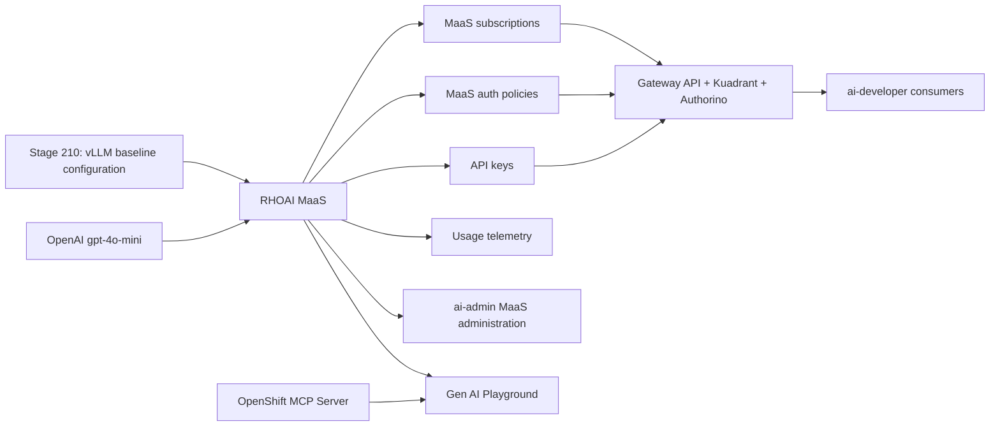

# Models-as-a-Service

## Why This Matters

Enterprise AI teams need to turn model endpoints into governed platform
services. A raw inference URL is difficult to share safely: it lacks
subscription boundaries, API key lifecycle management, user-facing model
discovery, usage reporting, and consistent controls across local and external
models.

Models-as-a-Service (MaaS) adds that product layer. In this demo it turns the
validated Nemotron endpoint from Stage 210 and an external OpenAI
`gpt-4o-mini` provider model into managed AI assets that can be discovered,
subscribed to, monitored, and consumed through OpenAI-compatible APIs.

## What Enables It

| Component | Role |
|-----------|------|
| RHOAI MaaS | Subscription-based governance, API keys, model publication, authorization policies, and usage telemetry. |
| KServe and vLLM | Local model-serving foundation for Nemotron. vLLM with MaaS is Technology Preview in RHOAI 3.4. |
| Leader Worker Set Operator | Required distributed-inference prerequisite for the RHOAI `LLMInferenceService` path. |
| Red Hat Connectivity Link and Kuadrant | Gateway policy, authorization integration, rate-limit enforcement, and observability substrate. |
| Gateway API | Cluster ingress path for MaaS model and API traffic. |
| Authorino | Authentication and authorization service used by the gateway policy chain. |
| PostgreSQL | Stores MaaS API key lifecycle data; OpenShift AI requires an externally managed PostgreSQL 14+ database. |
| Llama Stack Operator and Gen AI Studio | User-facing GenAI Playground and AI asset endpoint experience. |
| OpenShift MCP Server | Read-only cluster-context tool server registered in Gen AI Playground for controlled MCP tool use. |

## Architecture Delta

## Source Alignment

- [RHOAI 3.4 - Govern LLM access with Models-as-a-Service](https://docs.redhat.com/en/documentation/red_hat_openshift_ai_self-managed/3.4/html-single/govern_llm_access_with_models-as-a-service/index)
- [RHOAI 3.4 - Configuring authentication for llm-d using Red Hat Connectivity Link](https://docs.redhat.com/en/documentation/red_hat_openshift_ai_self-managed/3.4/html/deploy_models_using_distributed_inference_with_llm-d/configuring-authentication-for-llmd_distributed-inference)
- [OpenShift 4.20 - Leader Worker Set Operator](https://docs.redhat.com/en/documentation/openshift_container_platform/4.20/html/ai_workloads/leader-worker-set-operator)
- [Red Hat Connectivity Link 1.3 - Installing Connectivity Link](https://docs.redhat.com/en/documentation/red_hat_connectivity_link/1.3/html-single/installing_connectivity_link/index)
- [OpenShift 4.20 - cert-manager Operator for Red Hat OpenShift](https://docs.redhat.com/en/documentation/openshift_container_platform/4.20/html/security_and_compliance/cert-manager-operator-for-red-hat-openshift)
- [Red Hat Ecosystem Catalog - PostgreSQL 16 RHEL 9 image](https://catalog.redhat.com/en/software/containers/rhel9/postgresql-16/657b03866783e1b1fb87e142)
- [Centralized routing for external and self-hosted LLMs on OpenShift AI](https://developers.redhat.com/articles/2026/05/25/route-external-and-local-llms-models-as-a-service)
- [Red Hat - Model Context Protocol server for Red Hat OpenShift now available as Technology Preview](https://www.redhat.com/en/blog/model-context-protocol-server-red-hat-openshift-now-available-technology-preview)
- [OpenShift MCP Server repository](https://github.com/openshift/openshift-mcp-server)
- [OpenAI API - GPT-4o mini](https://developers.openai.com/api/docs/models/gpt-4o-mini)

## Current Scope

This stage is implemented in phases:

1. Enable MaaS prerequisites and validate CRD/schema availability. cert-manager
   is treated as a required platform prerequisite, not as a Stage 220-owned
   operator lifecycle resource.
2. Add schema-validated external OpenAI `gpt-4o-mini` publication resources
   using the same MaaS resource name and upstream provider model ID,
   developer subscription quota, developer authorization policy, and MaaS
   namespace admin access for `rhods-admins`.
3. Migrate the local Nemotron serving path into the MaaS namespace by creating
   a schema-validated `LLMInferenceService`, a MaaS `MaaSModelRef`, and the
   matching subscription/auth policy. The deployment wrapper removes a stale
   dashboard-created direct Nemotron `InferenceService` from `demo-sandbox`
   before the MaaS-owned backend is reconciled.
4. Validate user access with real demo users, temporary MaaS API keys,
   Nemotron tool-calling inference, external OpenAI inference, and MaaS
   observability prerequisites.
5. Register a read-only OpenShift MCP server in Gen AI Playground discovery so
   users can test model tool use against OpenShift cluster context without
   giving the model write permissions or access to Secrets, ConfigMaps, or
   RBAC resources.

The prerequisite, local Nemotron, external OpenAI, and model-policy resources
use schemas observed on the current RHOAI 3.4 cluster. Stage 220 pins Red Hat
Connectivity Link to `rhcl-operator.v1.3.4` with manual InstallPlan approval,
matching the RHOAI 3.4 MaaS quickstart implementation evidence. This is a
deliberate compatibility guard because RHCL 1.4.0 was observed on
`cluster-klvxt` to generate a Kuadrant Gateway WASM EnvoyFilter containing
`allow_on_headers_stop_iteration`, which the OpenShift gateway Envoy rejected.
The live MaaS API group is `maas.opendatahub.io/v1alpha1`; Stage 220 model
publication and policy resources use that installed schema.

Stage 220 intentionally does not patch generated Kuadrant `AuthPolicy` or
EnvoyFilter resources. The implementation follows the documented MaaS/RHCL
setup and leaves generated gateway behavior to supported RHOAI, RHCL,
Kuadrant, and OpenShift Service Mesh versions.

The external OpenAI path is credential-gated. `deploy.sh` creates
`openai-provider-api-key` in `models-as-a-service` from local
`OPENAI_API_KEY` or `RHOAI_OPENAI_API_KEY`, or reuses the Secret if it already
exists. The provider key is never committed.

The OpenShift MCP path uses the newer Red Hat/OpenShift MCP server project. The
server runs in `rhoai-mcp`, uses in-cluster ServiceAccount authentication, is
configured `read_only = true`, enables only the `core` and `config` toolsets,
and denies `Secret`, `ConfigMap`, and RBAC resource access in the MCP server
configuration. The server is registered for Gen AI Playground through the
platform-level `gen-ai-aa-mcp-servers` ConfigMap in
`redhat-ods-applications`. MCP and Gen AI Playground are preview surfaces in
this demo, so use them to demonstrate governed tool context, not production
automation.
