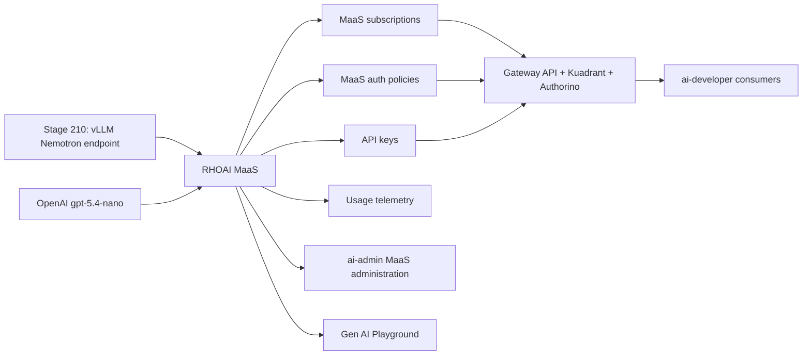

# Models-as-a-Service

## Why This Matters

Enterprise AI teams need to turn model endpoints into governed platform
services. A raw inference URL is difficult to share safely: it lacks
subscription boundaries, API key lifecycle management, user-facing model
discovery, usage reporting, and consistent controls across local and external
models.

Models-as-a-Service (MaaS) adds that product layer. In this demo it turns the
validated Nemotron endpoint from Stage 210 and an external OpenAI
`gpt-5.4-nano` provider into managed AI assets that can be discovered,
subscribed to, monitored, and consumed through OpenAI-compatible APIs.

## What Enables It

| Component | Role |
|-----------|------|
| RHOAI MaaS | Subscription-based governance, API keys, model publication, authorization policies, and usage telemetry. |
| KServe and vLLM | Local model-serving foundation for Nemotron. vLLM with MaaS is Technology Preview in RHOAI 3.4. |
| Red Hat Connectivity Link and Kuadrant | Gateway policy, authorization integration, rate-limit enforcement, and observability substrate. |
| Gateway API | Cluster ingress path for MaaS model and API traffic. |
| Authorino | Authentication and authorization service used by the gateway policy chain. |
| PostgreSQL | Stores MaaS API key lifecycle data; OpenShift AI requires an externally managed PostgreSQL 14+ database. |
| Llama Stack Operator and Gen AI Studio | User-facing GenAI Playground and AI asset endpoint experience. |

## Architecture Delta

## Source Alignment

- [RHOAI 3.4 - Govern LLM access with Models-as-a-Service](https://docs.redhat.com/en/documentation/red_hat_openshift_ai_self-managed/3.4/html-single/govern_llm_access_with_models-as-a-service/index)
- [RHOAI 3.4 - Configuring authentication for llm-d using Red Hat Connectivity Link](https://docs.redhat.com/en/documentation/red_hat_openshift_ai_self-managed/3.4/html/deploy_models_using_distributed_inference_with_llm-d/configuring-authentication-for-llmd_distributed-inference)
- [Red Hat Connectivity Link 1.4 - Installing Connectivity Link](https://docs.redhat.com/en/documentation/red_hat_connectivity_link/1.4/html-single/installing_connectivity_link/index)
- [OpenShift 4.20 - cert-manager Operator for Red Hat OpenShift](https://docs.redhat.com/en/documentation/openshift_container_platform/4.20/html/security_and_compliance/cert-manager-operator-for-red-hat-openshift)
- [Red Hat Ecosystem Catalog - PostgreSQL 16 RHEL 9 image](https://catalog.redhat.com/en/software/containers/rhel9/postgresql-16/657b03866783e1b1fb87e142)
- [OpenAI API - GPT-5.4 nano](https://developers.openai.com/api/docs/models/gpt-5.4-nano)

## Current Scope

This stage is implemented in phases:

1. Enable MaaS prerequisites and validate CRD/schema availability. cert-manager
   is treated as a required platform prerequisite, not as a Stage 230-owned
   operator lifecycle resource.
2. Add schema-validated external OpenAI `gpt-5.4-nano` publication resources,
   developer subscription quota, developer authorization policy, and MaaS
   namespace admin access for `rhods-admins`.
3. Add the local Nemotron MaaS publication path after the direct Stage 210
   `InferenceService` is migrated or paired with a schema-validated
   `LLMInferenceService` backend.
4. Add API key, user-access, Gen AI Playground, and observability validation
   flows.

The prerequisite and model-policy resources reconcile on the current RHOAI 3.4
cluster, but dashboard and MaaS API discovery are not yet accepted as healthy.
Current validation shows the generated Kuadrant Gateway WASM EnvoyFilter
contains an `allow_on_headers_stop_iteration` field rejected by the OpenShift
gateway Envoy. Until that compatibility issue is resolved, the dashboard can
show `Models as a Service could not be loaded` even though the MaaS CRs are
Ready. The live MaaS API group is `maas.opendatahub.io/v1alpha1`; Stage 230
model publication and policy resources use that installed schema.

The external OpenAI path is credential-gated. `deploy.sh` creates
`openai-provider-api-key` in `models-as-a-service` from local
`OPENAI_API_KEY` or `RHOAI_OPENAI_API_KEY`, or reuses the Secret if it already
exists. The provider key is never committed.
