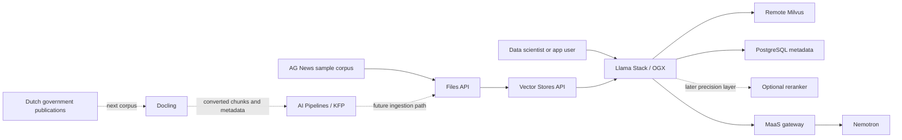

# Private Data RAG

Metadata-aware enterprise RAG on OpenShift AI with Llama Stack / OGX, Milvus,
and governed Nemotron access through MaaS.

## Why This Matters

Enterprise RAG is more than attaching a vector database to a chatbot. In a
regulated enterprise, retrieval must respect document category, tenant,
version, recency, and access boundaries while still returning the most relevant
context for the model. Red Hat's OGX/Llama Stack article frames this as a
layered retrieval strategy: metadata filtering narrows the search space, hybrid
retrieval combines semantic and keyword signals, and neural reranking improves
the final context passed to the model.

For a European-regulated enterprise, this provides a controlled path for
private knowledge grounding. The platform keeps documents, metadata, vector
indexes, and model access inside OpenShift governance while users get a more
accurate assistant experience than a model-only prompt can provide.

## What Enables It

| Technology | Role in this stage | Source |
|------------|-------------------|--------|
| Red Hat OpenShift AI Llama Stack / OGX | RAG runtime, OpenAI-compatible Files and Vector Stores APIs, retrieval orchestration, and provider configuration | [RHOAI 3.4 Llama Stack docs](https://docs.redhat.com/en/documentation/red_hat_openshift_ai_self-managed/3.4/html-single/working_with_llama_stack/index) |
| Remote Milvus provider | Vector store provider used by Llama Stack; this stage currently deploys a demo-local Milvus service as the remote endpoint | [RHOAI 3.4 Llama Stack vector store guidance](https://docs.redhat.com/en/documentation/red_hat_openshift_ai_self-managed/3.4/html-single/working_with_llama_stack/index) |
| PostgreSQL | Required metadata store for Llama Stack deployments | [RHOAI 3.4 Llama Stack PostgreSQL guidance](https://docs.redhat.com/en/documentation/red_hat_openshift_ai_self-managed/3.4/html-single/working_with_llama_stack/index) |
| Models-as-a-Service | Governed access to the existing Nemotron model | [RHOAI 3.4 MaaS docs](https://docs.redhat.com/en/documentation/red_hat_openshift_ai_self-managed/3.4/html-single/govern_llm_access_with_models-as-a-service/index) |
| AG News reference implementation | Initial compatibility corpus and implementation pattern for metadata, hybrid retrieval, and reranking | [agnews-rag-demo](https://github.com/abdelhamidfg/agnews-rag-demo) |
| Docling | Planned data-preparation layer for unstructured Dutch government publications | [RHOAI 3.4 data preparation docs](https://docs.redhat.com/en/documentation/red_hat_openshift_ai_self-managed/3.4/html/customize_models_for_gen_ai_and_agentic_ai_applications/prepare-your-data-for-ai-consumption_custom-models) |
| Red Hat OpenShift AI Pipelines | Planned automation layer for repeatable Docling conversion, chunking, extraction, and subset selection using the Red Hat `opendatahub-io/data-processing` KFP examples | [RHOAI 3.4 data preparation docs](https://docs.redhat.com/en/documentation/red_hat_openshift_ai_self-managed/3.4/html/customize_models_for_gen_ai_and_agentic_ai_applications/prepare-your-data-for-ai-consumption_custom-models) |

Llama Stack / OGX functionality is Technology Preview in the active RHOAI 3.4
baseline. The Red Hat article and GitHub repository guide the demo shape; the
official RHOAI documentation remains the source of truth for product behavior
and configuration.

The current implementation is the first rebuilt slice: `enterprise-rag`,
PostgreSQL metadata storage, a demo-local Milvus endpoint for the documented
remote Milvus provider, `LlamaStackDistribution`, environment-local Secrets,
and a deterministic AG News smoke-test sample. AG News is already structured
text and should not be used to claim Docling validation. Docling and KFP become
part of this stage when the corpus changes to unstructured Dutch government
publications.

## Architecture

- New in this stage: metadata-aware RAG runtime, a remote-Milvus-compatible
  vector store endpoint, PostgreSQL Llama Stack metadata, and an AG News
  compatibility sample. Planned next in this stage: full AG News
  ingestion/query validation, then Docling and KFP automation for unstructured
  Dutch government publications.
- Already available: GPU platform, model serving, Nemotron, and governed MaaS
  access from earlier stages.
- Value of the integration: a governed model can answer from private,
  metadata-filtered enterprise knowledge instead of relying only on general
  model memory.

## References

- [Build an enterprise RAG system with OGX](https://developers.redhat.com/articles/2026/05/26/build-enterprise-rag-system-ogx)
- [AG News RAG demo repository](https://github.com/abdelhamidfg/agnews-rag-demo)
- [RHOAI 3.4: Working with Llama Stack](https://docs.redhat.com/en/documentation/red_hat_openshift_ai_self-managed/3.4/html-single/working_with_llama_stack/index)
- [RHOAI 3.4: Govern LLM access with Models-as-a-Service](https://docs.redhat.com/en/documentation/red_hat_openshift_ai_self-managed/3.4/html-single/govern_llm_access_with_models-as-a-service/index)
- [RHOAI 3.4: Prepare your data for AI consumption](https://docs.redhat.com/en/documentation/red_hat_openshift_ai_self-managed/3.4/html/customize_models_for_gen_ai_and_agentic_ai_applications/prepare-your-data-for-ai-consumption_custom-models)
- [OpenDataHub data-processing examples](https://github.com/opendatahub-io/data-processing/tree/stable)
- [OpenDataHub data-processing Docling KFP examples](https://github.com/opendatahub-io/data-processing/tree/main/kubeflow-pipelines)
- [Stage 230 implementation plan](PLAN.md)
