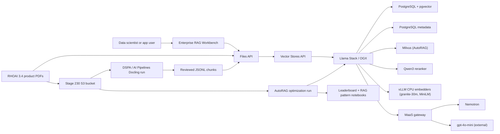
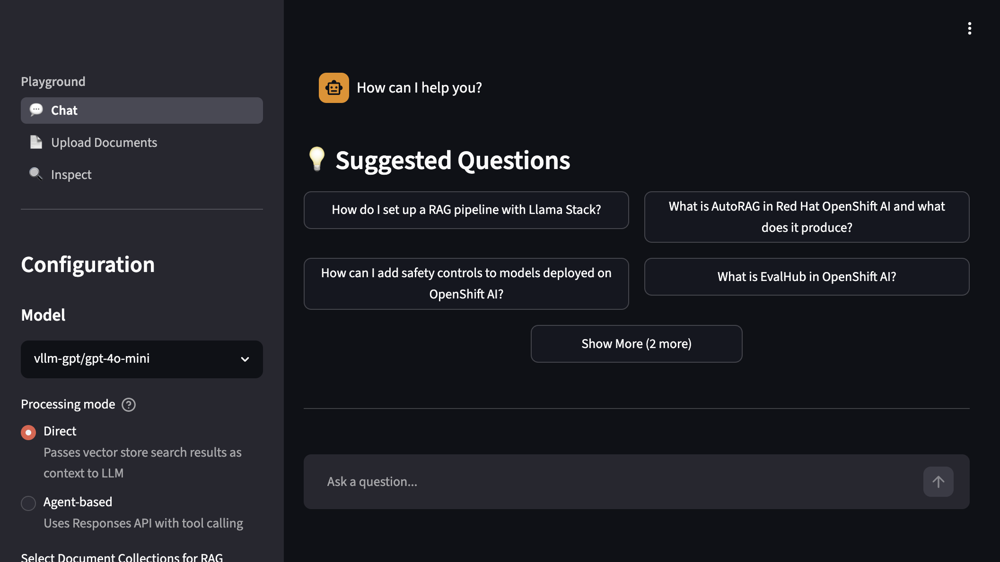
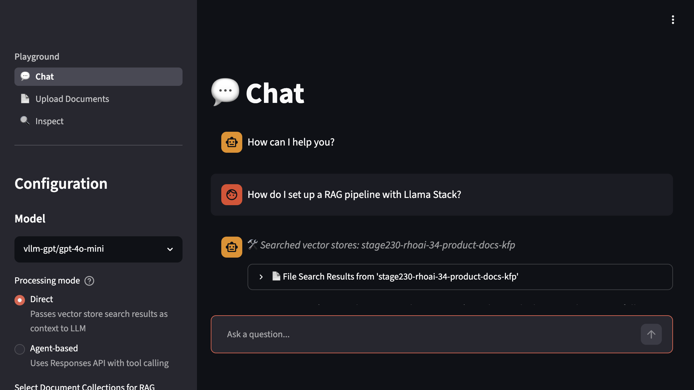
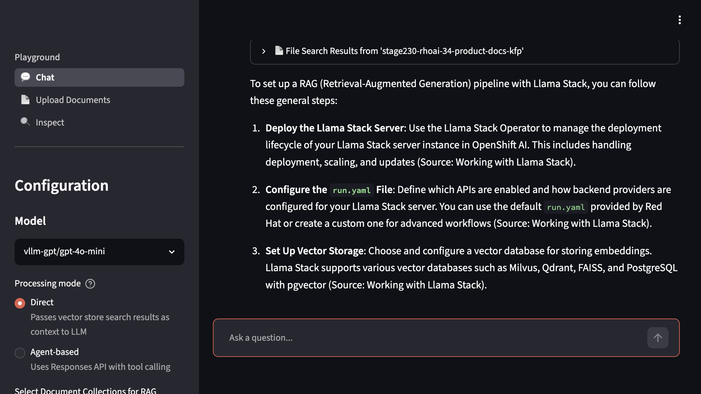
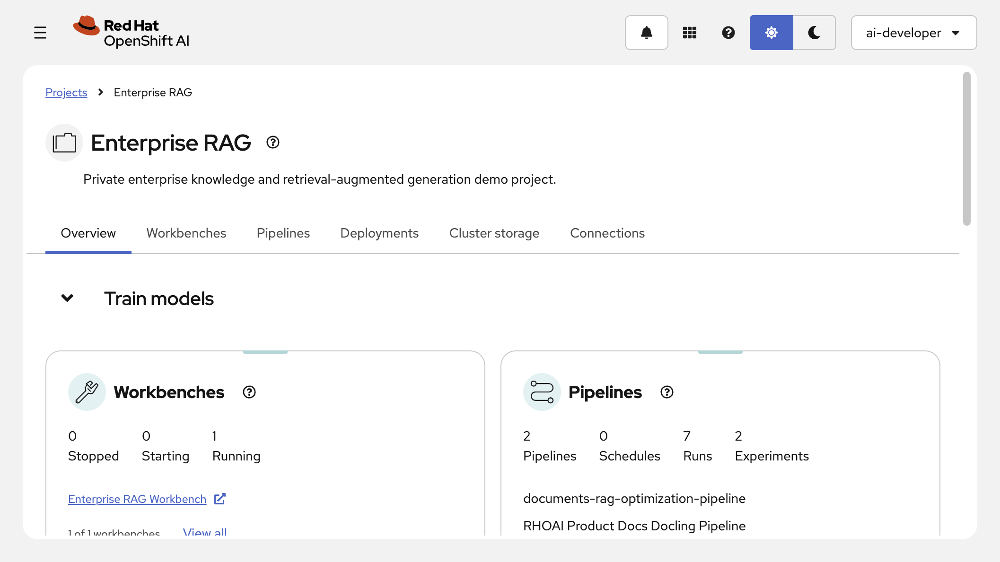
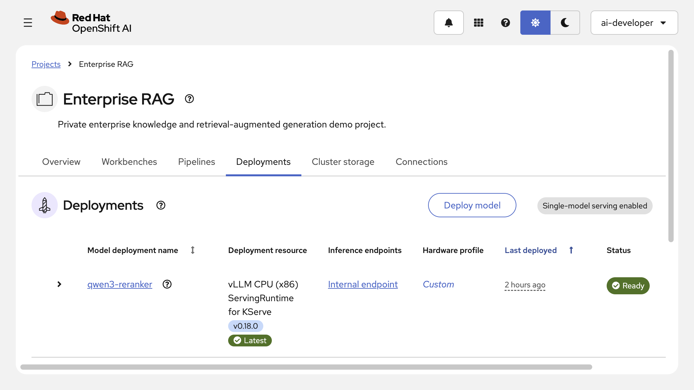

# Private Data RAG

Metadata-aware enterprise RAG on OpenShift AI with Llama Stack / OGX,
PostgreSQL with pgvector, governed Nemotron access through MaaS, and official
RHOAI product documentation as the audience-facing corpus.

## Why This Matters

Enterprise RAG is more than attaching a vector database to a chatbot. In a
regulated enterprise, retrieval must respect document category, tenant,
version, source, and access boundaries while still returning relevant context
for the model. Red Hat's OGX/Llama Stack article frames this as a layered
retrieval strategy: metadata filtering narrows the search space, hybrid
retrieval combines semantic and keyword signals, and neural reranking improves
the final context passed to the model.

For a European-regulated enterprise, this provides a controlled path for
private knowledge grounding. The platform keeps documents, metadata, vector
indexes, and model access inside OpenShift governance while users get a more
accurate assistant experience than a model-only prompt can provide.

## What Enables It

| Technology | Role in this stage | Source |
|------------|-------------------|--------|
| Red Hat OpenShift AI Llama Stack / OGX | RAG runtime, OpenAI-compatible Files and Vector Stores APIs, retrieval orchestration, provider configuration, and provider-listed reranker access | [RHOAI 3.4 Llama Stack docs](https://docs.redhat.com/en/documentation/red_hat_openshift_ai_self-managed/3.4/html-single/working_with_llama_stack/index) |
| PostgreSQL with pgvector | Llama Stack metadata store and active remote vector provider for metadata-filtered vector, keyword, and hybrid search | [RHOAI 3.4 Llama Stack vector store guidance](https://docs.redhat.com/en/documentation/red_hat_openshift_ai_self-managed/3.4/html-single/working_with_llama_stack/index) |
| Nomic embedding model | Active RHOAI Llama Stack inline sentence-transformers embedding model used for indexing | [RHOAI Llama Stack models API](https://docs.redhat.com/en/documentation/red_hat_openshift_ai_self-managed/3.4/html-single/working_with_llama_stack/index) |
| Models-as-a-Service | Governed access to the existing Nemotron model | [RHOAI 3.4 MaaS docs](https://docs.redhat.com/en/documentation/red_hat_openshift_ai_self-managed/3.4/html-single/govern_llm_access_with_models-as-a-service/index) |
| Official RHOAI 3.4 product PDFs | Primary corpus for querying the same documentation that explains Llama Stack RAG, AutoRAG, RAGAS, EvalHub, guardrails, AI Pipelines, and Docling | [RHOAI 3.4 documentation](https://docs.redhat.com/en/documentation/red_hat_openshift_ai_self-managed/3.4) |
| Docling | Converts the committed official RHOAI PDFs into text and structured artifacts before RAG chunk creation | [RHOAI 3.4 data preparation docs](https://docs.redhat.com/en/documentation/red_hat_openshift_ai_self-managed/3.4/html/customize_models_for_gen_ai_and_agentic_ai_applications/prepare-your-data-for-ai-consumption_custom-models) |
| RHOAI project workbench | Notebook-driven ingestion, retrieval inspection, reranker testing, and acceptance runs in the `enterprise-rag` project | [RHOAI 3.4 working on projects](https://docs.redhat.com/en/documentation/red_hat_openshift_ai_self-managed/3.4/html-single/working_on_projects/index) |
| Red Hat OpenShift AI Pipelines | GitOps-managed DSPA pipeline server runs the Docling product-document processing pipeline from S3 input to reviewed JSONL output | [RHOAI 3.4 AI Pipelines docs](https://docs.redhat.com/en/documentation/red_hat_openshift_ai_self-managed/3.4/html-single/working_with_ai_pipelines/index) |
| AutoRAG (Technology Preview) | Automated RAG configuration optimization over the product-document corpus: benchmark-driven runs rank RAG patterns by faithfulness/correctness metrics and generate indexing and inference notebooks | [RHOAI 3.4 AutoRAG docs](https://docs.redhat.com/en/documentation/red_hat_openshift_ai_self-managed/3.4/html-single/working_with_autorag/index) |
| Milvus (remote, demo-grade) | AutoRAG-required remote vector database registered with Llama Stack as the `milvus` vector_io provider; pgvector remains the application retrieval path | [RHOAI 3.4 AutoRAG docs](https://docs.redhat.com/en/documentation/red_hat_openshift_ai_self-managed/3.4/html-single/working_with_autorag/index) |
| vLLM CPU embedding serving | `granite-embedding-30m` and `all-minilm-l6-v2` as KServe `InferenceService`s (reranker pattern) registered as `remote::vllm` Llama Stack embedding providers for AutoRAG throughput | [RHOAI 3.4 model deployment docs](https://docs.redhat.com/en/documentation/red_hat_openshift_ai_self-managed/3.4/html-single/deploying_models/index) |
| Governed external GPT via MaaS | `gpt-4o-mini` through the Stage 220 gateway as a second AutoRAG generation model, measuring the private-vs-external trade-off under governance | [RHOAI 3.4 MaaS docs](https://docs.redhat.com/en/documentation/red_hat_openshift_ai_self-managed/3.4/html-single/govern_llm_access_with_models-as-a-service/index) |

Llama Stack / OGX functionality is Technology Preview in the active RHOAI 3.4
baseline. The Red Hat article and GitHub repository guide the demo shape; the
official RHOAI documentation remains the source of truth for product behavior
and configuration.

The current implementation provides `enterprise-rag`, PostgreSQL metadata
storage with the `pgvector` extension, a documented `remote::pgvector` Llama
Stack provider, `LlamaStackDistribution` with curated `userConfig`, a CPU
Qwen3 reranker exposed as `vllm-reranker/qwen3-reranker`, environment-local
Secrets, an Enterprise RAG Workbench, and the official RHOAI product-document
corpus. The selected RHOAI PDFs are
stored under `data/rhoai-product-docs/source/`, deterministic prepared chunks
are stored under `data/rhoai-product-docs/processed/`, and `deploy.sh` mirrors
the source PDFs into the Stage 230 NooBaa bucket under `raw/rhoai-product-docs/`.
`run-rhoai-docs-pipeline.sh` then runs a Docling KFP pipeline through the
GitOps-managed DSPA server and writes reviewed output chunks plus converted
Markdown/Docling JSON artifacts back to S3.

Docling is intentionally not a model deployment in this stage. In the RHOAI
dashboard, KServe-served endpoints such as the Qwen3 reranker appear under the
project `Deployments` tab. Docling appears under `Pipelines` as the
`RHOAI Product Docs Docling Pipeline`, and the Docling work is visible in the
run graph as `download-docling-models`, `docling-convert-standard`,
`docling-chunk-and-upload`, and `ingest-to-vector-store` tasks. Creating a
dashboard model deployment for Docling would be a separate serving design, not
the Red Hat-documented data-preparation pattern followed here.

The product-document corpus is documentation grounding first, and it now also
serves as the AutoRAG input corpus. Stage 230 implements AI Pipelines for
repeatable RHOAI product-document data preparation and for AutoRAG
optimization runs (Technology Preview). It still does not implement EvalHub
jobs, guardrails, or RAGAS evaluation; those remain future stages.

## Architecture



- New in this stage: metadata-aware RAG runtime, PostgreSQL-backed pgvector
  retrieval, PostgreSQL Llama Stack metadata, CPU reranking, an RHOAI
  workbench, the RHOAI product-document corpus, and AutoRAG (Technology
  Preview) optimization with a remote Milvus vector database.
- Already available: GPU platform, model serving, Nemotron, and governed MaaS
  access from earlier stages.
- Value of the integration: a governed model can answer from private,
  metadata-filtered enterprise knowledge instead of relying only on general
  model memory.

## Workbench Flow

The workbench opens into a curated notebook workspace under
`/opt/app-root/src/workspace`:

- `Docling_data_preparation_rhoai_docs.ipynb` -- S3 PDF read, Docling
  conversion and chunking, metadata enrichment, JSONL output to S3
- `Ingestion_pipeline_rhoai_docs.ipynb` -- vector store creation, Files API
  upload, metadata attachment
- `Retrieval_pipeline_rhoai_docs.ipynb` -- metadata extraction, hybrid search,
  reranking, grounded answer generation

The data preparation and ingestion notebook steps are automated by the KFP
pipeline. The retrieval notebook demonstrates interactive query-time behavior.
Runtime helper scripts and sample data are generated under hidden
`.stage230` workspace content rather than showing the full repository.

## Chatbot Flow

Stage 230 provides a Streamlit UI adapted from the upstream Llama Stack UI
distribution. The runtime Deployment and Route run as `private-rag-chatbot`
in the `enterprise-rag` project; the OpenShift BuildConfig and ImageStream
live in `enterprise-rag-build` so build pods are not admitted as
Kueue-managed RAG workloads. The UI is discovery-driven against the Stage
230 Llama Stack service rather than hardcoding a model or store:

- playground pages cover chat, direct RAG over the Vector Stores API, and an
  agent flow; models and vector stores are discovered live from Llama Stack,
  so the governed Nemotron, the governed gpt-4o-mini, and the
  product-document vector store all appear without UI configuration
- the product-document corpus is populated by the GitOps/DSPA/KFP path, not
  by ad hoc browser uploads
- `RAG_QUESTION_SUGGESTIONS` seeds per-vector-store demo questions for the
  `stage230-rhoai-34-product-docs-kfp` store, drawn from the committed
  AutoRAG validate-and-protect benchmark so live answers match measured
  pattern quality (Llama Stack RAG, AutoRAG, guardrails, EvalHub, Docling)
- agent mode offers `mcp::openshift` tool calling through Stage 220's
  read-only OpenShift MCP server, registered as the `openshift` MCP
  connector in the Llama Stack config (`registered_resources.connectors`);
  ask about pod status in a known namespace or node usage to demo tools
- RAG answers carry enterprise attribution: a "📚 Sources" panel groups the
  retrieved chunks per official guide with topic tags, relevance scores, and
  docs.redhat.com links (from the corpus metadata ingested with every
  chunk), the raw chunk payloads stay inspectable in a separate expander,
  and the model is instructed to name its source guides in the answer
- distribution pages expose the served models, vector stores, providers, and
  shields for platform-inspection moments in the demo
- evaluation pages preview the scoring workflows that the upcoming
  evaluation stage will formalize
- the OpenShift AI dashboard exposes a self-managed `RHOAI Demo RAG Chatbot`
  application tile that opens the chatbot Route

## AI Pipelines Flow

Run the product-document Docling pipeline through the Stage 230 DSPA server:

```bash
./stage-230-private-data-rag/run-rhoai-docs-pipeline.sh
```

For a small pipeline smoke run:

```bash
./stage-230-private-data-rag/run-rhoai-docs-pipeline.sh \
  --max-documents=1 \
  --output-s3-key=processed/rhoai-product-docs/rhoai-3.4-product-docs-docling-kfp-smoke.jsonl
```

The full runner compiles the KFP v2 pipeline, creates a new
PipelineVersion, submits a run, reviews the S3 output, confirms converted
Markdown and Docling JSON artifacts exist, and stores evidence in
`enterprise-rag/stage230-rhoai-docs-pipeline-evidence`.

Dashboard path: select the `Enterprise RAG` project, open `Pipelines`, choose
`RHOAI Product Docs Docling Pipeline`, then open the latest run. The run graph
shows a clean end-to-end flow from PDF import through vector store ingestion.

The OpenShift AI Pipelines run graph:

```text
import-pdfs -> create-pdf-splits -> download-docling-models
  -> process-pdf-splits (ParallelFor):
       docling-convert-standard -> docling-chunk-and-upload
  -> enrich-and-publish-rhoai-chunks
  -> ingest-to-vector-store
```

To make validation run both the pipeline and the RAG smoke over the generated
pipeline output:

```bash
RHOAI_STAGE230_RUN_RHOAI_DOCS_PIPELINE=true \
RHOAI_STAGE230_RUN_RHOAI_DOCS_SMOKE=true \
./stage-230-private-data-rag/validate.sh
```

For normal redeploy validation after the pipeline has already passed, reuse the
recorded KFP evidence and run the bounded RAG smoke over the latest S3 output:

```bash
RHOAI_STAGE230_RUN_RHOAI_DOCS_SMOKE=true \
RHOAI_STAGE230_RHOAI_DOCS_USE_PIPELINE_OUTPUT=true \
./stage-230-private-data-rag/validate.sh
```

The Stage 230 acceptance gate uses `--search-mode hybrid` and intentionally
fails if metadata extraction, hybrid metadata filtering, reranking, or final
grounded answer generation is broken. The active pgvector path was selected
because filtered hybrid search is part of the stage outcome, not a deferred
nice-to-have.

## AutoRAG Flow (Technology Preview)

AutoRAG is a Technology Preview feature in RHOAI 3.4 and is not supported
with Red Hat production SLAs. Stage 230 uses it to answer the question every
RAG team faces: which chunking, embedding, retrieval, and generation
combination actually works best for this corpus, measured instead of guessed.

Stage 230 provides all AutoRAG prerequisites through GitOps and `deploy.sh`:

- Gen AI studio is enabled in the OpenShift AI dashboard (Stage 110 baseline).
- A remote Milvus vector database (demo-grade standalone plus etcd) runs in
  `enterprise-rag` and is registered with Llama Stack as the `milvus`
  vector_io provider. pgvector remains the application retrieval path; the
  official AutoRAG guide requires remote Milvus for optimization runs.
- AutoRAG runs compare two embedding models served as dedicated vLLM CPU
  KServe `InferenceService`s (`granite-embedding-30m` and
  `all-minilm-l6-v2`, the documented per-run maximum of two), following the
  same serving pattern as the Qwen3 reranker and visible in the project
  `Deployments` tab. Dedicated vLLM CPU serving delivers ~90 texts/s per
  model with server-side chunked pooling for long inputs; the inline
  sentence-transformers provider keeps only the nomic app-path model, and
  the doc-recommended `BAAI/bge-m3` stays registered for GPU-capable
  environments.
- AutoRAG runs compare two governed generation models through MaaS: the
  local Nemotron and the external `gpt-4o-mini`, so the leaderboard
  measures the private-vs-external generation trade-off on the same corpus
  under identical retrieval settings. The corpus is public Red Hat
  documentation, making governed egress to the external model an explicit
  demo talking point rather than a data-boundary exception. Optimization
  runs draw quota from the dedicated `enterprise-rag-autorag`
  MaaSSubscription sized for evaluation bursts.
- The `autorag-llama-stack-connection` Secret carries the documented
  `LLAMA_STACK_CLIENT_BASE_URL` and `LLAMA_STACK_CLIENT_API_KEY` keys and
  shows up as a project connection through the GitOps-managed
  `llama-stack-connection` dashboard connection type.
- The optimization input is a scoped corpus under
  `autorag/rhoai-product-docs/input/`: the Evaluating AI systems, Guardrails,
  and AutoRAG guides (~1,000 chunks — enough distractor mass for retrieval
  settings to differentiate, sized for CPU embedding throughput). The full
  6-guide corpus remains the chatbot/pgvector application path.
- The committed benchmark
  (`data/rhoai-product-docs/autorag/benchmark_data.json`, 12 questions with
  expected answers and PDF document IDs, mirrored to S3 by `deploy.sh`)
  follows a validate-and-protect theme: how RAG systems are evaluated
  (EvalHub, AutoRAG metrics) and protected (NeMo Guardrails, PII detection,
  self-check rails). The optimization run therefore both tunes the current
  stage and previews the upcoming guardrails and evaluation demo stages.

Run an optimization through the Stage 230 DSPA:

```bash
./stage-230-private-data-rag/run-autorag-pipeline.sh
```

The runner imports the vendored Red Hat `documents-rag-optimization-pipeline`
(compiled on the `rhoai-3.4` branch of `pipelines-components`, with executor
images aligned to the installed operator's `odh-autorag-rhel9` digest) with
the documented pipeline name, so the run is visible both under `Pipelines`
and on the Gen AI studio `AutoRAG` page. It pre-warms the embedding models
and flushes the MaaS gateway's external-model connection pool until the
generation models answer consecutively, then submits the run against the
scoped validate-and-protect corpus with Nemotron and gpt-4o-mini as
generation models, granite-embedding-30m and all-minilm-l6-v2 as embedding
models, and the `faithfulness` metric over 4 RAG patterns by default, then
reviews the S3 artifacts (leaderboard, per-pattern `pattern.json`,
`evaluation_results.json`, indexing and inference notebooks) and stores
evidence in `enterprise-rag/stage230-autorag-pipeline-evidence`.

Dashboard path: open `AutoRAG` in the OpenShift AI sidebar to review the
leaderboard, compare all three metrics (answer faithfulness, answer
correctness, context correctness) with their confidence intervals, inspect
sample Q&A per pattern, and download the generated indexing and inference
notebooks for the selected pattern into the Enterprise RAG Workbench.

For the scripted handoff, fetch the winning pattern's artifacts directly
into the workbench workspace from a workbench terminal:

```bash
cd /opt/app-root/src/workspace
python .stage230/scripts/fetch_autorag_pattern.py
```

The helper ranks the latest run's patterns by faithfulness (use `--metric`
or `--pattern` to choose differently) and downloads `pattern.json`,
`evaluation_results.json`, and the generated `indexing.ipynb` and
`inference.ipynb` into `workspace/autorag/<Pattern>/`, ready to run against
the same Llama Stack service the optimization used.

To make validation run the AutoRAG gate:

```bash
RHOAI_STAGE230_RUN_AUTORAG=true \
./stage-230-private-data-rag/validate.sh
```

## Demo

| Screenshot | What it shows |
|------------|---------------|
|  | Llama Stack RAG chatbot (Streamlit) ready for questions |
|  | Contextual answer to RHOAI platform question with source citations |
|  | Expanded source document references from RHOAI product docs |
|  | Enterprise RAG data science project overview |
|  | Reranker and embedder model deployments powering the RAG pipeline |

## References

- [Build an enterprise RAG system with OGX](https://developers.redhat.com/articles/2026/05/26/build-enterprise-rag-system-ogx)
- [Red Hat AI RAG quickstart repository](https://github.com/rh-ai-quickstart/RAG)
- [RHOAI 3.4: Working with Llama Stack](https://docs.redhat.com/en/documentation/red_hat_openshift_ai_self-managed/3.4/html-single/working_with_llama_stack/index)
- [RHOAI 3.4: Working with AutoRAG](https://docs.redhat.com/en/documentation/red_hat_openshift_ai_self-managed/3.4/html-single/working_with_autorag/index)
- [Red Hat AI examples: AutoRAG](https://github.com/red-hat-data-services/red-hat-ai-examples/tree/main/examples/autorag)
- [pipelines-components: documents_rag_optimization_pipeline (rhoai-3.4)](https://github.com/red-hat-data-services/pipelines-components/tree/rhoai-3.4/pipelines/training/autorag/documents_rag_optimization_pipeline)
- [Introducing AutoML and AutoRAG (Red Hat blog)](https://www.redhat.com/en/blog/introducing-auto-ml-and-auto-rag-guided-experience-ai-engineers-red-hat-openshift-ai)
- [RHOAI 3.4: Evaluating AI systems](https://docs.redhat.com/en/documentation/red_hat_openshift_ai_self-managed/3.4/html-single/evaluating_ai_systems/index)
- [RHOAI 3.4: Enabling AI safety with Guardrails](https://docs.redhat.com/en/documentation/red_hat_openshift_ai_self-managed/3.4/html-single/enabling_ai_safety_with_guardrails/index)
- [RHOAI 3.4: Working with AI Pipelines](https://docs.redhat.com/en/documentation/red_hat_openshift_ai_self-managed/3.4/html-single/working_with_ai_pipelines/index)
- [RHOAI 3.4: Govern LLM access with Models-as-a-Service](https://docs.redhat.com/en/documentation/red_hat_openshift_ai_self-managed/3.4/html-single/govern_llm_access_with_models-as-a-service/index)
- [RHOAI 3.4: Prepare your data for AI consumption](https://docs.redhat.com/en/documentation/red_hat_openshift_ai_self-managed/3.4/html/customize_models_for_gen_ai_and_agentic_ai_applications/prepare-your-data-for-ai-consumption_custom-models)
- [OpenDataHub data-processing examples](https://github.com/opendatahub-io/data-processing/tree/stable)
- [Stage 230 implementation plan](PLAN.md)
