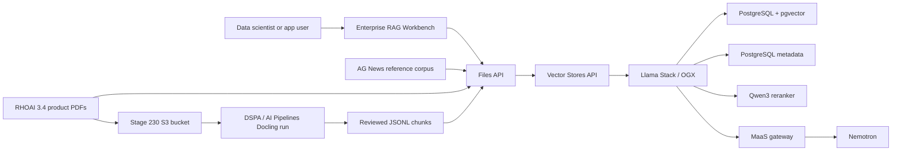

# Private Data RAG

Metadata-aware enterprise RAG on OpenShift AI with Llama Stack / OGX,
PostgreSQL with pgvector, governed Nemotron access through MaaS, and official
RHOAI product documentation as the audience-facing corpus.

## Why This Matters

Enterprise RAG is more than attaching a vector database to a chatbot. In a
regulated enterprise, retrieval must respect document category, tenant,
version, source, and access boundaries while still returning relevant context
for the model. Red Hat's OGX/Llama Stack article frames this as a layered
retrieval strategy: metadata filtering narrows the search space, hybrid
retrieval combines semantic and keyword signals, and neural reranking improves
the final context passed to the model.

For a European-regulated enterprise, this provides a controlled path for
private knowledge grounding. The platform keeps documents, metadata, vector
indexes, and model access inside OpenShift governance while users get a more
accurate assistant experience than a model-only prompt can provide.

## What Enables It

| Technology | Role in this stage | Source |
|------------|-------------------|--------|
| Red Hat OpenShift AI Llama Stack / OGX | RAG runtime, OpenAI-compatible Files and Vector Stores APIs, retrieval orchestration, provider configuration, and provider-listed reranker access | [RHOAI 3.4 Llama Stack docs](https://docs.redhat.com/en/documentation/red_hat_openshift_ai_self-managed/3.4/html-single/working_with_llama_stack/index) |
| PostgreSQL with pgvector | Llama Stack metadata store and active remote vector provider for metadata-filtered vector, keyword, and hybrid search | [RHOAI 3.4 Llama Stack vector store guidance](https://docs.redhat.com/en/documentation/red_hat_openshift_ai_self-managed/3.4/html-single/working_with_llama_stack/index) |
| Nomic embedding model | Active RHOAI Llama Stack inline sentence-transformers embedding model used for indexing | [RHOAI Llama Stack models API](https://docs.redhat.com/en/documentation/red_hat_openshift_ai_self-managed/3.4/html-single/working_with_llama_stack/index) |
| Models-as-a-Service | Governed access to the existing Nemotron model | [RHOAI 3.4 MaaS docs](https://docs.redhat.com/en/documentation/red_hat_openshift_ai_self-managed/3.4/html-single/govern_llm_access_with_models-as-a-service/index) |
| AG News reference implementation | Compatibility corpus and implementation pattern for metadata, hybrid retrieval, and reranking | [agnews-rag-demo](https://github.com/abdelhamidfg/agnews-rag-demo) |
| Official RHOAI 3.4 product PDFs | Primary audience corpus for querying the same documentation that explains Llama Stack RAG, AutoRAG, RAGAS, EvalHub, guardrails, AI Pipelines, and Docling | [RHOAI 3.4 documentation](https://docs.redhat.com/en/documentation/red_hat_openshift_ai_self-managed/3.4) |
| Docling | Converts the committed official RHOAI PDFs into text and structured artifacts before RAG chunk creation | [RHOAI 3.4 data preparation docs](https://docs.redhat.com/en/documentation/red_hat_openshift_ai_self-managed/3.4/html/customize_models_for_gen_ai_and_agentic_ai_applications/prepare-your-data-for-ai-consumption_custom-models) |
| RHOAI project workbench | Notebook-driven ingestion, retrieval inspection, reranker testing, and acceptance runs in the `enterprise-rag` project | [RHOAI 3.4 working on projects](https://docs.redhat.com/en/documentation/red_hat_openshift_ai_self-managed/3.4/html-single/working_on_projects/index) |
| Red Hat OpenShift AI Pipelines | GitOps-managed DSPA pipeline server runs the Docling product-document processing pipeline from S3 input to reviewed JSONL output | [RHOAI 3.4 AI Pipelines docs](https://docs.redhat.com/en/documentation/red_hat_openshift_ai_self-managed/3.4/html-single/working_with_ai_pipelines/index) |

Llama Stack / OGX functionality is Technology Preview in the active RHOAI 3.4
baseline. The Red Hat article and GitHub repository guide the demo shape; the
official RHOAI documentation remains the source of truth for product behavior
and configuration.

The current implementation provides `enterprise-rag`, PostgreSQL metadata
storage with the `pgvector` extension, a documented `remote::pgvector` Llama
Stack provider, `LlamaStackDistribution` with curated `userConfig`, a CPU
Qwen3 reranker exposed as `vllm-reranker/qwen3-reranker`, environment-local
Secrets, an Enterprise RAG Workbench, deterministic AG News acceptance data,
and the official RHOAI product-document corpus. The selected RHOAI PDFs are
stored under `data/rhoai-product-docs/source/`, deterministic prepared chunks
are stored under `data/rhoai-product-docs/processed/`, and `deploy.sh` mirrors
the source PDFs into the Stage 230 NooBaa bucket under `raw/rhoai-product-docs/`.
`run-rhoai-docs-pipeline.sh` then runs a Docling KFP pipeline through the
GitOps-managed DSPA server and writes reviewed output chunks plus converted
Markdown/Docling JSON artifacts back to S3.

The product-document corpus is documentation grounding only. It does not mean
Stage 230 implements AutoRAG optimization, EvalHub jobs, guardrails, RAGAS
evaluation, or those adjacent product capabilities. Stage 230 does implement
AI Pipelines only for repeatable RHOAI product-document data preparation.

## Architecture



- New in this stage: metadata-aware RAG runtime, PostgreSQL-backed pgvector
  retrieval, PostgreSQL Llama Stack metadata, CPU reranking, an RHOAI
  workbench, the AG News compatibility sample, and the RHOAI product-doc
  audience corpus.
- Already available: GPU platform, model serving, Nemotron, and governed MaaS
  access from earlier stages.
- Value of the integration: a governed model can answer from private,
  metadata-filtered enterprise knowledge instead of relying only on general
  model memory.

## Workbench Flow

The workbench opens into a curated notebook workspace under
`/opt/app-root/src/workspace`:

- `Ingestion_pipeline_ag_news.ipynb`
- `retrieval_pipeline_ag_news.ipynb`
- `rhoai_product_docs_rag_smoke.ipynb`

Runtime helper scripts and sample data are generated under hidden `.stage230`
workspace content rather than showing the full implementation repository.

Run the Red Hat article-aligned AG News acceptance path:

```bash
cd /opt/app-root/src/workspace
python .stage230/scripts/agnews_rag_acceptance.py \
  --vector-store stage230-agnews-demo \
  --search-mode hybrid
```

Prepare and query the focused RHOAI 3.4 product-document corpus:

```bash
cd /opt/app-root/src/workspace
python .stage230/scripts/rhoai_product_docs_prepare.py \
  --manifest .stage230/data/rhoai-product-docs/metadata/rhoai-3.4-product-docs.json \
  --source-dir .stage230/data/rhoai-product-docs/source \
  --output .stage230/data/rhoai-product-docs/processed/rhoai-3.4-product-docs-chunks.jsonl
python .stage230/scripts/rhoai_product_docs_rag_smoke.py \
  --reset \
  --manifest .stage230/data/rhoai-product-docs/metadata/rhoai-3.4-product-docs.json \
  --sample .stage230/data/rhoai-product-docs/processed/rhoai-3.4-product-docs-chunks.jsonl \
  --vector-store stage230-rhoai-34-product-docs \
  --search-mode hybrid
```

The smoke helper reads the full prepared JSONL, then indexes a bounded
per-topic subset for the selected smoke questions by default. This keeps
redeploy validation fast while still proving Files API upload, Vector Stores
metadata, hybrid retrieval, reranking, and Nemotron answer generation from the
current corpus. Use `--full-corpus` only for a deeper validation run that
intentionally indexes every generated chunk.

## Chatbot Flow

Stage 230 also provides a small Streamlit chatbot. The runtime Deployment and
Route run as `private-rag-chatbot` in the `enterprise-rag` project; the
OpenShift BuildConfig and ImageStream live in `enterprise-rag-build` so build
pods are not admitted as Kueue-managed RAG workloads. The implementation uses
the Red Hat AI RAG quickstart's direct-chat pattern as a reference, but it is
not a copied quickstart UI:

- the product-document corpus is populated by the GitOps/DSPA/KFP path, not by
  ad hoc browser uploads
- the default model is the governed Stage 220 Nemotron endpoint exposed through
  Llama Stack
- the default knowledge store is the RHOAI product-document vector store
  generated from the pipeline output
- users can switch between RAG-grounded answers and model-only answers for
  comparison
- retrieved context is visible in an expander so demo users can inspect source
  document metadata
- reranking is enabled by default through the Stage 230 Qwen3 reranker
- the OpenShift AI dashboard exposes a self-managed `RHOAI Demo RAG Chatbot`
  application tile that opens the chatbot Route
- MCP and guardrails are visible as disabled extension points for later stages,
  not active Stage 230 claims

## AI Pipelines Flow

Run the product-document Docling pipeline through the Stage 230 DSPA server:

```bash
./stage-230-private-data-rag/run-rhoai-docs-pipeline.sh
```

For a small pipeline smoke run:

```bash
./stage-230-private-data-rag/run-rhoai-docs-pipeline.sh \
  --max-documents=1 \
  --output-s3-key=processed/rhoai-product-docs/rhoai-3.4-product-docs-docling-kfp-smoke.jsonl
```

The full runner compiles the KFP v2 pipeline, creates a new
PipelineVersion, submits a run, reviews the S3 output, confirms converted
Markdown and Docling JSON artifacts exist, and stores evidence in
`enterprise-rag/stage230-rhoai-docs-pipeline-evidence`.

To make validation run both the pipeline and the RAG smoke over the generated
pipeline output:

```bash
RHOAI_STAGE230_RUN_RHOAI_DOCS_PIPELINE=true \
RHOAI_STAGE230_RUN_RHOAI_DOCS_SMOKE=true \
./stage-230-private-data-rag/validate.sh
```

For normal redeploy validation after the pipeline has already passed, reuse the
recorded KFP evidence and run the bounded RAG smoke over the latest S3 output:

```bash
RHOAI_STAGE230_RUN_RHOAI_DOCS_SMOKE=true \
RHOAI_STAGE230_RHOAI_DOCS_USE_PIPELINE_OUTPUT=true \
./stage-230-private-data-rag/validate.sh
```

The Stage 230 acceptance gate uses `--search-mode hybrid` and intentionally
fails if metadata extraction, hybrid metadata filtering, reranking, or final
grounded answer generation is broken. The active pgvector path was selected
because filtered hybrid search is part of the stage outcome, not a deferred
nice-to-have.

## References

- [Build an enterprise RAG system with OGX](https://developers.redhat.com/articles/2026/05/26/build-enterprise-rag-system-ogx)
- [AG News RAG demo repository](https://github.com/abdelhamidfg/agnews-rag-demo)
- [Red Hat AI RAG quickstart repository](https://github.com/rh-ai-quickstart/RAG)
- [RHOAI 3.4: Working with Llama Stack](https://docs.redhat.com/en/documentation/red_hat_openshift_ai_self-managed/3.4/html-single/working_with_llama_stack/index)
- [RHOAI 3.4: Working with AutoRAG](https://docs.redhat.com/en/documentation/red_hat_openshift_ai_self-managed/3.4/html-single/working_with_autorag/index)
- [RHOAI 3.4: Evaluating AI systems](https://docs.redhat.com/en/documentation/red_hat_openshift_ai_self-managed/3.4/html-single/evaluating_ai_systems/index)
- [RHOAI 3.4: Enabling AI safety with Guardrails](https://docs.redhat.com/en/documentation/red_hat_openshift_ai_self-managed/3.4/html-single/enabling_ai_safety_with_guardrails/index)
- [RHOAI 3.4: Working with AI Pipelines](https://docs.redhat.com/en/documentation/red_hat_openshift_ai_self-managed/3.4/html-single/working_with_ai_pipelines/index)
- [RHOAI 3.4: Govern LLM access with Models-as-a-Service](https://docs.redhat.com/en/documentation/red_hat_openshift_ai_self-managed/3.4/html-single/govern_llm_access_with_models-as-a-service/index)
- [RHOAI 3.4: Prepare your data for AI consumption](https://docs.redhat.com/en/documentation/red_hat_openshift_ai_self-managed/3.4/html/customize_models_for_gen_ai_and_agentic_ai_applications/prepare-your-data-for-ai-consumption_custom-models)
- [OpenDataHub data-processing examples](https://github.com/opendatahub-io/data-processing/tree/stable)
- [Stage 230 implementation plan](PLAN.md)
