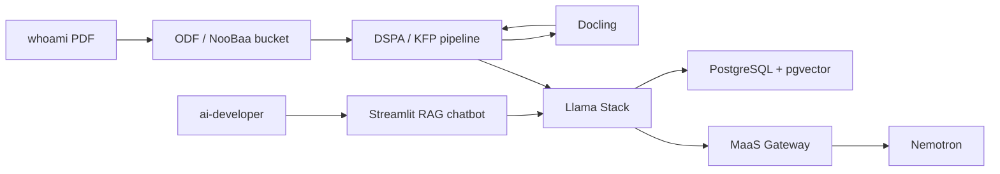

# Private Data RAG

Enterprise AI becomes useful when a model can answer from company knowledge
without moving sensitive data outside the platform boundary. Retrieval-augmented
generation gives an LLM a controlled way to use current internal documents at
inference time instead of relying only on training data or manual prompt
copy-paste.

For a European-regulated enterprise, this matters because policy, customer,
operational, and compliance context often cannot be sent to unmanaged SaaS
tools. A private RAG pattern lets platform teams keep source documents, vector
data, prompts, and model access under OpenShift governance while still giving
business users a useful assistant experience.

Red Hat's enterprise RAG quickstart frames this as an OpenShift AI architecture
with Llama Stack, PostgreSQL with PGVector, S3-compatible storage, ingestion,
and a chatbot experience. In this demo we adapt the pattern to our existing
platform: Nemotron remains the governed generation model through
Models-as-a-Service, and RAG adds private document grounding around that model.
The first scenario is `whoami`: a private CV PDF is converted with Docling and
indexed so the model can answer identity and expertise questions from the
document rather than from general model memory.

## What Enables It

This stage introduces the private knowledge layer for the GenAI demo flow:

| Capability | Demo implementation |
|------------|---------------------|
| Private RAG project | Dedicated OpenShift AI project `Enterprise RAG` (`enterprise-rag`) with admin/developer access |
| Private document source | Stage 230 `enterprise-rag-bucket` ObjectBucketClaim backed by ODF/NooBaa; no MinIO server is deployed |
| Pipeline server | RHOAI AI Pipelines `DataSciencePipelinesApplication` backed by the `enterprise-rag-pipelines` NooBaa artifact bucket |
| Ingestion workflow | KFP v2 whoami pipeline downloads from S3, calls Docling, inserts into Llama Stack, and records metrics |
| Document preparation | Docling service converts the whoami PDF to Markdown before ingestion |
| RAG orchestration | RHOAI 3.4 Llama Stack `LlamaStackDistribution` |
| RAG application | Repo-owned Streamlit chatbot informed by the Red Hat AI Enterprise RAG quickstart and the legacy whoami app, built in OpenShift with a RHOAI 3.4-compatible Llama Stack client, pointed at the stage-owned Llama Stack service, and able to switch between RAG and model-only answers |
| Demo shortcut | OpenShift console application-menu `ConsoleLink` named `Private RAG Chatbot`, patched at sync time to the generated chatbot route |
| Embeddings | Llama Stack inline `sentence-transformers` provider using 384-dimensional `sentence-transformers/all-MiniLM-L6-v2` embeddings |
| Vector store | PostgreSQL with pgvector, managed as a stage-owned runtime service |
| Generation model | Stage 220 Nemotron model consumed through the MaaS gateway |
| Governance | Stage 220 MaaS subscription, API keys, token limits, and telemetry |
| Future controls | Disabled-by-default MCP and guardrails adapters in the chatbot codebase for later agentic and safety stages |

The first implementation is internal-only RAG: it does not add Tavily or other
external search tools. That keeps the stage aligned with the private enterprise
story. Guardrails, agentic retrieval, and AutoRAG can build on this foundation
in later stages. The whoami ingestion path intentionally runs through DSPA/KFP
so the demo has a visible, repeatable RHOAI pipeline server workflow instead of
only a deploy-time script. The Streamlit chatbot gives the stage an
audience-facing test surface for selecting the `whoami` vector store, asking a
question, seeing retrieved context before the model answer, and comparing the
same prompt with retrieval disabled. MCP connectors and guardrails status are
visible in the Inspect tab but intentionally disabled until later stages deploy
the corresponding product-backed controls.

## Architecture Delta

## Source Alignment

- [Red Hat AI quickstart: Centralize company knowledge with an Enterprise RAG Chatbot](https://docs.redhat.com/en/learn/ai-quickstarts/rh-RAG)
- [RHOAI 3.4: Working with Llama Stack](https://docs.redhat.com/en/documentation/red_hat_openshift_ai_self-managed/3.4/html-single/working_with_llama_stack/index)
- [RHOAI 3.4: Working with AI pipelines](https://docs.redhat.com/en/documentation/red_hat_openshift_ai_self-managed/3.4/html-single/working_with_ai_pipelines/index)
- [RHOAI 3.4: Working with data in an S3-compatible object store](https://docs.redhat.com/en/documentation/red_hat_openshift_ai_self-managed/3.4/html-single/working_with_data_in_an_s3-compatible_object_store/index)
- [RHOAI 3.4: Govern LLM access with Models-as-a-Service](https://docs.redhat.com/en/documentation/red_hat_openshift_ai_self-managed/3.4/html-single/govern_llm_access_with_models-as-a-service/index)
- [OCP 4.20: Web console customization](https://docs.redhat.com/en/documentation/openshift_container_platform/4.20/html-single/web_console/index)
- Red Hat quickstart reference implementation: [rh-ai-quickstart/RAG](https://github.com/rh-ai-quickstart/RAG), `frontend/` Streamlit UI, main commit `d1f0847ae92a9c17e827a854334e035e2750a660`
- Previous main-branch implementation: `steps/step-07-rag/scenario-docs/whoami/adnan_drina_cv.pdf` and `steps/step-07-rag/kfp/`
- rh-brain: `2026-01-29 - Deploy an Enterprise RAG Chatbot with Red Hat OpenShift AI`
- rh-brain: `Enterprise RAG on OpenShift AI`

The chatbot source lives in `stage-230-private-data-rag/chatbot/` and is built
into the namespace-local `private-rag-chatbot:latest` image by OpenShift
Builds. The code is a purpose-built Stage 230 app, not a copy of the quickstart
UI. The quickstart `0.2.45` image pins `llama-stack-client==0.6.0`, which is
incompatible with the RHOAI 3.4 Llama Stack server used here. The repo-owned
build pins `llama-stack-client==0.7.2`, keeps direct RAG small and inspectable,
and includes disabled MCP and guardrails adapters so later stages can add tool
calling and safety checks without replacing the chatbot.
