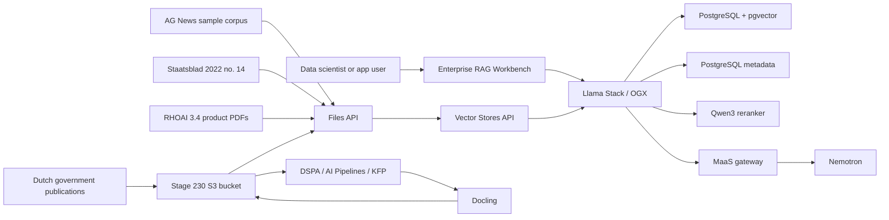

# Private Data RAG

Metadata-aware enterprise RAG on OpenShift AI with Llama Stack / OGX,
PostgreSQL with pgvector, and governed Nemotron access through MaaS.

## Why This Matters

Enterprise RAG is more than attaching a vector database to a chatbot. In a
regulated enterprise, retrieval must respect document category, tenant,
version, recency, and access boundaries while still returning the most relevant
context for the model. Red Hat's OGX/Llama Stack article frames this as a
layered retrieval strategy: metadata filtering narrows the search space, hybrid
retrieval combines semantic and keyword signals, and neural reranking improves
the final context passed to the model.

For a European-regulated enterprise, this provides a controlled path for
private knowledge grounding. The platform keeps documents, metadata, vector
indexes, and model access inside OpenShift governance while users get a more
accurate assistant experience than a model-only prompt can provide.

## What Enables It

| Technology | Role in this stage | Source |
|------------|-------------------|--------|
| Red Hat OpenShift AI Llama Stack / OGX | RAG runtime, OpenAI-compatible Files and Vector Stores APIs, retrieval orchestration, provider configuration, and provider-listed Qwen3 reranker access | [RHOAI 3.4 Llama Stack docs](https://docs.redhat.com/en/documentation/red_hat_openshift_ai_self-managed/3.4/html-single/working_with_llama_stack/index) |
| PostgreSQL with pgvector | Llama Stack metadata store and active remote vector provider for metadata-filtered vector, keyword, and hybrid search | [RHOAI 3.4 Llama Stack vector store guidance](https://docs.redhat.com/en/documentation/red_hat_openshift_ai_self-managed/3.4/html-single/working_with_llama_stack/index) |
| Nomic embedding model | Active RHOAI Llama Stack inline sentence-transformers embedding model used for AG News indexing | [RHOAI Llama Stack models API](https://docs.redhat.com/en/documentation/red_hat_openshift_ai_self-managed/3.4/html-single/working_with_llama_stack/index) |
| Models-as-a-Service | Governed access to the existing Nemotron model | [RHOAI 3.4 MaaS docs](https://docs.redhat.com/en/documentation/red_hat_openshift_ai_self-managed/3.4/html-single/govern_llm_access_with_models-as-a-service/index) |
| AG News reference implementation | Initial compatibility corpus and implementation pattern for metadata, hybrid retrieval, and reranking | [agnews-rag-demo](https://github.com/abdelhamidfg/agnews-rag-demo) |
| RHOAI project workbench | Notebook-driven ingestion, retrieval inspection, reranker testing, and acceptance runs in the `enterprise-rag` project | [RHOAI 3.4 working on projects](https://docs.redhat.com/en/documentation/red_hat_openshift_ai_self-managed/3.4/html-single/working_on_projects/index) |
| Kueue-backed CPU hardware profile | Schedules the workbench through the Stage 120 `CPU Default` hardware profile and `lq-cpu-default` LocalQueue | [RHOAI 3.4 workload management with Kueue](https://docs.redhat.com/en/documentation/red_hat_openshift_ai_self-managed/3.4/html/managing_openshift_ai/managing-workloads-with-kueue) |
| Qwen3 reranker | CPU-hosted neural reranking layer adapted from the article-linked reference implementation and sized for the demo worker nodes | [agnews-rag-demo](https://github.com/abdelhamidfg/agnews-rag-demo) |
| Staatsblad 2022 no. 14 smoke corpus | First Dutch government publication development corpus with recommended enterprise metadata, based on the Wet open overheid text placement PDF | [Official publication PDF](https://zoek.officielebekendmakingen.nl/stb-2022-14.pdf) |
| Docling | Data-preparation layer for unstructured Dutch government publications; notebooks validate each processing step and the DSPA/KFP pipeline automates S3-backed Docling conversion plus chunk generation for the single PDF corpus | [RHOAI 3.4 data preparation docs](https://docs.redhat.com/en/documentation/red_hat_openshift_ai_self-managed/3.4/html/customize_models_for_gen_ai_and_agentic_ai_applications/prepare-your-data-for-ai-consumption_custom-models) |
| Red Hat OpenShift AI Pipelines | Repeatable automation for Docling conversion, chunking, artifact storage, task logs, metrics, and reviewed pipeline output before indexing larger corpora | [RHOAI 3.4 AI Pipelines docs](https://docs.redhat.com/en/documentation/red_hat_openshift_ai_self-managed/3.4/html-single/working_with_ai_pipelines/index) |
| Official RHOAI 3.4 product PDFs | Audience explainer corpus for querying the same documentation that describes Llama Stack RAG, AutoRAG, RAGAS, EvalHub, guardrails, AI Pipelines, and Docling | [RHOAI 3.4 documentation](https://docs.redhat.com/en/documentation/red_hat_openshift_ai_self-managed/3.4) |

Llama Stack / OGX functionality is Technology Preview in the active RHOAI 3.4
baseline. The Red Hat article and GitHub repository guide the demo shape; the
official RHOAI documentation remains the source of truth for product behavior
and configuration.

The current implementation is the first rebuilt slice: `enterprise-rag`,
PostgreSQL metadata storage with the `pgvector` extension, a documented
`remote::pgvector` Llama Stack provider, `LlamaStackDistribution` with a
curated article-aligned Llama Stack `userConfig`, a CPU Qwen3 reranker exposed
as `vllm-reranker/qwen3-reranker`,
environment-local Secrets, an Enterprise RAG Workbench, and a deterministic AG
News acceptance sample. AG News is already structured text and should not be
used to claim Docling validation. The first Dutch development smoke corpus is
`stb-2022-14.pdf`, the Staatsblad publication for the Wet open overheid text
placement. The notebook path validates the preparation contract step by step;
the DSPA/KFP path automates the same contract from S3 input through Docling
conversion, reviewed artifacts, metrics, and S3 chunk output before those
chunks are indexed into the RAG smoke path. A broader set of unstructured
Dutch government publications must reuse that pipeline pattern rather than
manual preprocessing.
The workbench opens into a curated notebook workspace under
`/opt/app-root/src/workspace`, following the article-linked AG News flow and
the first Dutch smoke flow:
`Ingestion_pipeline_ag_news.ipynb`, `retrieval_pipeline_ag_news.ipynb`, and
`dutch_publication_rag_smoke.ipynb`, plus
`dutch_publication_docling_prepare.ipynb` for the data-preparation contract
and `rhoai_product_docs_rag_smoke.ipynb` for official-product-document Q&A.
Runtime helper scripts and sample data are generated under hidden `.stage230`
workspace content rather than showing the full implementation repository to the
data scientist.
The article-linked notebooks install `llama-stack-client` with notebook-local
`%pip` cells. This GitOps implementation instead preinstalls the required
client libraries into the workbench PVC and exposes them through `PYTHONPATH`
so the workbench is ready when opened.

Demo exceptions are explicit: the Qwen3 reranker modelcar is an implementation
artifact adapted from the Red Hat article-linked reference path, not a
Red Hat-supported product operand.
The reranker resource request is intentionally smaller than the article-linked
example so it can schedule on the demo CPU worker pool without using GPU
capacity.
Retrieval can return broad candidate sets, but notebooks and smoke scripts
bound reranker input to the top candidates and trim candidate text so requests
fit the CPU reranker's configured context window. Do not pass full long PDF
chunks directly to the reranker acceptance path.

The RHOAI product-document explainer corpus is now the primary audience Q&A
dataset for this stage. The selected official RHOAI 3.4 PDFs are stored under
`stage-230-private-data-rag/data/rhoai-product-docs/source/`, the deterministic
prepared chunks are stored under
`stage-230-private-data-rag/data/rhoai-product-docs/processed/`, and
`deploy.sh` mirrors the source PDFs into the Stage 230 NooBaa bucket under
`raw/rhoai-product-docs/`. The preparation helper can refresh the local corpus
from `docs.redhat.com` only when run with `--force-download`. This lets the
demo audience ask why the stage uses Llama Stack, pgvector, RAGAS, AutoRAG,
EvalHub, guardrails, AI Pipelines, and Docling vocabulary from committed,
reviewable source material. It is documentation grounding only; it does not
mean Stage 230 implements AutoRAG optimization, EvalHub jobs, or AI safety
guardrails.

## Architecture



- New in this stage: metadata-aware RAG runtime, PostgreSQL-backed pgvector
  retrieval, PostgreSQL Llama Stack metadata, CPU reranking, an RHOAI
  workbench, and an AG News compatibility sample.
- Already available: GPU platform, model serving, Nemotron, and governed MaaS
  access from earlier stages.
- Value of the integration: a governed model can answer from private,
  metadata-filtered enterprise knowledge instead of relying only on general
  model memory.

The deterministic workbench flow is available from the workbench:

```bash
cd /opt/app-root/src/workspace
python .stage230/scripts/agnews_rag_acceptance.py \
  --vector-store stage230-agnews-demo \
  --search-mode hybrid
```

The Dutch publication smoke path uses the same runtime and validates language
following, metadata filtering, reranking, and grounded answer generation:

```bash
cd /opt/app-root/src/workspace
python .stage230/scripts/dutch_publication_rag_smoke.py \
  --reset \
  --vector-store stage230-dutch-woo-demo \
  --search-mode hybrid
```

The data-preparation notebook validates the single-document preparation
contract and compiles the Docling KFP source:

```bash
cd /opt/app-root/src/workspace
python .stage230/kfp/dutch_publication_docling_pipeline.py \
  --output .stage230/compiled/stage-230-dutch-publication-docling.yaml
python .stage230/scripts/dutch_publication_prepare.py \
  --converter pypdf
```

`--converter pypdf` is only the local/workbench validation path. The supported
pipeline path uses Docling through the KFP component runtime.

Run the automated DSPA/KFP pipeline from the repository after deployment:

```bash
./stage-230-private-data-rag/run-docling-pipeline.sh
```

The runner compiles the KFP definition, uploads a new pipeline version to the
`dspa-enterprise-rag` pipeline server, creates a run in the
`stage-230-private-data-rag` experiment, waits for completion, reviews the
prepared JSONL artifact in S3, and stores run evidence in the
`stage230-docling-pipeline-evidence` ConfigMap. The full validation gate also
indexes that pipeline output through the Dutch RAG smoke path:

```bash
RHOAI_STAGE230_RUN_DSPA_PIPELINE=true ./stage-230-private-data-rag/validate.sh
```

The RHOAI product-document explainer flow reads the staged official PDFs,
creates focused chunks, and validates three default questions:

```bash
cd /opt/app-root/src/workspace
python .stage230/scripts/rhoai_product_docs_prepare.py \
  --manifest .stage230/data/rhoai-product-docs/metadata/rhoai-3.4-product-docs.json \
  --source-dir .stage230/data/rhoai-product-docs/source \
  --output .stage230/data/rhoai-product-docs/processed/rhoai-3.4-product-docs-chunks.jsonl
python .stage230/scripts/rhoai_product_docs_rag_smoke.py \
  --reset \
  --manifest .stage230/data/rhoai-product-docs/metadata/rhoai-3.4-product-docs.json \
  --sample .stage230/data/rhoai-product-docs/processed/rhoai-3.4-product-docs-chunks.jsonl \
  --vector-store stage230-rhoai-34-product-docs \
  --search-mode hybrid
```

The Stage 230 acceptance gate uses `--search-mode hybrid` and intentionally
fails if metadata extraction, hybrid metadata filtering, reranking, or final
grounded answer generation is broken. The active pgvector path was selected
because filtered hybrid search is part of the stage outcome, not a deferred
nice-to-have.

## References

- [Build an enterprise RAG system with OGX](https://developers.redhat.com/articles/2026/05/26/build-enterprise-rag-system-ogx)
- [AG News RAG demo repository](https://github.com/abdelhamidfg/agnews-rag-demo)
- [RHOAI 3.4: Working with Llama Stack](https://docs.redhat.com/en/documentation/red_hat_openshift_ai_self-managed/3.4/html-single/working_with_llama_stack/index)
- [RHOAI 3.4: Working with AutoRAG](https://docs.redhat.com/en/documentation/red_hat_openshift_ai_self-managed/3.4/html-single/working_with_autorag/index)
- [RHOAI 3.4: Evaluating AI systems](https://docs.redhat.com/en/documentation/red_hat_openshift_ai_self-managed/3.4/html-single/evaluating_ai_systems/index)
- [RHOAI 3.4: Enabling AI safety with Guardrails](https://docs.redhat.com/en/documentation/red_hat_openshift_ai_self-managed/3.4/html-single/enabling_ai_safety_with_guardrails/index)
- [RHOAI 3.4: Working with AI Pipelines](https://docs.redhat.com/en/documentation/red_hat_openshift_ai_self-managed/3.4/html-single/working_with_ai_pipelines/index)
- [RHOAI 3.4: Govern LLM access with Models-as-a-Service](https://docs.redhat.com/en/documentation/red_hat_openshift_ai_self-managed/3.4/html-single/govern_llm_access_with_models-as-a-service/index)
- [RHOAI 3.4: Prepare your data for AI consumption](https://docs.redhat.com/en/documentation/red_hat_openshift_ai_self-managed/3.4/html/customize_models_for_gen_ai_and_agentic_ai_applications/prepare-your-data-for-ai-consumption_custom-models)
- [OpenDataHub data-processing examples](https://github.com/opendatahub-io/data-processing/tree/stable)
- [OpenDataHub data-processing Docling KFP examples](https://github.com/opendatahub-io/data-processing/tree/main/kubeflow-pipelines)
- [Stage 230 implementation plan](PLAN.md)
