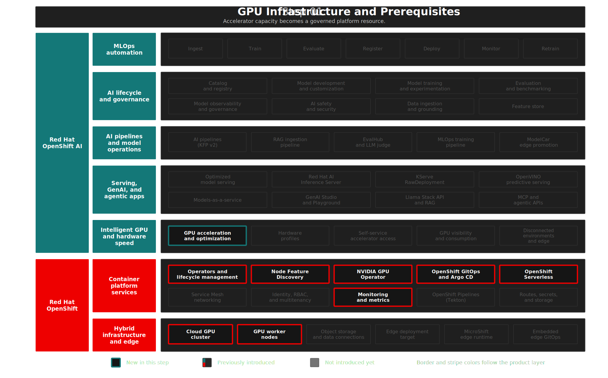

# Step 01: GPU Infrastructure & Prerequisites
**"GPU foundation for private AI"** — Transform a vanilla OpenShift 4.20 cluster into an AI-ready platform with GPU compute, hardware discovery, and the operator stack that RHOAI 3.4 depends on.

## Overview

**Private AI** starts with compute you govern. This step establishes the **compute foundation** — GPU-accelerated capacity, hardware discovery, model-serving prerequisites, queue-aware workload management, and the Red Hat Connectivity Link stack required by RHOAI 3.4 Models-as-a-Service — so workloads run where you operate. The operators installed here (NFD, NVIDIA GPU Operator, Serverless, Kueue, Authorino, Limitador, DNS Operator, RHCL, monitoring) are managed as GitOps-friendly OpenShift resources. This is where Trust becomes operational: the compute layer is open, governed, and under the organization's control.

This step demonstrates RHOAI's **Intelligent GPU and hardware speed** capability: self-service GPU access, intelligent workload scheduling, and hardware discovery — the foundation that every AI workload on the platform depends on.

## Architecture



### What Gets Deployed

```text
OpenShift 4.20 Cluster
├── NFD Operator          → Hardware labels for GPU discovery
├── NVIDIA GPU Operator   → Driver lifecycle (DTK, DCGM exporter)
├── GPU MachineSets       → g6.4xlarge (1×L4) + g6.12xlarge (4×L4) = 5 GPUs
├── OpenShift Serverless  → KnativeServing for KServe networking
├── Red Hat build of Kueue → Queue management for MaaS GPU workloads
├── RHCL + Kuadrant       → MaaS authorization and token-limit policy CRDs
└── User Workload Mon.    → Prometheus scraping for GPU telemetry
```

| Component | Purpose | Namespace |
|-----------|---------|-----------|
| Node Feature Discovery | Hardware labels (PCI, kernel) for GPU Operator | `openshift-nfd` |
| NVIDIA GPU Operator v25.10 | Driver lifecycle via Driver Toolkit (DTK) | `nvidia-gpu-operator` |
| GPU MachineSets (AWS G6) | 1×g6.4xl + 1×g6.12xl = 5 NVIDIA L4 GPUs | `openshift-machine-api` |
| OpenShift Serverless | Knative infrastructure for KServe | `openshift-serverless` |
| Red Hat build of Kueue | Queue controller used by the MaaS namespace in Step 03 | `openshift-kueue-operator` |
| Authorino Operator | AuthConfig CRDs and authorization service for MaaS/RHCL | `openshift-authorino` |
| Limitador Operator | Rate-limit backing service for RHCL token policies | `openshift-limitador-operator` |
| DNS Operator | DNS resources used by the RHCL gateway stack | `openshift-dns-operator` |
| Red Hat Connectivity Link Operator | Kuadrant, AuthPolicy, and token rate-limit policy CRDs | `openshift-operators` |
| Kuadrant | RHCL control-plane instance for MaaS policy enforcement | `kuadrant-system` |
| User Workload Monitoring | Prometheus scraping for DCGM metrics | `openshift-monitoring` |

> **MaaS dependency correction:** RHOAI 3.4 MaaS requires RHCL 1.2+, a ready `Kuadrant` custom resource, and Authorino TLS configuration before `kserve.modelsAsService.managementState: Managed` can reconcile cleanly. LeaderWorkerSet remains deferred because it is needed for distributed inference with llm-d, not for this first MaaS foundation slice.

> **AWS Quota:** Requires "Running On-Demand G and VT instances" >= 64 vCPU (16 + 48). Sandbox accounts default to 64.

Manifests: [`gitops/step-01-gpu-and-prereq/base/`](../../gitops/step-01-gpu-and-prereq/base/)

<details>
<summary>RHOAI and OCP Features in This Step</summary>

| | Feature | Status |
|---|---|---|
| RHOAI | Intelligent GPU and hardware speed | Introduced |
| OCP | Operator Lifecycle Manager (OLM) | Introduced |
| OCP | Node Feature Discovery (NFD) | Introduced |
| OCP | NVIDIA GPU Operator | Introduced |
| OCP | OpenShift Serverless (Knative) | Introduced |
| OCP | Monitoring (Prometheus) | Introduced |
| OCP | OpenShift GitOps (ArgoCD) | Introduced |

<details>
</details>

<summary>Design Decisions</summary>

> **Default GPU driver (no pin):** RHOAI 3.4 AI Inference Server uses CUDA 13.0 (vLLM v0.13.0), which is compatible with GPU Operator 25.10's default driver 580.x. The CUDA 12.8 vs 13.0 conflict documented in [KB 7134740](https://access.redhat.com/solutions/7134740) no longer applies. Subscription uses `installPlanApproval: Automatic`.

> **Driver Toolkit over RHEL entitlements:** OCP 4.20 uses DTK for pre-compiled driver images, eliminating RHEL entitlement secrets on GPU nodes.

> **GPU node taints (`nvidia.com/gpu=true:NoSchedule`):** Reserves expensive GPU instances exclusively for workloads that explicitly request GPU resources.

> **RHCL stack for MaaS:** RHOAI 3.4 MaaS uses RHCL and Kuadrant for authorization policy and token-limit enforcement. The RHCL operator is installed in `openshift-operators`, and the `Kuadrant` CR is created in `kuadrant-system` to match the RHOAI 3.4 MaaS prerequisites. `deploy.sh` performs the documented Authorino TLS runtime configuration because the target Service and generated certificate are created by the operator at install time.

> **GPU MachineSet AZ auto-detection:** `deploy.sh` detects the availability zone from existing worker machinesets (`items[0].spec.template.spec.providerSpec.value.placement.availabilityZone`) rather than hardcoding `${REGION}b`. AWS sandbox clusters may only have subnets in a single AZ (e.g. `us-east-2a`), causing MachineSet creation to fail silently if the hardcoded AZ has no subnet.

> **ArgoCD `selfHeal: false`:** This step's ArgoCD Application uses `selfHeal: false` (unlike other steps) to allow operators to manually scale GPU MachineSets without ArgoCD reverting the change. ArgoCD shows OutOfSync for visibility but does not auto-heal. Git-triggered syncs still work. See the `manage-resources` skill for scaling workflows.

> **Custom ArgoCD health checks** (`bootstrap.sh`): Three custom Lua health checks are configured during bootstrap to fix ArgoCD misreporting:
> - **PersistentVolumeClaim** — Treats `Pending` PVCs as Healthy (for `WaitForFirstConsumer` storage classes that stay Pending until a pod mounts them)
> - **InferenceService** — Reads the KServe `Ready` condition correctly (ArgoCD's built-in check misinterprets the condition format)
> - **TrustyAIService** — Reads the `Available` condition (ArgoCD has no built-in health check for this CRD)

</details>

<details>
<summary>Deploy</summary>

```bash
./steps/step-01-gpu-and-prereq/deploy.sh     # ArgoCD app: operators + GPU MachineSets
./steps/step-01-gpu-and-prereq/validate.sh   # Verify GPUs, operators, KnativeServing, Kueue, RHCL
```

</details>

<details>
<summary>What to Verify After Deployment</summary>

| Check | What It Tests | Pass Criteria |
|-------|--------------|---------------|
| GPU nodes online | Two nodes with `nvidia.com/gpu` allocatable | 1 GPU + 4 GPUs |
| DCGM dashboard | GPU utilization, temperature, and memory | Visible in OpenShift Monitoring |
| All operators Succeeded | NFD, GPU, Serverless, Kueue, Authorino, Limitador, DNS, RHCL | All Succeeded |
| KnativeServing Ready | Control plane healthy | Ready in `knative-serving` |
| Kuadrant Ready | MaaS policy control plane | Ready in `kuadrant-system` |

</details>

## The Demo

> In this demo, we verify that the OpenShift cluster has been transformed into an AI-ready platform — GPU nodes are online, drivers are active, and every operator prerequisite for RHOAI 3.4 is in place.

### GPU Nodes Online

> Before any model can be served, the cluster needs GPU compute. We start by confirming that the GPU nodes provisioned by the MachineSets are online and reporting their accelerator capacity to the scheduler.

1. Open the OpenShift Console → **Compute** → **Nodes**
2. Filter by label `nvidia.com/gpu.present=true`

**Expect:** Two GPU nodes — `g6.4xlarge` (1 GPU) and `g6.12xlarge` (4 GPUs). Both showing `Ready`.

> Five NVIDIA L4 GPUs across two node types, provisioned and tainted for AI workloads only. The taints ensure no accidental consumption — only workloads that explicitly request GPUs get scheduled here. This is Red Hat OpenShift AI's intelligent GPU management in action.

### Operator Stack

> GPU nodes are ready, but inference networking, queued scheduling, and governed model access require additional platform capabilities. This foundation slice installs the operators needed by RHOAI model serving, MaaS policy enforcement, and MaaS queue management; llm-d multi-node serving remains deferred.

1. Navigate to **Operators** → **Installed Operators**
2. Filter by the GPU and AI-related namespaces

**Expect:** All operators showing `Succeeded` — NFD, GPU Operator, Serverless, Kueue, Authorino, Limitador, DNS Operator, and Red Hat Connectivity Link. `Kuadrant` should be `Ready` in `kuadrant-system`.

> Every operator prerequisite for this RHOAI 3.4 foundation slice is deployed and healthy. This is the AI-ready foundation — GPU drivers, KServe networking, Kueue queue control, and MaaS policy infrastructure — all managed via GitOps on Red Hat OpenShift Container Platform.

## Key Takeaways

**For business stakeholders:**

- Create the governed compute base for enterprise AI
- Isolate expensive AI resources for shared use across teams
- Start private AI with infrastructure you control

**For technical teams:**

- Deploy GPU discovery, drivers, serving prerequisites, Kueue, RHCL, and monitoring in a repeatable way
- Reserve GPU nodes for workloads that explicitly request them
- Manage the GPU layer as OpenShift-native, GitOps-friendly infrastructure

<details>
<summary>Troubleshooting</summary>

### GPU MachineSet stuck in Provisioning

**Symptom:** MachineSet shows desired replicas but machines remain in `Provisioning` state.

**Root Cause:** The hardcoded availability zone has no subnet in the sandbox cluster. AWS sandbox accounts may only have one AZ available.

**Solution:** `deploy.sh` auto-detects the AZ from existing worker MachineSets. If deploying manually, check available AZs:
```bash
oc get machineset -n openshift-machine-api -o jsonpath='{.items[0].spec.template.spec.providerSpec.value.placement.availabilityZone}'
```

### GPU Operator InstallPlan stuck on Manual approval

**Symptom:** GPU Operator CSV not progressing, `oc get installplan` shows `RequiresApproval`.

**Solution:**
```bash
oc get installplan -n nvidia-gpu-operator -o name | xargs -I {} oc patch {} -n nvidia-gpu-operator --type merge -p '{"spec":{"approved":true}}'
```

### NVIDIA driver pods CrashLoopBackOff after cluster restart

**Symptom:** `nvidia-driver-daemonset` pods crash after a cluster stop/start cycle.

**Root Cause:** Driver container image cache may be stale after node reprovisioning.

**Solution:** Delete the driver pods to force re-pull:
```bash
oc delete pods -n nvidia-gpu-operator -l app=nvidia-driver-daemonset
```

</details>

## References

- [RHOAI 3.4 — Installing and Uninstalling](https://docs.redhat.com/en/documentation/red_hat_openshift_ai_self-managed/3.4/html-single/installing_and_uninstalling_openshift_ai_self-managed/index)
- [RHOAI 3.4 — Govern LLM access with Models-as-a-Service](https://docs.redhat.com/en/documentation/red_hat_openshift_ai_self-managed/3.4/html-single/govern_llm_access_with_models-as-a-service/govern_llm_access_with_models-as-a-service)
- [RHOAI 3.4 — Distributed Inference Dependencies](https://docs.redhat.com/en/documentation/red_hat_openshift_ai_self-managed/3.4/html-single/installing_and_uninstalling_openshift_ai_self-managed/index#installing-distributed-inference-dependencies)
- [OCP 4.20 — Understanding the Driver Toolkit](https://docs.redhat.com/en/documentation/openshift_container_platform/4.20/html/hardware_accelerators/using-the-driver-toolkit)
- [OCP 4.20 — NVIDIA GPU Architecture](https://docs.redhat.com/en/documentation/openshift_container_platform/4.20/html/hardware_accelerators/nvidia-gpu-architecture)
- [OCP 4.20 — Red Hat build of Kueue](https://docs.redhat.com/en/documentation/openshift_container_platform/4.20/html/ai_workloads/red-hat-build-of-kueue)
- [NVIDIA GPU driver 580.105.08 compatibility (KB 7134740)](https://access.redhat.com/solutions/7134740)
- [Red Hat OpenShift AI — Product Page](https://www.redhat.com/en/products/ai/openshift-ai)
- [Red Hat OpenShift AI — Datasheet](https://www.redhat.com/en/resources/red-hat-openshift-ai-hybrid-cloud-datasheet)
- [Get started with AI for enterprise organizations — Red Hat](https://www.redhat.com/en/resources/artificial-intelligence-for-enterprise-beginners-guide-ebook)

## Next Steps

- **Step 02**: [Red Hat OpenShift AI 3.4 Platform](../step-02-rhoai/README.md) — Install the full RHOAI platform with GenAI Studio, Hardware Profiles, and model serving
