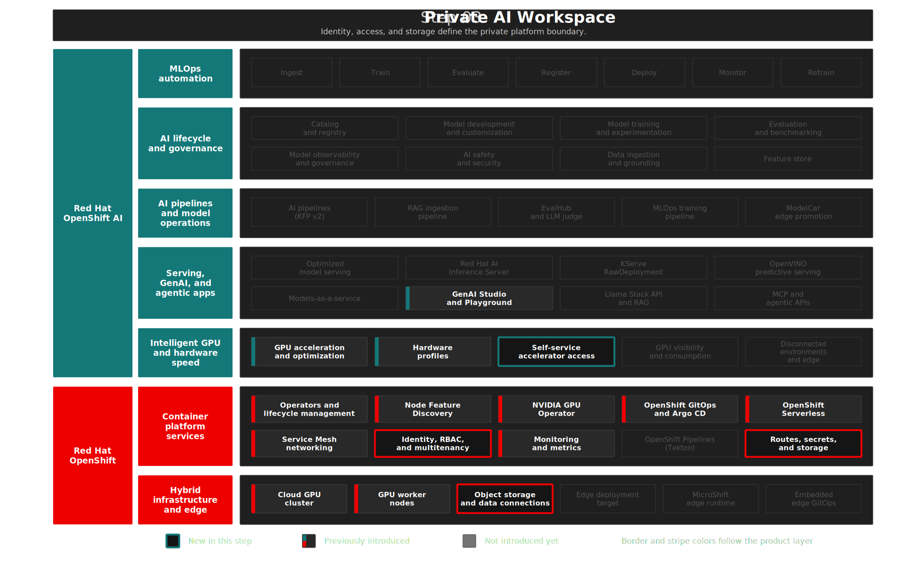

# Step 03: Enterprise Projects and Storage Foundation
**"From one shared sandbox to governed enterprise projects"** — create the project boundaries, shared object storage, role bindings, and queue entry point used by the rest of the demo.

## Overview

RHOAI 3.4 is the point where the demo stops treating every workload as one `private-ai` project. This step creates three enterprise projects with distinct responsibilities:

- `maas` for shared LLM serving and Model-as-a-Service endpoints.
- `enterprise-rag` for RAG, Llama Stack, MCP, guardrails, and GenAI evaluation.
- `enterprise-mlops` for predictive AI, pipelines, MLflow, TrustyAI, and workbenches.

The storage and identity story remains common across all three. MinIO provides the S3-compatible storage layer, RHOAI data connection secrets make that storage visible in the dashboard, and OpenShift RBAC maps `ai-admin` and `ai-developer` to the right project roles.

`maas` is the only Kueue-managed project in this slice. RHOAI 3.4 documents namespace-level Kueue enforcement, so this step deliberately avoids applying `kueue.openshift.io/managed=true` to `enterprise-rag` or `enterprise-mlops` until those workloads are made queue-aware.

Narrative alignment uses `/Users/adrina/Sandbox/rh-brain/Red Hat Brain/wiki/products/Red Hat OpenShift AI.md` for the enterprise platform framing. Configuration correctness is pinned to official RHOAI 3.4 and OCP 4.20 documentation.

## Architecture



```text
Enterprise AI Foundation
├── minio-storage       → shared S3-compatible object storage
├── maas                → LLM serving, MaaS endpoints, Kueue LocalQueue
├── enterprise-rag      → RAG, Llama Stack, MCP, guardrails, GenAI eval
├── enterprise-mlops    → predictive AI, pipelines, MLflow, TrustyAI
├── OAuth + HTPasswd    → ai-admin and ai-developer demo identities
└── RBAC                → admin/edit bindings in each enterprise project
```

| Component | Purpose | Namespace |
|-----------|---------|-----------|
| MinIO | S3-compatible storage for models, pipeline artifacts, RAG data, and MLflow artifacts | `minio-storage` |
| Data connections | Dashboard-visible S3 connection secrets | `maas`, `enterprise-rag`, `enterprise-mlops` |
| Storage config | KServe storage-initializer S3 credentials | `maas`, `enterprise-rag`, `enterprise-mlops` |
| Kueue queue | `maas-default` LocalQueue backed by `maas-gpu` ClusterQueue | `maas` |
| RBAC | `ai-admin` gets `admin`, `ai-developer` gets `edit` | all three enterprise projects |

Manifests: [`gitops/step-03-enterprise-projects/base/`](../../gitops/step-03-enterprise-projects/base/)

<details>
<summary>Design Decisions</summary>

> **Kueue only in `maas`:** RHOAI 3.4 queue enforcement applies to namespaces labeled `kueue.openshift.io/managed=true`. The label is applied only to `maas` because this slice moves GPU model serving there and adds a default LocalQueue. RAG and MLOps projects stay unlabelled until their Jobs, Notebooks, and controller-created workloads have explicit queue handling.

> **Shared MinIO, project-local connections:** The storage provider stays in `minio-storage`, but each enterprise project gets its own dashboard-visible connection and KServe storage config secret. That keeps the user experience project-scoped while avoiding three storage systems in a demo.

> **OpenShift Groups created by `deploy.sh`:** Groups are created at deploy time because Argo CD cannot reliably diff `user.openshift.io/v1 Group` resources.

> **No `opendatahub.io/managed` label on `storage-config`:** The RHOAI model controller deletes some secrets it did not create when that label is present. The dashboard connection secret keeps the managed label; the KServe storage config secret does not.

</details>

<details>
<summary>Deploy</summary>

```bash
./steps/step-03-enterprise-projects/deploy.sh
./steps/step-03-enterprise-projects/validate.sh
```

</details>

<details>
<summary>What to Verify</summary>

| Check | Pass Criteria |
|-------|---------------|
| MinIO | `minio` deployment ready in `minio-storage` |
| Projects | `maas`, `enterprise-rag`, and `enterprise-mlops` namespaces exist |
| Data connections | `minio-connection` exists in all three enterprise projects |
| Storage config | `storage-config` exists in all three enterprise projects |
| Kueue | `maas` has `kueue.openshift.io/managed=true` and `LocalQueue/maas-default` |
| RBAC | `ai-admin-admin` and `ai-developer-edit` exist in all three enterprise projects |

</details>

## The Demo

Start in the RHOAI dashboard as `ai-admin` and show the three projects. The story is no longer "one private AI namespace"; it is "one platform, multiple governed project surfaces."

Then log in as `ai-developer` and open each project. The same MinIO data connection appears in every project, but the workload purpose is now separated:

- MaaS consumers discover and call shared LLM endpoints.
- RAG builders work in `enterprise-rag` without owning the shared model-serving namespace.
- Predictive AI engineers use `enterprise-mlops` for model training, tracking, and pipeline work.

Finally, show that only `maas` is Kueue-managed:

```bash
oc get namespace maas -o jsonpath='{.metadata.labels.kueue\.openshift\.io/managed}'
oc get localqueue maas-default -n maas
```

## References

- [RHOAI 3.4 — Working with connections](https://docs.redhat.com/en/documentation/red_hat_openshift_ai_self-managed/3.4/html/working_on_projects/using-connections_projects)
- [RHOAI 3.4 — Managing workloads with Kueue](https://docs.redhat.com/en/documentation/red_hat_openshift_ai_self-managed/3.4/html/managing_openshift_ai/managing-workloads-with-kueue_kueue)
- [OCP 4.20 — Red Hat build of Kueue](https://docs.redhat.com/en/documentation/openshift_container_platform/4.20/html/ai_workloads/red-hat-build-of-kueue)
- `rh-brain`: `/Users/adrina/Sandbox/rh-brain/Red Hat Brain/wiki/products/Red Hat OpenShift AI.md`

## Next Steps

- **Step 04**: [Model Registry & Model Catalog](../step-04-model-registry/README.md) — enterprise model governance with a curated catalog and versioned registry.
