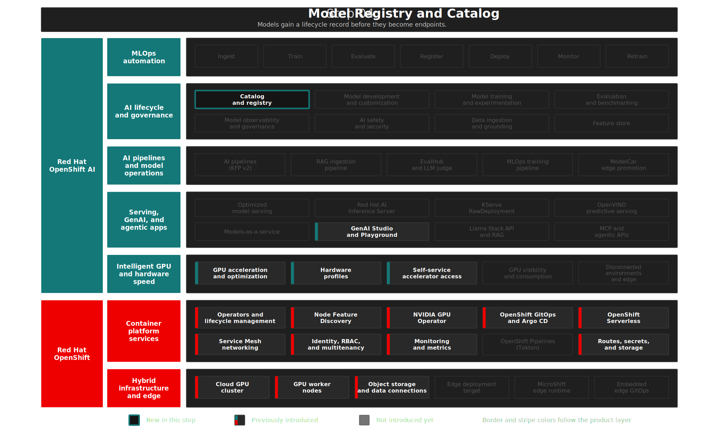

# Step 04: Model Registry & Model Catalog
**"Discover and Govern"** — Enterprise model governance — discover from the Catalog, govern through the Registry.

## Overview

Private AI extends to **models**: you need control over what is discovered, registered, and promoted — not only compute and tenancy. This step adds a **catalog** for discovery and a **registry** for lifecycle and accountability, closing the loop on *who* can serve *which* artifact *where*. **Red Hat OpenShift AI 3.3** pairs the **Model Catalog** (48+ Red Hat-validated models in OCI ModelCar format) with the **Model Registry** (versions, ownership, approval) — discover in the Catalog, govern in the Registry.

This step demonstrates RHOAI's **Catalog and registry** capability: centralized management for predictive and gen AI models, their metadata and artifacts. This completes the Private AI foundation — compute, platform, access, storage, and now model lifecycle.

## Architecture



### What Gets Deployed

```text
Model Governance
├── Model Catalog         → 48+ Red Hat-validated models (OCI ModelCar)
├── Model Registry        → Custom governance: versions, owners, approval status
├── MariaDB 10.11         → Registry metadata storage (5 Gi PVC)
├── Internal Service      → Unauthenticated endpoint for seed job automation
├── RBAC                  → ai-admin = full control, ai-developer = read-only
└── Seed Job              → Registers initial models on first deploy
```

| Component | Purpose | Namespace |
|-----------|---------|-----------|
| **Model Catalog** | 48+ Red Hat-validated models (OCI ModelCar), browse in GenAI Studio | platform-wide |
| **Model Registry** (`private-ai-registry`) | Custom governance: versions, owners, approval status | `rhoai-model-registries` |
| **MariaDB 10.11** | Registry metadata storage (5 Gi PVC) | `rhoai-model-registries` |
| **Internal Service** (`:8080`) | Unauthenticated endpoint for seed job automation | `rhoai-model-registries` |
| **RBAC** | `ai-admin` = full control, `ai-developer` = read-only | `rhoai-model-registries` |
| **Seed Job** | Registers initial models on first deploy | `rhoai-model-registries` |

Manifests: [`gitops/step-04-model-registry/base/`](../../gitops/step-04-model-registry/base/)

<details>
<summary>RHOAI and OCP Features in This Step</summary>

| | Feature | Status |
|---|---|---|
| RHOAI | Catalog and registry | Introduced |

<details>
</details>

<summary>Design Decisions</summary>

> **Model Catalog for discovery, Registry for governance:** The Catalog provides 48+ OCI-ready models for rapid deployment. The Registry adds custom metadata, versioning, and RBAC. In production, the ideal flow is: discover in Catalog → register for governance → deploy from Registry. Our demo uses OCI ModelCar for small models (Granite 8B FP8, Mistral INT4) pulled directly from the Red Hat Registry, and S3/MinIO for large BF16 models (>20GB) where OCI image layers may hit CRI-O overlay limits. Ref: [Working with the Model Catalog](https://docs.redhat.com/en/documentation/red_hat_openshift_ai_self-managed/3.3/html/working_with_the_model_catalog/).

> **External MariaDB instead of embedded:** Explicit PVC control and simpler backup/restore for the demo.

> **Internal service on port 8080:** Bypasses OAuth so Kubernetes Jobs can seed models without token negotiation.

> **PVC sync wave aligned with consumer:** The MariaDB PVC (`model-registry-db-pvc`) uses sync wave `"2"` — the same wave as the MariaDB Deployment. With `WaitForFirstConsumer` storage class, a PVC in an earlier wave than its consumer creates a deadlock: ArgoCD waits for the PVC to become Healthy (Bound), but binding requires a pod to schedule, and the pod is in a later wave that hasn't started. Placing both in the same wave eliminates this.

</details>

<details>
<summary>Deploy</summary>

```bash
./steps/step-04-model-registry/deploy.sh      # ArgoCD app: registry + MariaDB + RBAC + seed job
./steps/step-04-model-registry/validate.sh     # Verify CR status, seed job, API health
```

</details>

<details>
<summary>What to Verify After Deployment</summary>

| Check | What It Tests | Pass Criteria |
|-------|--------------|---------------|
| MariaDB running | Registry metadata storage | 1 pod Running in `rhoai-model-registries` |
| ModelRegistry CR | `private-ai-registry` resource | CR exists |
| Registry pods | Application pods running | At least 1 Running |
| Seed job | Initial model registration | Succeeded (may be cleaned up by TTL) |
| Internal service | Unauthenticated endpoint | `private-ai-registry-internal` on port 8080 |

</details>

## The Demo

> In this demo, we explore both sides of model governance — the Model Catalog for discovery and the Model Registry for lifecycle management. We see 48+ validated models ready to deploy, a registered model with version metadata, and role-based access that separates model administrators from consumers.

**Credentials:** `ai-admin` / `redhat123` · `ai-developer` / `redhat123`

### Model Catalog — 48+ Validated Models

> Before teams can serve models, they need to find them. The Model Catalog provides a curated library of Red Hat-validated models — tested against the platform, available with no external dependencies.

1. Log in as `ai-developer`
2. Navigate to **GenAI Studio → AI Available Assets**

**Expect:** A catalog page showing 48+ pre-bundled models grouped by provider — IBM Granite, Meta Llama, Mistral, Qwen, phi-4, DeepSeek, Gemma. Each card shows parameter count, license, and recommended hardware.

> Over 48 models in OCI ModelCar format, ready to deploy with the cluster's pull secret. No HuggingFace account needed, no external downloads, no supply chain concerns. This is Red Hat OpenShift AI's curated model catalog — the starting point for any AI project.

### Registered Model — Granite 3.1 8B

> The Catalog is for discovery. The Registry is for governance. When a model is approved for production use, it gets registered with version metadata, ownership, and an artifact path — creating the audit trail that compliance teams require.

1. Switch to `ai-admin`
2. Navigate to **Settings → Model registries → private-ai-registry**

**Expect:** The Granite 3.1 8B Instruct FP8 model appears — registered by the automated seed job during deployment.

> The admin team has registered Granite with version metadata, owner, and an artifact path pointing to internal S3. This is the audit trail — who approved what, when, and where it's stored. Every model in production should pass through this registry.

### Access Control — Admin vs Developer

> Model governance requires separation of duties. Administrators control what enters the registry. Developers consume only what has been vetted — no shadow AI, no untracked models in production.

1. In the `ai-admin` session, show registry management — register, archive, delete
2. Switch to `ai-developer` — observe read-only view

**Expect:** `ai-admin` has full registry management capabilities. `ai-developer` sees the same models but cannot register, modify, or delete — read-only access.

> Admins control what enters the registry. Developers consume only what has been vetted. This separation of duties — built into the platform with OpenShift RBAC — is how organizations prevent shadow AI and maintain model governance at scale.

## Key Takeaways

**For business stakeholders:**

- Give teams a trusted way to discover and approve models
- Reduce shadow AI and ad hoc model handling
- Add accountability to model ownership, approval, and promotion

**For technical teams:**

- Use the catalog for discovery and the registry for lifecycle governance
- Track model versions, ownership, and approval state in one place
- Reuse the same model governance flow across predictive and generative AI

<details>
<summary>Troubleshooting</summary>

### MariaDB pod stuck in Pending

**Symptom:** `model-registry-db` pod is Pending with `unbound immediate PersistentVolumeClaims`.

**Root Cause:** PVC is in an earlier sync wave than the Deployment. With `WaitForFirstConsumer` storage class, the PVC cannot bind without a consuming pod.

**Solution:** Both PVC and Deployment are now in sync wave `"2"`. If the issue recurs, verify:
```bash
oc get pvc model-registry-db-pvc -n rhoai-model-registries -o jsonpath='{.metadata.annotations.argocd\.argoproj\.io/sync-wave}'
# Expected: "2"
```

### Seed job fails with connection refused

**Symptom:** `model-registry-seed` job logs show `Connection refused` to the registry internal service.

**Root Cause:** Registry pods not yet ready when the seed job runs.

**Solution:** The seed job retries. If it exhausts retries, wait for registry pods to be Running and recreate:
```bash
oc wait pods -l app=private-ai-registry -n rhoai-model-registries --for=condition=Ready --timeout=120s
oc delete job model-registry-seed -n rhoai-model-registries
oc apply -f gitops/step-04-model-registry/base/seed-job.yaml
```

### Model Registry not visible in Dashboard

**Symptom:** Model Registry doesn't appear in RHOAI Dashboard under Settings.

**Root Cause:** The `modelregistry` component may not be `Managed` in the DataScienceCluster.

**Solution:**
```bash
oc get datasciencecluster default-dsc -o jsonpath='{.spec.components.modelregistry.managementState}'
# Expected: Managed
```

</details>

## References

- [Working with the Model Catalog](https://docs.redhat.com/en/documentation/red_hat_openshift_ai_self-managed/3.3/html/working_with_the_model_catalog/)
- [Deploying a Model from the Catalog](https://docs.redhat.com/en/documentation/red_hat_openshift_ai_self-managed/3.3/html/working_with_the_model_catalog/deploying-a-model-from-the-model-catalog_working-model-catalog)
- [Working with Model Registries](https://docs.redhat.com/en/documentation/red_hat_openshift_ai_self-managed/3.3/html-single/working_with_model_registries/working_with_model_registries)
- [Managing Model Registries](https://docs.redhat.com/en/documentation/red_hat_openshift_ai_self-managed/3.3/html-single/managing_model_registries/index)
- [Red Hat OpenShift AI — Product Page](https://www.redhat.com/en/products/ai/openshift-ai)
- [Red Hat OpenShift AI — Datasheet](https://www.redhat.com/en/resources/red-hat-openshift-ai-hybrid-cloud-datasheet)
- [Get started with AI for enterprise organizations — Red Hat](https://www.redhat.com/en/resources/artificial-intelligence-for-enterprise-beginners-guide-ebook)

## Next Steps

- **Step 05**: [LLM Serving on vLLM](../step-05-llm-on-vllm/README.md) — Deploy models as live inference endpoints and validate in the GenAI Playground
