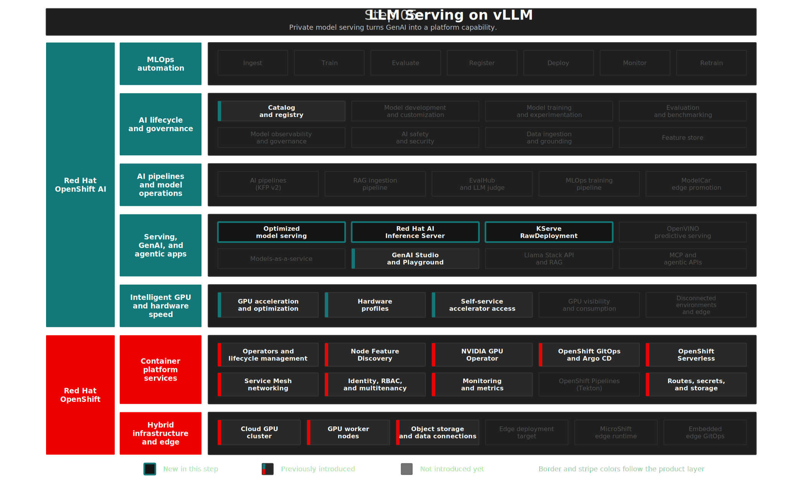

# Step 05: MaaS Model Serving on vLLM
**"Shared LLMs as a governed internal service"** — serve Red Hat-validated LLMs in the `maas` project, expose them to GenAI users, and prepare them for RHOAI 3.4 Models-as-a-Service workflows.

## Overview

This step moves LLM serving out of the old shared project model and into `maas`, the dedicated namespace for shared model endpoints. The active implementation uses KServe `Standard` deployment mode with the Red Hat AI Inference Server powered by vLLM, and the platform posture is now RHOAI 3.4 MaaS-ready:

- `kserve.modelsAsService.managementState: Managed` is enabled in the DSC.
- The dashboard exposes Model Catalog, Model Registry, GenAI Studio, MaaS, MLflow, and Kueue controls.
- `maas` is the only Kueue-managed workload namespace in this slice.
- InferenceServices carry `kueue.x-k8s.io/queue-name: maas-default`.

MaaS governance resources are treated as verified-GitOps only. The live cluster exposes MaaS CRDs such as `MaaSModelRef`, `MaaSSubscription`, and `MaaSAuthPolicy`; this first remediation batch does not commit them until the supported binding from the active KServe `InferenceService` endpoints to MaaS model references is documented and schema-verified. The demo uses the supported dashboard/API workflow and records the GitOps gap instead of inventing manifests.

Narrative alignment uses `/Users/adrina/Sandbox/rh-brain/Red Hat Brain/wiki/configurations/OpenShift AI vLLM and llm-d Inference Baseline.md` and `/Users/adrina/Sandbox/rh-brain/Red Hat Brain/raw/A guide to Models-as-a-Service.md`. API correctness stays pinned to official RHOAI 3.4 and OCP 4.20 docs.

## Architecture



```text
MaaS Model Serving
├── maas namespace
├── vLLM ServingRuntime
├── granite-8b-agent InferenceService      → 1 GPU, OCI ModelCar, FP8
├── mistral-3-bf16 InferenceService        → 4 GPUs, S3/MinIO, BF16
├── deploy.sh upload helper                → one-shot Mistral sync into MinIO
├── maas-default LocalQueue                → Kueue admission for MaaS workloads
└── enterprise-ai-registry links           → model/version metadata
```

| Model | GPUs | Source | Use Case | Namespace |
|-------|------|--------|----------|-----------|
| `granite-8b-agent` | 1 L4 | OCI ModelCar | RAG, MCP tools, guardrails, agentic workflows | `maas` |
| `mistral-3-bf16` | 4 L4 | S3/MinIO | Enterprise chat, benchmarking, evaluation judge | `maas` |

Manifests: [`gitops/step-05-maas-model-serving/base/`](../../gitops/step-05-maas-model-serving/base/)

<details>
<summary>Design Decisions</summary>

> **MaaS namespace boundary:** LLM runtime ownership is separated from RAG and MLOps workloads. RAG consumers call `*.maas.svc.cluster.local` endpoints, but do not own serving runtime resources.

> **Verified GitOps for MaaS governance:** RHOAI 3.4 release notes classify MaaS as Generally Available, while some MaaS subfeatures remain Technology Preview or Developer Preview. This repo only commits MaaS governance resources that are documented and schema-verified against the installed CRDs. Subscription-plan and publish-endpoint resources remain documented/deferred until the KServe-to-MaaS binding is explicit enough for repeatable GitOps.

> **Kueue on MaaS only:** Queue enforcement applies only to `maas`; every GitOps-managed model-serving workload in this namespace is labeled for `maas-default`.

> **OCI ModelCar for small models, S3 for large models:** Granite uses OCI ModelCar from `registry.redhat.io`. Mistral BF16 uses S3/MinIO because the model is large enough that object storage remains the safer demo path.

> **Upload helper outside Argo desired state:** The Mistral upload PVC and Job are applied by `deploy.sh` before the Argo CD app syncs. They are not part of the steady-state Kustomize base because bound PVC specs do not safely round-trip through GitOps after dynamic provisioning.

> **Recreate deployment strategy:** LLM InferenceServices use `deploymentStrategy.type: Recreate` to avoid double-allocating scarce L4 GPUs during updates.

> **Fixed serving capacity:** These demo endpoints set KServe autoscaling scale-down policy to `Disabled`. That keeps long cold-starting GPU models from being scaled down by generated HPAs before metrics samples exist.

</details>

<details>
<summary>Deploy</summary>

```bash
./steps/step-05-maas-model-serving/deploy.sh
./steps/step-05-maas-model-serving/validate.sh
```

</details>

<details>
<summary>What to Verify</summary>

| Check | Pass Criteria |
|-------|---------------|
| Namespace | `maas` exists and is Kueue-managed |
| Queue | `LocalQueue/maas-default` exists in `maas` |
| Runtime | vLLM `ServingRuntime` exists in `maas` |
| Models | `granite-8b-agent` and `mistral-3-bf16` InferenceServices exist |
| AI asset endpoints | Models carry `opendatahub.io/dashboard=true` and `opendatahub.io/genai-asset=true` |
| Registry linkage | deployed models have model registry labels after `deploy.sh` linking |
| Playground | deployed model appears in GenAI Playground / AI assets |

```bash
oc get localqueue maas-default -n maas
oc get servingruntime -n maas
oc get inferenceservice -n maas
oc get inferenceservice -n maas -o custom-columns=NAME:.metadata.name,DASHBOARD:.metadata.labels.opendatahub\.io/dashboard,GENAI:.metadata.labels.opendatahub\.io/genai-asset
oc get pods -n maas -l serving.kserve.io/inferenceservice -o wide
```

</details>

## The Demo

Start with the `maas` project in the RHOAI dashboard. The first message is governance: shared LLM endpoints now live in a platform-owned namespace, not inside the RAG or predictive AI teams' projects.

Then open GenAI Studio and select a running model. The user experience is simple, but the platform story is richer:

- Model metadata comes from the enterprise registry.
- Serving is backed by vLLM/KServe.
- GPU placement is explicit through hardware profiles and node selectors.
- MaaS is enabled for governed publishing and consumption.
- Kueue admission is scoped to this serving namespace.

For API validation:

```bash
oc exec deploy/granite-8b-agent-predictor -n maas -c kserve-container -- \
  curl -s http://localhost:8080/v1/models
```

### Product Playground Model Comparison

> The Red Hat product UI should be part of the demo, not only the custom ACME chatbot. Here we prove that the same governed endpoints can be compared directly in GenAI Studio before developers package them into an application.

1. Open **GenAI Studio** → **Playground**
2. Create a new playground in the `maas` project
3. Add `granite-8b-agent` in the first chat instance
4. Add `mistral-3-bf16` in a second chat instance
5. Set temperature to `0.1` and leave streaming enabled so the comparison is deterministic and visibly responsive
6. Use the same prompt in both panes:

```text
Explain how a governed private AI platform should expose shared LLMs to application teams.
```

**Expect:** Both models answer from the RHOAI Dashboard. Granite is the lower-cost agentic model used later for RAG/MCP; Mistral is the larger model used for enterprise chat, benchmarking, and evaluation judging.

> Product-native comparison lets platform teams discuss cost, latency, model quality, and governance before an application is built. The same assets are then reused by the Step 07 chatbot, Step 08 evaluation jobs, and Step 10 MCP workflow.

For cluster-side readiness before presenting this scene:

```bash
./scripts/validate-genai-playground-readiness.sh
```

## References

- [RHOAI 3.4 — Deploy large models with KServe](https://docs.redhat.com/en/documentation/red_hat_openshift_ai_self-managed/3.4/html/deploying_models/deploying-large-models_serving-large-models)
- [RHOAI 3.4 — Govern LLM access with Models-as-a-Service](https://docs.redhat.com/en/documentation/red_hat_openshift_ai_self-managed/3.4/html/govern_llm_access_with_models-as-a-service/deploy-and-manage-models-as-a-service_maas)
- [RHOAI 3.4 — GenAI Playground prerequisites](https://docs.redhat.com/en/documentation/red_hat_openshift_ai_self-managed/3.4/html/experimenting_with_models_in_the_gen_ai_playground/playground-prerequisites_rhoai-user)
- `rh-brain`: `/Users/adrina/Sandbox/rh-brain/Red Hat Brain/wiki/configurations/OpenShift AI vLLM and llm-d Inference Baseline.md`
- `rh-brain`: `/Users/adrina/Sandbox/rh-brain/Red Hat Brain/raw/A guide to Models-as-a-Service.md`

## Next Steps

- **Step 06**: [Model Performance Metrics](../step-06-model-metrics/README.md) — Grafana dashboards and GuideLLM benchmarks for MaaS endpoints.
- **Step 07**: [Enterprise RAG](../step-07-rag/README.md) — RAG workloads consume shared MaaS endpoints from `enterprise-rag`.
