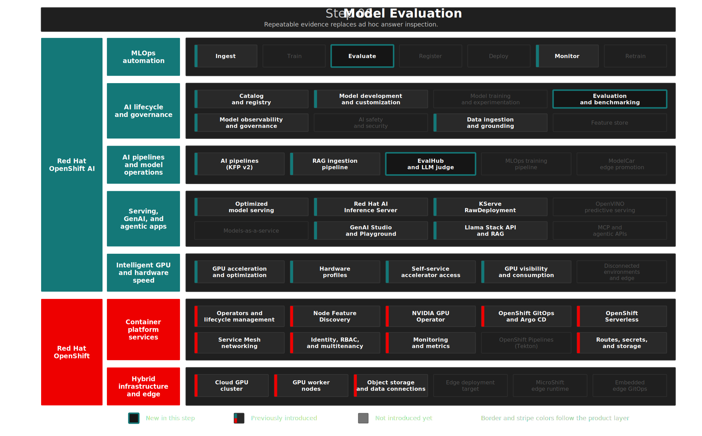

# Step 08: Model Evaluation
**"Trust but Verify"** — Introduce EvalHub as the product-native evaluation control plane, then quantify RAG value and model quality with repeatable evidence.

## Overview

Building on **RAG** from Step 07 — within the same governed platform — this step adds **evaluation**: quantifying how much document grounding improves answers versus the base model, benchmarking deployed models on standard tasks, and submitting a product-native EvalHub job. That is how teams move from "it feels right" to evidence stakeholders and compliance can review.

**Red Hat OpenShift AI 3.4 introduces EvalHub as a Technology Preview evaluation control plane.** EvalHub replaces one-off benchmark scripts with a unified, cluster-native service: a versioned REST API, SDK and CLI access, tenant-scoped authorization, curated and custom evaluation providers, isolated Kubernetes Jobs for each benchmark, MLflow result tracking, and optional OCI result export. In this demo, EvalHub becomes the first-class entry point for standardized LLM evaluation, while the existing KFP RAG evaluation remains the richer application-specific quality harness.

This step demonstrates RHOAI's **Evaluation** capability — repeatable scoring and benchmarking for models and RAG pipelines — while reusing **AI pipelines**, **MLflow**, and **Model observability and governance** to make model quality measurable before production deployment.

### EvalHub in This Demo

EvalHub is intentionally introduced as the control plane, not just another benchmark runner:

| EvalHub capability | Demo implementation |
|--------------------|---------------------|
| Unified REST API | `run-evalhub-smoke.sh` calls health, provider, benchmark, job submit, and job status APIs. |
| SDK/CLI-ready workflow | README commands use REST today; CLI/SDK use is documented as the same tenant/job workflow. |
| Framework-agnostic providers | The EvalHub CR mounts provider ConfigMaps labeled `lm-evaluation-harness`, `garak`, `guidellm`, and `lighteval`; the REST API exposes the LM-Eval provider as `lm_evaluation_harness`. |
| Tenant isolation | Requests use `X-Tenant: enterprise-rag`; validation checks namespace label, tenant resources, and RBAC. |
| Kubernetes-native execution | EvalHub runs benchmark work as tenant-scoped Kubernetes Jobs, separate from the server. |
| MLflow evidence | Smoke jobs use experiment `evalhub-granite-smoke`; RAG KFP runs log deeper scenario evidence. |
| Governance extensions | OCI result export, custom providers/collections, and agent-discoverable evaluation access are tracked as follow-on items until implemented and schema-validated. |

## Architecture



### What Gets Deployed

```text
Model Evaluation
├── EvalHub (TrustyAI-managed product-native evaluation)
│   ├── EvalHub CR           → TrustyAI-managed API server and route
│   ├── PostgreSQL           → Durable EvalHub job and registry state
│   ├── Provider registry    → lm-evaluation-harness, garak, guidellm, lighteval
│   ├── Tenant RBAC          → enterprise-rag X-Tenant isolation and SAR checks
│   └── run-evalhub-smoke.sh → Submit granite-8b-agent smoke job with MLflow experiment
├── RAG Evaluation (KFP Pipeline — 4 steps)
│   ├── scan_tests           → Discover *_tests.yaml configs from PVC
│   ├── run_and_score_tests  → Execute RAG agent, score via LLM-as-judge, HTML reports
│   ├── eval_summary         → Aggregate results, log pre/post RAG quality + improvement
│   ├── log_rag_mlflow       → Persist metrics, params, tags, references, and JSON evidence
│   ├── run-rag-eval.sh      → Launch via KFP (platform-native, tracked in DSPA)
│   ├── run-eval-report.sh   → Quick eval via lsd-rag pod (debug/demo)
│   └── HTML + MLflow        → Per-scenario reports in MinIO and run evidence in MLflow
├── Standard Benchmarks (LM-Eval)
│   ├── LMEvalJob CRs        → TrustyAI-managed benchmark jobs
│   └── run-lmeval.sh        → Trigger on-demand benchmarks
└── Dependencies
    ├── Candidate model      → Agent model (step-05) generates answers
    ├── Judge model          → Larger model (step-05) evaluates quality
    ├── lsd-rag + pgvector   → RAG infrastructure (step-07)
    └── MLflow server        → Cluster-scoped Step 12 server for EvalHub + KFP evidence
```

| Component | Purpose | Namespace |
|-----------|---------|-----------|
| **EvalHub CR** | Technology Preview evaluation API reconciled by TrustyAI Operator | `evalhub-system` |
| **EvalHub PostgreSQL** | Durable EvalHub database using RHEL 9 PostgreSQL 16 | `evalhub-system` |
| **EvalHub Route** | External API route for health, provider listing, and job submission | `evalhub-system` |
| **EvalHub tenant RBAC** | Allows selected users/groups to submit tenant-scoped jobs | `enterprise-rag` |
| **`run-evalhub-smoke.sh`** | Submit a small EvalHub job against `granite-8b-agent` | `enterprise-rag` tenant |
| **Test YAMLs** | Version-controlled Q&A pairs with expected answers | `enterprise-rag` (ConfigMaps) |
| **`run-rag-eval.sh`** | Launch KFP RAG eval pipeline | `enterprise-rag` |
| **`run-eval-report.sh`** | Quick eval via lsd-rag pod (debug/demo) | `enterprise-rag` |
| **`run-lmeval.sh`** | Trigger LM-Eval standard benchmarks | `enterprise-rag` |
| **MLflowConfig** | Project-specific artifact root for RAG evaluation runs | `enterprise-rag` |
| **LMEvalJob CRs** | TrustyAI-managed benchmark jobs | `enterprise-rag` |
| **HTML + MLflow Evidence** | Per-scenario HTML reports in MinIO plus MLflow metrics/artifacts | `minio-storage`, `enterprise-rag` workspace |

Manifests: [`gitops/step-08-model-evaluation/base/`](../../gitops/step-08-model-evaluation/base/)

<details>
<summary>RHOAI and OCP Features in This Step</summary>

| | Feature | Status |
|---|---|---|
| RHOAI | Evaluation (LM-Eval, LLM-as-Judge) | Introduced |
| RHOAI | EvalHub | Technology Preview; introduced as the evaluation control plane |
| RHOAI | Model observability and governance | Used |
| RHOAI | AI pipelines (KFP v2) | Used |
| RHOAI | MLflow tracking server | Technology Preview; Step 12 prerequisite for EvalHub |
| RHOAI | Gen AI Studio Prompts | Technology Preview; prompt identity is logged as MLflow run metadata |
| RHOAI | Optimized model serving (judge model) | Used |

#### Scoring Scale (RAG Evaluation)

| Score | Meaning | Color | Quality |
|-------|---------|-------|---------|
| **(A)** | Exact match — same key facts | Green | Best |
| **(B)** | Superset — all expected points plus additional correct detail | Green | Great |
| **(C)** | Subset — covers some but not all expected points | Yellow | Partial |
| **(D)** | Minor differences that don't affect factual accuracy | Grey | Okay |
| **(E)** | Disagrees with or contradicts the expected response | Red | Fail |

</details>

<details>
<summary>Design Decisions</summary>

> **Two separate models for RAG eval:** `granite-8b-agent` as candidate, `mistral-3-bf16` as judge. Using the same small model for both roles causes hallucinated judgments — it injects biases instead of faithfully comparing texts.

> **Identical test sets:** Pre-RAG and Post-RAG use the same questions and expected answers. The only variable is document context. The score difference directly quantifies RAG value.

> **Judge model hardcoded in pipeline:** `mistral-3-bf16` is called directly via its vLLM endpoint (`http://mistral-3-bf16-predictor.maas.svc.cluster.local:8080/v1/chat/completions`). This bypasses LlamaStack's scoring API for more reliable A–E grading.

> **Two eval scripts coexist:** `run-rag-eval.sh` (KFP pipeline, platform-native, tracked) and `run-eval-report.sh` (quick pod-based, localhost access, simpler debugging). KFP is the primary path; the shell script is the fast demo path.

> **Tests in GitOps:** Test YAMLs deploy as ConfigMaps via ArgoCD. A PostSync Job copies them to the shared PVC for the KFP pipeline. `run-eval-report.sh` copies them directly to the lsd-rag pod.

> **LM-Eval via LMEvalJob CR:** RHOAI 3.4's native evaluation service, managed by the TrustyAI operator. Templates are stored in `gitops/step-08-model-evaluation/base/lmeval/` and applied on demand.

> **EvalHub is Technology Preview.** RHOAI 3.4 introduces EvalHub for early access to a unified evaluation control plane. It is appropriate for this demo and for evaluation workflow design, but production positioning must keep Red Hat Technology Preview support limits visible.

> **EvalHub two-layer control plane.** The TrustyAI Operator reconciles the declarative `EvalHub` custom resource into the API server, service, route, provider mounts, and runtime environment. The EvalHub server is the second control plane: it accepts `/api/v1/evaluations/...` requests, validates tenant-scoped requests, stores job state, creates isolated Kubernetes Jobs in the tenant namespace, and aggregates results. The official RHOAI docs remain the source of truth for API fields, RBAC, and configuration.

> **Demo database credential.** The EvalHub PostgreSQL Secret is committed with placeholder demo values so Argo CD can build a complete workshop environment without a separate secret manager. The manifest header includes the replacement command, and production use must replace both `database-password` and `db-url` through an external secret mechanism or a pre-created OpenShift Secret.

> **MLflow as experiment memory.** RHOAI 3.4 documents MLflow as EvalHub's experiment tracker. This step sets `MLFLOW_TRACKING_URI`, `MLFLOW_WORKSPACE=enterprise-rag`, and `MLFLOW_INSECURE_SKIP_VERIFY=true` for the demo cluster's self-signed internal service. The EvalHub service account is bound to `mlflow-operator-mlflow-integration` in `enterprise-rag` so the server's projected MLflow token can create and read smoke-test experiments. The EvalHub smoke job uses experiment name `evalhub-granite-smoke`, while the KFP RAG evaluation still logs richer scenario-level evidence to the `enterprise-rag` experiment.

> **Prompt versions are evaluation inputs.** RHOAI 3.4 Gen AI Studio stores reusable system instructions as project-scoped Prompts. Step 08 accepts prompt metadata (`PROMPT_NAME`, `PROMPT_VERSION`, `PROMPT_ALIAS`, `PROMPT_SOURCE`, `PROMPT_COMMIT_MESSAGE`) and logs it to MLflow with the scenario quality metrics. `PROMPT_ALIAS` is a demo promotion label, not a required RHOAI UI field. This keeps prompt iteration auditable without claiming direct runtime loading from the Prompt Registry.

> **Tenant label uses the official empty value.** The Red Hat Developer article uses a simplified `tenant=true` explanation, but the RHOAI 3.4 docs specify `evalhub.trustyai.opendatahub.io/tenant=` and state that the empty value is intentional. The operator checks label presence, not label value.

> **EvalHub gaps intentionally deferred.** OCI result export, custom/BYOF providers, CLI/SDK demo profiles, EvalHub MCP-style agent access, richer OTEL/Prometheus dashboards, and multi-replica scaling are future enhancements. The first implementation proves product-native server deployment, tenant setup, provider discovery, job submission, Kubernetes job isolation, and MLflow result linkage.

> **Configurable sample limits:** LMEvalJob templates default to 50 samples per task for fast demo runs (~10 min). Increase via CLI (`run-lmeval.sh model 200`) or remove for full benchmarks.

> **Depends on step-07 vector stores.** Post-RAG evaluation retrieves context from `acme_corporate` and `whoami` vector stores. Run step-07 ingestion pipelines first.

</details>

<details>
<summary>Deploy</summary>

```bash
./steps/step-12-mlops-pipeline/validate.sh     # Step 12 MLflow prerequisite
./steps/step-08-model-evaluation/deploy.sh     # ArgoCD app + EvalHub smoke + KFP eval
./steps/step-08-model-evaluation/validate.sh   # Verify EvalHub, RAG eval, LM-Eval, MLflow evidence
```

Additional operations:

```bash
# RAG Evaluation
./steps/step-08-model-evaluation/run-evalhub-smoke.sh [run_id] # EvalHub product-native smoke job
./steps/step-08-model-evaluation/run-rag-eval.sh [run_id]   # KFP pipeline (tracked in DSPA)
./steps/step-08-model-evaluation/run-eval-report.sh          # Quick eval via lsd-rag pod
./steps/step-07-rag/run-batch-ingestion.sh acme --eval       # Trigger eval after ingestion

# Evaluate a Gen AI Studio prompt version
PROMPT_NAME=acme-rag-agentic \
PROMPT_VERSION=v1 \
PROMPT_ALIAS=staging \
PROMPT_SOURCE=rhoai-gen-ai-studio-prompts \
PROMPT_COMMIT_MESSAGE="Initial agentic RAG prompt" \
./steps/step-08-model-evaluation/run-rag-eval.sh prompt-agentic-v1

# Standard Model Evaluation (LM-Eval)
./steps/step-08-model-evaluation/run-lmeval.sh granite-8b-agent      # 50 samples (~10 min)
./steps/step-08-model-evaluation/run-lmeval.sh granite-8b-agent 200  # 200 samples (~30 min)
./steps/step-08-model-evaluation/run-lmeval.sh mistral-3-bf16        # Benchmark second model
```

</details>

<details>
<summary>What to Verify After Deployment</summary>

| Check | What It Tests | Pass Criteria |
|-------|--------------|---------------|
| ArgoCD sync | App synced and healthy | Synced / Healthy |
| Target context | API server access, optional guard | `oc whoami --show-server`; set `RHOAI_EXPECTED_API_SERVER` to enforce a specific cluster |
| RHOAI readiness | `rhods-operator.3.4.0`, DSC Ready, EvalHub CRD | All present |
| Step 12 MLflow | Cluster-scoped MLflow server | Available=True |
| EvalHub server | CR, PostgreSQL, service, route, health | Ready + HTTP 200 |
| EvalHub tenant | Namespace label and operator-created tenant resources | Present |
| EvalHub RBAC | Users/groups can create virtual `evaluations` | SubjectAccessReview returns allowed |
| EvalHub runtime RBAC | EvalHub service account can create tenant ConfigMaps and Jobs; benchmark Jobs have tenant service account, CA bundle, MLflow, and callback access | Product TrustyAI roles are bound in `enterprise-rag` and `evalhub-system` |
| EvalHub MLflow RBAC | EvalHub service account can reach the tenant MLflow workspace | Internal MLflow search returns HTTP 200 |
| EvalHub providers | REST provider registry | Includes `lm_evaluation_harness` |
| EvalHub smoke | Latest smoke job | `completed` plus MLflow experiment URL |
| Eval ConfigMaps | eval-configs and eval-test-cases | Both present |
| Eval provider | LlamaStack eval provider registered | At least 1 provider |
| Judge model | mistral-3-bf16 InferenceService | READY=True |
| LM-Eval config | DataScienceCluster LM-Eval permissions | `permitOnline: allow` |
| RAG eval reports | HTML reports in MinIO | Latest report within `DEMO_FRESHNESS_HOURS` |
| MLflow workspace | `enterprise-rag` MLflowConfig and pipeline RoleBinding | Present |
| MLflow run evidence | Latest `enterprise-rag` KFP run tagged `rhoai.demo.step=08` | Fresh finished run |
| LM-Eval runs | LMEvalJob CRs | Recent completed job per model |

> **Pre-merge branch validation:** While this branch is under test, the Step 08 ArgoCD `Application` is pinned to `targetRevision: feat/step-08-evalhub` so live validation uses the branch contents. Restore the Application manifest to `targetRevision: main` before merging to trunk.

```bash
oc get applications.argoproj.io step-08-model-evaluation -n openshift-gitops \
  -o jsonpath='{.status.sync.status} / {.status.health.status}'

oc get subscription rhods-operator -n redhat-ods-operator \
  -o jsonpath='{.status.installedCSV}'

oc get evalhub evalhub -n evalhub-system \
  -o jsonpath='{.status.phase} {.status.url}'

EVALHUB_URL=https://$(oc get route evalhub -n evalhub-system -o jsonpath='{.spec.host}')
TOKEN=$(oc whoami -t)
curl -sk -H "Authorization: Bearer $TOKEN" -H "X-Tenant: enterprise-rag" \
  "$EVALHUB_URL/api/v1/evaluations/providers" | \
  python3 -c "import json,sys; print([p['resource']['id'] for p in json.load(sys.stdin)['items']])"

oc get configmap eval-configs eval-test-cases -n enterprise-rag

oc exec deploy/lsd-rag -n enterprise-rag -- \
  curl -s http://localhost:8321/v1/providers | \
  python3 -c "import json,sys; print([p['provider_id'] for p in json.load(sys.stdin)['data'] if p['api']=='eval'])"

oc get inferenceservice mistral-3-bf16 -n maas \
  -o jsonpath='{.status.conditions[?(@.type=="Ready")].status}'

oc get datasciencecluster default-dsc \
  -o jsonpath='{.spec.components.trustyai.eval.lmeval.permitOnline}'

oc get mlflowconfig mlflow -n enterprise-rag \
  -o jsonpath='{.spec.artifactRootPath}'
```

</details>

## The Demo

> In this demo, we quantify the value of RAG by comparing the same questions with and without document context, then run industry-standard benchmarks to baseline model reasoning capabilities — proving that evaluation is a platform capability, not an afterthought.

### The Problem — Pre-RAG Hallucination

> We start by asking the LLM about ACME Corp without RAG context. This establishes the baseline: what does the model think it knows when it has no access to your documents?

1. Ask the LLM about ACME Corp without RAG context:

```bash
oc exec deploy/lsd-rag -n enterprise-rag -- curl -s -X POST http://localhost:8321/v1/chat/completions \
  -H "Content-Type: application/json" \
  -d '{"model":"vllm-inference/granite-8b-agent",
       "messages":[{"role":"user","content":"What is ACME Corp?"}],
       "max_tokens":200,"temperature":0,"stream":false}' | \
  python3 -c "import json,sys; print(json.load(sys.stdin)['choices'][0]['message']['content'][:300])"
```

**Expect:** The model falls back to internet training data — "ACME Corp is a fictional company from cartoons."

> Without documents, the model hallucinates. It thinks ACME is a cartoon company, not our semiconductor client. This is the gap RAG fills — and evaluation measures.

### Product-Native EvalHub Smoke

> EvalHub demonstrates the RHOAI 3.4 product-native evaluation path: one API, tenant-scoped authorization, provider discovery, isolated Kubernetes evaluation Jobs, and MLflow experiment tracking.

1. Run the EvalHub smoke job:

```bash
./steps/step-08-model-evaluation/run-evalhub-smoke.sh
```

**Expect:** The script checks `/api/v1/health`, lists `/api/v1/evaluations/providers`, verifies provider ID `lm_evaluation_harness`, submits the `arc_easy` benchmark by benchmark `id` against `granite-8b-agent`, passes tokenizer `ibm-granite/granite-3.1-8b-instruct`, and polls until the job reaches a terminal state. A successful run prints the EvalHub `results` object and `results.mlflow_experiment_url`.

> This is intentionally scoped to one provider benchmark. It proves the EvalHub control plane and tenant path without replacing the richer KFP RAG quality harness or the longer `LMEvalJob` benchmarks. The demo message is that standardized provider benchmarks, custom application evaluations, and MLflow evidence can coexist under one RHOAI evaluation story.

### Run RAG Evaluation

> Now we run the evaluation pipeline to systematically compare pre-RAG and post-RAG answers across all test questions. The same questions, the same expected answers — the only variable is document context.

1. Run the evaluation:

```bash
# Option A: Quick eval via lsd-rag pod (faster, good for demos)
./steps/step-08-model-evaluation/run-eval-report.sh

# Option B: KFP pipeline (platform-native, tracked in DSPA)
./steps/step-08-model-evaluation/run-rag-eval.sh
```

**Expect:** A 4-step pipeline: `scan_tests` → `run_and_score_tests` → `eval_summary` → `log_rag_mlflow`. The summary step logs pre/post-RAG quality and RAG improvement metrics to the Dashboard. The `run_and_score_tests` step produces an `Output[HTML]` artifact viewable inline in the Dashboard, plus 4 HTML reports uploaded to MinIO. When the MLflow server is present, `log_rag_mlflow` creates an `enterprise-rag` run with only per-scenario quality metrics, params, tags, and compact JSON evidence artifacts.

> The evaluation pipeline is a Kubeflow Pipeline — tracked, versioned, and visible in the RHOAI Dashboard. Every run is reproducible and auditable, not a one-off script execution.

### Review Results

> The evaluation summary quantifies the value of RAG in a single number: the quality improvement from document grounding.

1. Check the `eval_summary` Dashboard metrics:
   - `pre_rag_quality` — baseline without documents (expect ~20%)
   - `post_rag_quality` — with RAG context (expect ~90%)
   - `rag_improvement` — quality delta (expect +70pp)
   - `reports` — clickable MinIO console URL to view full HTML reports
2. Check the MLflow experiment:
   - Experiment: `enterprise-rag`
   - Run name: `rag-eval-<run_id>`
   - Metrics: one quality percentage per scenario/mode, such as `scenario_ACME_Corporate_Post-RAG_Evaluation_post-rag_quality_pct`
   - Params: `prompt_name`, `prompt_version`, `prompt_alias`, `prompt_source`, `prompt_commit_message`
   - Tags: `rhoai.demo.step=08`, `rhoai.demo.capability=enterprise-rag-evaluation`
   - Artifacts: `rag-eval-summary.json`, `rag-eval-context.json`, `rag-eval-references.json`, including the aggregate rollup for audit review

**Expect:** A clear quality gap — ~20% without documents to ~90% with them.

> Every evaluation run is versioned and stored in object storage. MLflow keeps the scenario-level evidence easy to compare across runs, while the aggregate RAG improvement remains in the pipeline summary and JSON artifacts.

### Scoring Breakdown

> The scoring breakdown shows how the LLM-as-judge evaluated each individual question across both scenarios — demonstrating the A-E grading scale in practice.

#### Post-RAG (with documents) — should score A/B

| Scenario | Scores | Summary |
|----------|--------|---------|
| **ACME Corporate** | B, B, B, B, B, B | 6/6 excellent — grounded in semiconductor docs |
| **Whoami** | B, B, B, **A** | 4/4 excellent — grounded in actual CV |

#### Pre-RAG (no documents) — should score D/E

| Scenario | Scores | Summary |
|----------|--------|---------|
| **ACME Corporate** | E, E, E, E, E, E | 6/6 fail — thinks ACME is a Looney Tunes company |
| **Whoami** | E, E, B, E | 3/4 fail — thinks Adnan Drina is a football coach |

**Expect:** Post-RAG scores are consistently A/B (grounded in real documents), Pre-RAG scores are consistently D/E (hallucination from training data).

> The contrast is stark. With documents, every answer is grounded and accurate. Without documents, the model confidently fabricates information. This is why evaluation must be automated and repeatable — you need to know the moment your RAG pipeline stops delivering value.

### Standard Model Benchmarks (LM-Eval)

> RAG evaluation measures retrieval quality. Standard benchmarks measure the model itself — reasoning, comprehension, common sense. RHOAI's native LM-Eval service runs industry-standard tasks against any deployed model.

1. Trigger an LM-Eval benchmark for granite-8b-agent:

```bash
# Quick benchmark (50 samples per task, ~10 min)
./steps/step-08-model-evaluation/run-lmeval.sh granite-8b-agent

# Medium benchmark (200 samples, ~30 min)
./steps/step-08-model-evaluation/run-lmeval.sh granite-8b-agent 200

# Full benchmark (no limit, hours)
./steps/step-08-model-evaluation/run-lmeval.sh granite-8b-agent 0
```

2. Monitor progress:

```bash
oc get lmevaljob granite-8b-agent-eval -n enterprise-rag -w
```

3. View results when complete:

```bash
oc get lmevaljob granite-8b-agent-eval -n enterprise-rag \
  -o template --template='{{.status.results}}' | jq '.results'
```

4. Or view in the RHOAI Dashboard: **Develop & train → Evaluations**

**Expect:** Benchmark results for HellaSwag, ARC Challenge, WinoGrande, and BoolQ — the standard reasoning tasks that baseline a model before production deployment.

> LM-Eval is RHOAI's built-in benchmarking service, managed by the TrustyAI operator. It runs industry-standard tasks to measure reasoning ability — this is how you baseline a model before deploying it, and how you validate that fine-tuning or quantization didn't degrade capabilities.

## Key Takeaways

**For business stakeholders:**

- Replace "it feels right" with evidence stakeholders can review
- Measure whether grounding actually improves answer quality
- Create a repeatable basis for governance and production decisions

**For technical teams:**

- Deploy EvalHub as the product-native evaluation control plane for tenant-scoped jobs
- Evaluate RAG quality in a tracked pipeline and persist the run in MLflow
- Benchmark served models with standard tasks using TrustyAI tooling
- Keep evaluation results versioned, reviewable, and tied to the deployed platform

<details>
<summary>Troubleshooting</summary>

### LM-Eval job fails with "online access denied"

**Root Cause:** The DataScienceCluster doesn't have LM-Eval permissions enabled.

**Solution:**

```bash
oc get datasciencecluster default-dsc -o jsonpath='{.spec.components.trustyai.eval.lmeval}'
```

Should show `permitOnline: allow` and `permitCodeExecution: allow`. If not, redeploy step-02.

### Post-RAG scores are low (D/E) when they should be A/B

**Root Cause:** Vector stores are empty — step-07 ingestion hasn't run.

**Solution:**

```bash
oc exec deploy/lsd-rag -n enterprise-rag -- curl -s http://localhost:8321/v1/vector_stores | \
  python3 -c "import json,sys; [print(f\"{v['name']}: {v['file_counts']['completed']} files\") for v in json.load(sys.stdin)['data']]"
```

If stores show 0 files, run ingestion: `./steps/step-07-rag/run-batch-ingestion.sh acme && ./steps/step-07-rag/run-batch-ingestion.sh whoami`

### KFP eval pipeline can't reach mistral-3-bf16

**Root Cause:** The judge model's InferenceService is not ready or the service DNS isn't resolving from KFP pods.

**Solution:**

```bash
oc get inferenceservice mistral-3-bf16 -n maas
oc get svc -n maas | grep mistral
```

The KFP pipeline connects to `http://mistral-3-bf16-predictor.maas.svc.cluster.local:8080`. Verify the service exists in maas and the model is Ready.

### MLflow run evidence is missing

**Root Cause:** Step 12 MLflow is not available, EvalHub cannot reach the internal MLflow service, or the `pipeline-runner-dspa-rag` ServiceAccount does not yet have the MLflow integration RoleBinding.

**Solution:**

```bash
oc get mlflow mlflow
oc get mlflowconfig mlflow -n enterprise-rag
oc get rolebinding rag-eval-pipeline-mlflow-client -n enterprise-rag
./steps/step-08-model-evaluation/run-rag-eval.sh
```

If the MLflow server is not deployed yet, deploy Step 12 and rerun Step 08.

### EvalHub deploy refuses to run

**Root Cause:** Step 08 has RHOAI 3.4 readiness gates. It refuses to run if `rhods-operator.3.4.0` is not installed, if `DataScienceCluster/default-dsc` is not Ready, or if the EvalHub CRD is missing. If you set `RHOAI_EXPECTED_API_SERVER`, the shared login guard also refuses to run when `oc whoami --show-server` does not match that value.

**Solution:**

```bash
oc whoami --show-server
echo "$RHOAI_EXPECTED_API_SERVER"
oc get subscription rhods-operator -n redhat-ods-operator -o jsonpath='{.status.installedCSV}'
oc get datasciencecluster default-dsc -o jsonpath='{.status.phase}'
oc get crd evalhubs.trustyai.opendatahub.io
```

Log in to the intended cluster, clear or correct `RHOAI_EXPECTED_API_SERVER` if you enabled the guard, or finish the RHOAI 3.4 upgrade before deploying Step 08. The script does not patch the RHOAI Subscription automatically.

### EvalHub smoke job cannot list providers

**Root Cause:** The EvalHub server is not ready, the `enterprise-rag` namespace is not labeled as a tenant, or the caller does not have tenant RBAC for EvalHub virtual resources.

**Solution:**

```bash
oc get evalhub evalhub -n evalhub-system -o yaml
oc get namespace enterprise-rag --show-labels | grep evalhub
oc get serviceaccount,rolebinding,configmap -n enterprise-rag | grep evalhub
oc create -f - -o json <<'EOF'
apiVersion: authorization.k8s.io/v1
kind: SubjectAccessReview
spec:
  user: ai-developer
  resourceAttributes:
    namespace: enterprise-rag
    verb: create
    group: trustyai.opendatahub.io
    resource: evaluations
EOF
```

The tenant label value should be empty: `evalhub.trustyai.opendatahub.io/tenant=`.

### EvalHub smoke job completes without an MLflow URL

**Root Cause:** EvalHub submitted the job but could not log results to MLflow. Check the EvalHub CR environment, Step 12 MLflow availability, and the tenant MLflow experiment RBAC.

**Solution:**

```bash
oc get evalhub evalhub -n evalhub-system -o jsonpath='{.spec.env}'
oc get mlflow mlflow -o jsonpath='{.status.conditions[?(@.type=="Available")].status}'
oc get rolebinding evalhub-mlflow-client -n enterprise-rag -o yaml
```

### EvalHub smoke job cannot create tenant resources

**Root Cause:** EvalHub creates a tenant ConfigMap and Kubernetes Job for each benchmark. The `evalhub-service` service account needs the product-provided TrustyAI EvalHub job roles in the tenant namespace. The generated benchmark Job also needs a tenant `evalhub-evalhub-system-job` ServiceAccount, an `evalhub-service-ca` ConfigMap, MLflow job access, and a tenant `status-events` callback RoleBinding.

**Solution:**

```bash
oc get rolebinding evalhub-job-config-client -n enterprise-rag -o yaml
oc get rolebinding evalhub-jobs-writer-client -n enterprise-rag -o yaml
oc get serviceaccount evalhub-evalhub-system-job -n enterprise-rag -o yaml
oc get configmap evalhub-service-ca -n enterprise-rag -o yaml
oc get rolebinding evalhub-job-mlflow-client -n enterprise-rag -o yaml
oc get role evalhub-job-status-events -n enterprise-rag -o yaml
oc get rolebinding evalhub-job-status-callback -n enterprise-rag -o yaml
oc auth can-i create configmaps -n enterprise-rag --as=system:serviceaccount:evalhub-system:evalhub-service
oc auth can-i create jobs.batch -n enterprise-rag --as=system:serviceaccount:evalhub-system:evalhub-service
```

### EvalHub smoke job cannot load tokenizer

**Root Cause:** LM-Eval needs a real tokenizer identifier for OpenAI-compatible completions. The demo serving name `granite-8b-agent` is not a Hugging Face tokenizer repo.

**Solution:**

```bash
EVALHUB_TOKENIZER=ibm-granite/granite-3.1-8b-instruct \
./steps/step-08-model-evaluation/run-evalhub-smoke.sh
```

### EvalHub tinyTruthfulQA smoke job fails with missing tinyBenchmarks

**Root Cause:** The RHOAI 3.4 LM-Eval adapter image in this demo cluster lists `tinyTruthfulQA`, but that task requires the optional `tinyBenchmarks` Python package at runtime. The packaged adapter image does not include that dependency.

**Solution:** Use the validated default `arc_easy` smoke benchmark, or pass an explicit known-good benchmark:

```bash
EVALHUB_BENCHMARK_ID=arc_easy \
./steps/step-08-model-evaluation/run-evalhub-smoke.sh
```

### Evaluations page not visible in Dashboard

**Root Cause:** `disableLMEval` is `true` in `OdhDashboardConfig`.

**Solution:** Already set to `false` in `gitops/step-02-rhoai/base/rhoai-operator/dashboard-config.yaml`. If not applied, redeploy step-02.

</details>

## References

- [RHOAI 3.4 — Evaluating Large Language Models (LM-Eval)](https://docs.redhat.com/en/documentation/red_hat_openshift_ai_self-managed/3.4/html/evaluating_ai_systems/evaluating-large-language-models_evaluate)
- [RHOAI 3.4 — Evaluate LLMs with EvalHub](https://docs.redhat.com/en/documentation/red_hat_openshift_ai_self-managed/3.4/html/evaluating_ai_systems/evaluating-llms-with-evalhub_evaluate)
- [RHOAI 3.4 — Evaluating RAG Systems with Ragas](https://docs.redhat.com/en/documentation/red_hat_openshift_ai_self-managed/3.4/html/evaluating_ai_systems/evaluating-rag-systems-with-ragas_evaluate)
- [RHOAI 3.4 — Working with MLflow](https://docs.redhat.com/en/documentation/red_hat_openshift_ai_self-managed/3.4/html/working_with_mlflow/index)
- [RHOAI 3.4 — Reusable system instructions in Gen AI Studio](https://docs.redhat.com/en/documentation/red_hat_openshift_ai_self-managed/3.4/html/experimenting_with_models_in_the_gen_ai_playground/reusable-system-instructions_rhoai-user)
- [Red Hat Developer — How EvalHub manages two-layer Kubernetes control planes](https://developers.redhat.com/articles/2026/05/12/how-evalhub-manages-two-layer-kubernetes-control-planes)
- [RHOAI 3.4 — Overview of Evaluating AI Systems](https://docs.redhat.com/en/documentation/red_hat_openshift_ai_self-managed/3.4/html/evaluating_ai_systems/overview-evaluating-ai-systems_evaluate)
- [rhoai-genaiops/evals](https://github.com/rhoai-genaiops/evals) — KFP pipeline pattern for LlamaStack scoring
- [fantaco-redhat-one-2026](https://github.com/burrsutter/fantaco-redhat-one-2026/tree/main/evals-llama-stack) — Llama Stack eval API examples
- [EleutherAI/lm-evaluation-harness](https://github.com/EleutherAI/lm-evaluation-harness) — Engine behind RHOAI LM-Eval
- [TrustyAI Documentation](https://trustyai.org/docs/main/main) — Tutorials for LM-Eval setup
- `rh-brain`: `/Users/adrina/Sandbox/rh-brain/Red Hat Brain/raw/Synthetic data for RAG evaluation Why your RAG system needs better testing.md`
- `rh-brain`: `/Users/adrina/Sandbox/rh-brain/Red Hat Brain/raw/Evaluation Quickstart  MLflow AI Platform.md`
- `rh-brain`: `/Users/adrina/Sandbox/rh-brain/Red Hat Brain/raw/Evaluating (Production) Traces  MLflow AI Platform 1.md`
- `rh-brain`: `/Users/adrina/Sandbox/rh-brain/Red Hat Brain/raw/Prompt Registry for LLMs & Agents.md`
- `rh-brain`: `/Users/adrina/Sandbox/rh-brain/Red Hat Brain/raw/Build resilient guardrails for OpenClaw AI agents on Kubernetes 1.md`
- [Red Hat OpenShift AI — Product Page](https://www.redhat.com/en/products/ai/openshift-ai)
- [Red Hat OpenShift AI — Production AI datasheet](https://www.redhat.com/en/resources/production-ai-for-cloud-environments-datasheet)
- [Get started with AI for enterprise organizations — Red Hat](https://www.redhat.com/en/resources/artificial-intelligence-for-enterprise-beginners-guide-ebook)

## Next Steps

- **Step 09**: [Guardrails](../step-09-guardrails/README.md) — AI safety with TrustyAI detectors
