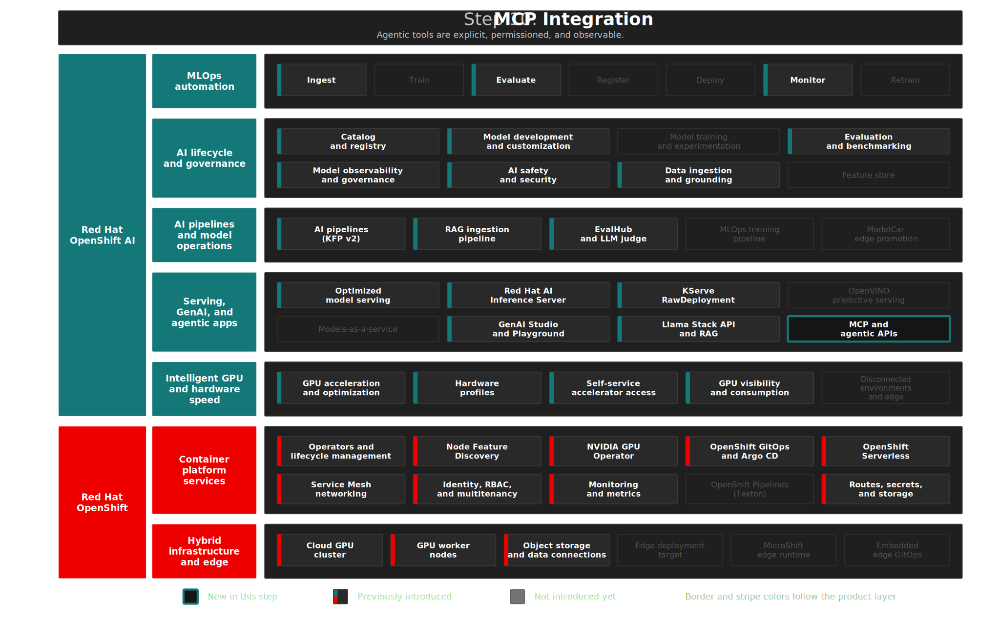

# Step 10: Agentic AI with MCP
**"From answers to action"** — Give the AI agent access to live enterprise systems through Model Context Protocol.

## Overview

Building on the **secured RAG chatbot** from Steps 07–09 — evaluation and guardrails already part of the governed platform — this step connects the agent to **live enterprise systems** so ACME Semiconductor gets **tool-enabled action**, not only document answers. The loop closes: models grounded in data, held to policy, and now able to use tools — querying equipment databases, inspecting OpenShift workloads, and notifying teams in Slack. **Red Hat OpenShift AI 3.4** supports this through the **Model Context Protocol (MCP)** — standardized communication between AI applications and external services — with MCP servers from the [Red Hat Ecosystem Catalog](https://catalog.redhat.com/en/categories/ai/mcpservers) and the **Llama Stack API** orchestrating tool use.

This step demonstrates RHOAI's **Agentic AI and gen AI UIs** capability: a unified API layer (MCP and Llama Stack API) that speeds agentic AI workflows, building tool-enabled workflows that perform complex tasks with limited supervision.

## Architecture



### What Gets Deployed

```text
MCP Integration
├── database-mcp         → EDB Postgres MCP — generic SQL access to ACME equipment DB
├── openshift-mcp        → Kubernetes MCP Server — read-only cluster inspection
├── slack-mcp            → Slack MCP Server — workspace messaging
├── PostgreSQL           → ACME equipment/calibration data
├── MCP ConfigMap        → Dashboard registration for GenAI Playground
├── ACME demo namespace  → Simulated equipment pods (healthy + failing)
└── Tool Groups          → Registered in LlamaStack via deploy.sh
```

| Component | Image Source | Purpose | Namespace |
|-----------|-------------|---------|-----------|
| **database-mcp** | `quay.io/mcp-servers/edb-postgres-mcp` | Generic SQL access to ACME equipment DB | `enterprise-rag` |
| **openshift-mcp** | `quay.io/mcp-servers/kubernetes-mcp-server` | Read-only cluster inspection | `enterprise-rag` |
| **slack-mcp** | `quay.io/mcp-servers/slack-mcp-server` | Slack workspace messaging | `enterprise-rag` |
| **PostgreSQL** | `registry.redhat.io/rhel9/postgresql-15` | ACME equipment/calibration data | `enterprise-rag` |

All MCP server images come from the [Red Hat Ecosystem Catalog](https://catalog.redhat.com/en/categories/ai/mcpservers). Zero on-cluster builds required.

#### ACME Corp Demo Environment

Step 10 deploys an `acme-corp` namespace with three simulated equipment monitoring pods:

| Pod | Equipment | Status | Behavior |
|-----|-----------|--------|----------|
| `acme-equipment-0001` | LITHO-001 | Healthy | Logs OK health checks every 30s |
| `acme-equipment-0005` | L-900-07 | Healthy | Logs OK health checks every 30s |
| `acme-equipment-0007` | L-900-08 | **CrashLoopBackOff** | Exits with DFO calibration error |

Pod `acme-equipment-0007` is deliberately broken — the demo agent investigates this failure. Because Argo CD includes this sample pod in the application graph, the Step 10 application can report **Degraded** even when the platform and MCP services are healthy. That degraded state is the demo signal, not an infrastructure failure.

#### MCP Server Tools

**database-mcp** (EDB Postgres MCP) — generic SQL access, LLM discovers schema autonomously:

| Tool | Description |
|------|-------------|
| `list_schemas` | List database schemas |
| `list_objects` | List tables/views in a schema |
| `execute_sql` | Execute SQL queries |
| `get_object_details` | Column details for a table |
| `explain_query` | Query execution plan |
| `analyze_db_health` | Database health checks |

**openshift-mcp** (Kubernetes MCP Server) — read-only cluster inspection:

| Tool | Description |
|------|-------------|
| `pods_list_in_namespace` | List pods in a namespace |
| `pods_get` | Get pod details |
| `pods_log` | Get pod logs |
| `events_list` | List cluster events |
| `namespaces_list` | List namespaces |
| `resources_list` / `resources_get` | Generic resource operations |

**slack-mcp** (Slack MCP Server) — workspace messaging:

| Tool | Description |
|------|-------------|
| `conversations_add_message` | Post message to a channel |
| `channels_list` | List workspace channels |
| `conversations_history` | Get channel message history |
| `conversations_search_messages` | Search messages |

Manifests: [`gitops/step-10-mcp-integration/base/`](../../gitops/step-10-mcp-integration/base/)

<details>
<summary>RHOAI and OCP Features in This Step</summary>

| | Feature | Status |
|---|---|---|
| RHOAI | Agentic AI and gen AI UIs (MCP, Llama Stack API) | Used |
| RHOAI | Model development and customization (RAG) | Used |
| RHOAI | AI safety and security (guardrails) | Used |
| RHOAI | Gen AI Studio reusable system instructions | Technology Preview; used for the MCP troubleshooting prompt |

</details>

<details>
<summary>Design Decisions</summary>

> **Red Hat Ecosystem Catalog images:** All 3 MCP servers use prebuilt images from `quay.io/mcp-servers/`. Zero on-cluster builds, faster deployment, trusted supply chain.

> **Generic SQL access:** The Database MCP uses EDB Postgres MCP rather than custom endpoints. The LLM discovers the schema autonomously and writes targeted SQL — no application-specific API required.

> **MCP transport configuration (RHOAI 3.4):** The gen-ai backend defaults to `streamable-http` transport (POST directly to URL). MCP servers that only support SSE transport (GET `/sse` + POST `/messages`) **must** include `"transport": "sse"` in the ConfigMap JSON, or the Dashboard shows "Error" status. OpenShift-MCP (kubernetes-mcp-server v0.0.54+) supports streamable-http on `/mcp`, so its Dashboard URL uses `/mcp` instead of `/sse`. The `lsd-rag` runtime registers the same servers as Llama Stack connectors using in-cluster `/sse` service URLs.

> **Connector-based lsd-rag integration:** RHOAI 3.4 packages Llama Stack 0.7, where the old `/v1/toolgroups` and `/v1/tool-runtime/invoke` endpoints are no longer part of the served API. The `lsd-rag` ConfigMap enables `connectors`, stores connector metadata on the Llama Stack PVC, and registers `openshift-mcp`, `database-mcp`, and `slack-mcp` at startup.

> **GitOps-managed ConfigMap:** The `gen-ai-aa-mcp-servers` ConfigMap is managed by ArgoCD, following the [RHOAI 3.4 documentation pattern](https://docs.redhat.com/en/documentation/red_hat_openshift_ai_self-managed/3.4/html/experimenting_with_models_in_the_gen_ai_playground/playground-prerequisites_rhoai-user#configuring-model-context-protocol-servers_rhoai-user).

> **Product Playground plus application chatbot:** The RHOAI Playground is now a demo scene for asset discovery, model comparison, knowledge-source experimentation, MCP selection, prompt saving, and code export. The Step 07 chatbot remains the application view for the full ACME workflow, including deterministic browser validation and Step 09 guardrail checks.

> **Prompt-guided tool order:** The `acme-rag-troubleshooting` prompt captures the recommended investigation sequence: inspect OpenShift, map pod to equipment in PostgreSQL, search ACME procedures through RAG, then notify Slack only when requested. The prompt is versioned for collaboration and evaluation; MCP server RBAC and tool implementations enforce what the agent can actually do.

> **Database MCP starts after PostgreSQL is queryable:** `deploy.sh` verifies the seeded ACME schema before refreshing `database-mcp`. This prevents the MCP server from keeping a closed connection pool if it starts while the PostgreSQL container is still replaying startup scripts.

> **Slack credentials at deploy time:** Bot token is created from `.env` by deploy.sh (not stored in git).

</details>

<details>
<summary>Deploy</summary>

```bash
./steps/step-10-mcp-integration/deploy.sh     # ArgoCD app + Slack secret + MCP connector refresh
./steps/step-10-mcp-integration/validate.sh   # infrastructure + MCP connector/tool discovery checks
```

</details>

<details>
<summary>What to Verify After Deployment</summary>

`validate.sh` checks infrastructure, Dashboard MCP configuration, Llama Stack connector registration, and MCP tool discovery.

| Check | What It Tests | Pass Criteria |
|-------|--------------|---------------|
| ArgoCD sync/health | App is Synced; Healthy or Degraded only because `acme-equipment-0007` is intentionally CrashLoopBackOff | Synced + expected health reason |
| MCP deployments | database-mcp, openshift-mcp, slack-mcp | All available |
| PostgreSQL | Pod running | Ready |
| ConfigMap | `gen-ai-aa-mcp-servers` in `redhat-ods-applications` | Exists |
| ACME environment | acme-corp namespace, two healthy equipment pods, one intentional failing pod | 0001/0005 Running, 0007 CrashLoopBackOff |
| MCP connectivity | Pod found for each server | 3 pods |
| **Connector registration** | openshift-mcp, database-mcp, slack-mcp | All registered in lsd-rag |
| **MCP tool discovery** | `/v1beta/connectors/<connector>/tools` | Each connector returns tool definitions |
| Product Playground readiness | Dashboard feature flags, AI asset labels, MCP ConfigMap JSON, RAG storage, vector store, MLflow workspace | `./scripts/validate-genai-playground-readiness.sh` passes or warns only on optional runtime readiness |

</details>

## The Demo

> In this demo, the AI agent autonomously resolves an equipment alert using four integrated enterprise systems. Starting from a failing pod on OpenShift, it identifies the equipment in a database, finds the resolution procedure in internal documents, and notifies the platform team on Slack — all in a single conversation, with no scripted logic.

### Product Playground — Assemble the Assets

> We start in the Red Hat product UI. The same model endpoints, MCP servers, knowledge sources, prompts, and exported code path should be visible before we move to the custom ACME chatbot.

1. Run the cluster-side readiness check:

```bash
./scripts/validate-genai-playground-readiness.sh
```

2. Open **GenAI Studio** → **AI asset endpoints**
3. Confirm `granite-8b-agent` and `mistral-3-bf16` are visible as model endpoints
4. Open the MCP servers tab and confirm `Database-MCP`, `OpenShift-MCP`, and `Slack-MCP` are listed without error
5. Confirm custom endpoints are available for internal endpoints and external providers are not enabled by default

**Expect:** The Dashboard shows the AI assets that the rest of the demo uses: two governed model endpoints, three MCP servers, and internal custom endpoint controls.

> This is the product-native control point. Platform teams can show what is approved for experimentation without asking users to inspect YAML, service names, or application code.

### Product Playground — Create an Internal Custom Endpoint

> The AI assets page is project-scoped. When the ACME playground runs in `enterprise-rag`, users can add the shared MaaS gateway as an internal custom endpoint without enabling external provider egress.

1. Retrieve the demo MaaS API key created for the RAG project:

```bash
oc get secret rag-maas-api-key -n enterprise-rag \
  -o jsonpath='{.data.MAAS_API_KEY}' | base64 -d
```

2. In **GenAI Studio** → **AI asset endpoints**, select the `enterprise-rag` project
3. Click **Create endpoint**
4. Use these values:

| Field | Value |
|-------|-------|
| Model type | Inferencing |
| Model ID | `granite-8b-agent` |
| Display name | `Granite 8B Agent via MaaS` |
| URL | `https://maas-default-gateway-data-science-gateway-class.openshift-ingress.svc/v1` |
| Token | Paste the `MAAS_API_KEY` value |
| Use case | `RAG, MCP, guardrails, ACME troubleshooting` |

5. Click **Verify model**
6. Click **Create**, then **Add to Playground**

**Expect:** The custom endpoint appears in the `enterprise-rag` AI assets page and is selectable in the Playground. No external provider option is needed or enabled.

> This demonstrates the intended Private AI pattern for cross-project experimentation: the model remains governed by MaaS, while the RAG team gets a project-local asset entry for the Playground.

### Product Playground — Compare Base vs Grounded Agent

> A side-by-side Playground comparison makes the value of RAG and tools visible. One chat instance is the base model; the second has knowledge and MCP tools selected.

1. Open **GenAI Studio** → **Playground**
2. Create a playground in the `enterprise-rag` project
3. Add one chat instance with `granite-8b-agent` and no tools
4. Add a second chat instance with `granite-8b-agent` and the uploaded ACME knowledge source from Step 07
5. Open the **MCP** tab, select the OpenShift and Database MCP servers, authorize if prompted, and use **View tools** to confirm tool names are visible
6. Ask both panes:

```text
An equipment monitoring pod is failing in the acme-corp namespace. Identify the failed pod, map it to the equipment, and suggest the documented remediation.
```

**Expect:** The base pane can only speculate. The grounded pane can use MCP to inspect the cluster and database, then use the ACME knowledge source to identify the DFO calibration remediation.

> This shows the product-level experiment before the application-level workflow. The same model becomes more useful when the platform gives it approved knowledge and tools.

### Product Playground — Save the Prompt and Export Code

> Once the experiment works, the practitioner needs a handoff path. RHOAI 3.4 provides prompt saving through the Playground and a code export path for moving from prototype to application.

Prompt saving requires the MLflow service to be available in the project. If Step 12 has not been deployed yet, present the code export path now and return to saved prompt versioning after the MLflow server is available.

1. In the grounded chat instance, set the system prompt from [`../step-07-rag/prompts/acme-rag-troubleshooting.md`](../step-07-rag/prompts/acme-rag-troubleshooting.md):

```text
You are an ACME Semiconductor equipment troubleshooting assistant.

When investigating an equipment alert, follow this order:

1. Inspect OpenShift pod state for the affected namespace.
2. Map the failing pod to equipment records using the equipment database.
3. Search ACME documents for known issues and procedures for that product.
4. Summarize the pod, equipment ID, product, likely issue, and next action.
5. If requested, send a concise Slack notification to the platform team.
```

2. Save the prompt as `acme-rag-troubleshooting` with commit message `Initial MCP troubleshooting prompt`
3. Open the saved prompt from the prompt list and apply the saved version to the chat instance
4. Use **View code** or the Playground export action to generate the Python client example

**Expect:** The prompt can be reused in a later Playground session, and the exported code contains the model endpoint, prompt, and selected tool/knowledge configuration needed to start an application implementation.

> This closes the prototype-to-application loop. The custom chatbot in Step 07 is the implemented application; the Playground export shows how a team would move from product experimentation toward code.

### Product Playground — Update and Delete Lifecycle

> The Playground is a shared project asset. We also show lifecycle controls so users understand what happens when a playground is changed or removed.

1. From the Playground action menu, choose **Update configuration**
2. Review the warning that updating the playground deletes the inline vector database for all users in the project
3. Add or remove a model from the playground configuration, then cancel unless you intentionally want to reset the inline knowledge upload
4. From the same action menu, open **Delete playground** and review the confirmation dialog

**Expect:** The Dashboard makes lifecycle impact explicit. Updating is safe for model selection but destructive to inline RAG uploads; deleting removes the playground for every user with access to the project.

> This reinforces why the demo uses the product Playground for experimentation and the Step 07 GitOps/KFP ingestion path for durable knowledge. Operational knowledge should not depend on an inline vector database that is cleared during Playground reconfiguration.

In the chatbot, select `granite-8b-agent`, switch to **Agent-based** mode, use the `acme-rag-troubleshooting` system prompt, and toggle on all MCP servers (database, openshift, slack). Step 08 can later record this prompt version with the demo `production` promotion label when comparing MCP troubleshooting behavior.

### Inspect the Cluster

> An equipment monitoring pod is failing in the `acme-corp` namespace. We ask the agent to investigate — it will query the live OpenShift cluster through the Kubernetes MCP Server to find the problem.

1. Ask: *"List pods in acme-corp project"*

**Expect:** The agent calls `pods_list_in_namespace(namespace="acme-corp")` via the OpenShift MCP server. Returns 3 pods — two healthy, one (`acme-equipment-0007`) in CrashLoopBackOff.

> The agent just queried the live OpenShift cluster through MCP. No kubectl, no scripts — the LLM decided which API to call and parsed the response. It immediately identifies the failing pod.

### Identify the Equipment

> The agent found a failing pod, but a pod name is not actionable for a maintenance team. We need the actual equipment identifier. The agent will pivot to the equipment database and look up the mapping.

1. Ask: *"Fetch the equipment name for the failed pod"*

**Expect:** The agent calls `execute_sql` via the Database MCP server, querying the `acme_pod_equipment_map` table. Returns L-900-08 (L-900 EUV Scanner 08), product: L-900 EUV Calibration Suite.

> The LLM discovered the database schema on its own, wrote a SQL query joining the pod name to equipment records, and returned the specific scanner model. No one pre-built this query — the agent constructed it from the schema and the conversation context.

### Search Known Issues

> We now know which piece of equipment is failing. The agent will search the internal knowledge base — the same RAG vector store from Step 07 — for documented resolution procedures.

1. Ask: *"Search for known issues for the mentioned product"*

**Expect:** The agent calls `knowledge_search` against the `acme_corporate` vector store. Returns the DFO calibration procedure documentation for the L-900 product line.

> This is where it all comes together. The agent combined live cluster data, a database lookup, and document retrieval in a single conversation to find the exact calibration procedure for the scanner that is failing.

### Notify the Team

> The agent has the full picture: which pod failed, which equipment it maps to, and the documented resolution procedure. Now it delivers the summary to the platform team on Slack.

1. Ask: *"Send a Slack message with the summary to the platform team"*

**Expect:** The agent calls `conversations_add_message` via the Slack MCP server, posting a structured summary — pod name, equipment ID, product line, known issue, and recommended procedure — to `#all-acme-mcp-demo`.

> Four questions, four different enterprise systems — OpenShift cluster, PostgreSQL database, RAG document store, and Slack. *"Think of [Llama Stack] as Kubernetes for AI agents: just as Kubernetes orchestrates containers, Llama Stack orchestrates agents and their providers"* — and MCP provides the standardized tool interfaces from the Red Hat Ecosystem Catalog. This is what enterprise agentic AI looks like on Red Hat OpenShift AI.

## Key Takeaways

**For business stakeholders:**

- Move from answers to assisted action across enterprise workflows
- Connect models to live systems on the same governed platform
- Build on an open ecosystem of tools and integrations

**For technical teams:**

- Add tool access through MCP and Llama Stack on top of the secured RAG flow
- Connect models to databases, infrastructure, and messaging systems
- Reuse evaluation, guardrails, and governance already established in earlier steps

<details>
<summary>Troubleshooting</summary>

### Dashboard shows "Error" for MCP servers

**Symptom:** MCP servers show "Error" status in Gen AI Studio > AI asset endpoints > MCP servers tab, despite pods running and responding correctly.

**Root Cause:** The RHOAI 3.4 gen-ai backend defaults to `streamable-http` transport, which POSTs an `initialize` JSON-RPC call directly to the configured URL. MCP servers using SSE transport return `405 Method Not Allowed` because their `/sse` endpoint only accepts GET.

**Diagnosis:**
```bash
TOKEN=$(oc whoami -t)
curl -sk -H "Authorization: Bearer $TOKEN" \
  "https://$(oc get route data-science-gateway -n redhat-ods-applications -o jsonpath='{.spec.host}' 2>/dev/null || echo 'data-science-gateway.apps.<cluster>')/gen-ai/api/v1/mcp/status?namespace=acme-corp&server_url=<url-encoded-mcp-url>"
```

**Solution:** Add `"transport": "sse"` to the ConfigMap JSON for servers that only support SSE:
```json
{
  "url": "https://<route>/sse",
  "transport": "sse",
  "description": "..."
}
```

### Dashboard shows "Token Required" for OpenShift-MCP

**Symptom:** OpenShift-MCP shows "Token Required" in the Dashboard.

**Root Cause:** The gen-ai backend POSTs to `/sse` using streamable-http transport, but `/sse` on kubernetes-mcp-server expects a session ID from a prior SSE handshake. The error message `"sessionid must be provided"` is misinterpreted as a token issue.

**Solution:** Change the URL to `/mcp` which supports streamable-http natively:
```json
{
  "url": "https://<route>/mcp",
  "description": "..."
}
```

</details>

## References

- [RHOAI 3.4 — Configuring MCP Servers](https://docs.redhat.com/en/documentation/red_hat_openshift_ai_self-managed/3.4/html/experimenting_with_models_in_the_gen_ai_playground/playground-prerequisites_rhoai-user#configuring-model-context-protocol-servers_rhoai-user)
- [RHOAI 3.4 — Experimenting with models in the Gen AI Playground](https://docs.redhat.com/en/documentation/red_hat_openshift_ai_self-managed/3.4/html-single/experimenting_with_models_in_the_gen_ai_playground/index)
- [RHOAI 3.4 — Reusable system instructions in Gen AI Studio](https://docs.redhat.com/en/documentation/red_hat_openshift_ai_self-managed/3.4/html/experimenting_with_models_in_the_gen_ai_playground/reusable-system-instructions_rhoai-user)
- [Red Hat Ecosystem Catalog — MCP Servers](https://catalog.redhat.com/en/categories/ai/mcpservers)
- [Kubernetes MCP Server (Red Hat Developer)](https://developers.redhat.com/articles/2025/09/25/kubernetes-mcp-server-ai-powered-cluster-management)
- [Model Context Protocol](https://modelcontextprotocol.io/)
- [Red Hat OpenShift AI — Product Page](https://www.redhat.com/en/products/ai/openshift-ai)
- [Red Hat OpenShift AI — Production AI datasheet](https://www.redhat.com/en/resources/production-ai-for-cloud-environments-datasheet)
- [Get started with AI for enterprise organizations — Red Hat](https://www.redhat.com/en/resources/artificial-intelligence-for-enterprise-beginners-guide-ebook)
- `rh-brain`: `/Users/adrina/Sandbox/rh-brain/Red Hat Brain/raw/Prompt Registry for LLMs & Agents.md`

## Next Steps

- **Step 11**: [Face Recognition](../step-11-face-recognition/README.md) — Predictive AI on RHOAI: train a YOLO11 model, deploy on OpenVINO, CPU-only inference
