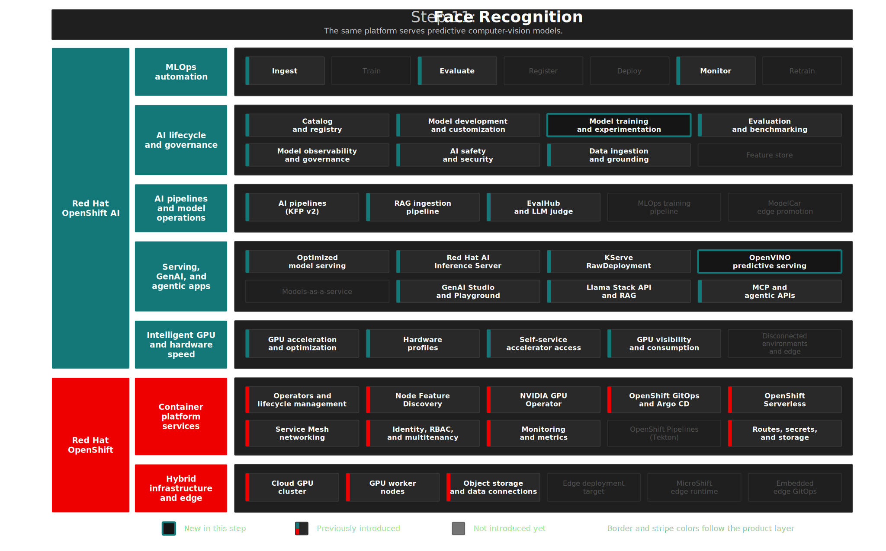

# Step 11: Face Recognition — Predictive AI on RHOAI
**"Beyond LLMs"** — Query the validated YOLO11 face recognition model through KServe Standard mode with OpenVINO Model Server. Optional notebooks show how the model was trained and promoted. CPU-only inference, no GPU required.

## Overview

**Predictive AI on the same platform as generative AI.** The serving, pipelines, observability, and governance established for LLMs carry forward for traditional ML — you do not adopt a separate toolchain. Computer vision enables object detection and image classification particularly valuable in manufacturing and quality control. The "WhoAmI — Visual Identity" scenario is the proof moment: face recognition runs on **Red Hat OpenShift AI 3.4** alongside the GenAI stack, not on an island — one infrastructure footprint, one operational model.

This step demonstrates RHOAI's **Model development and customization**, **Model training and experimentation**, and **optimized serving** capabilities for predictive AI. The standard demo uses the last validated model version already served by RHOAI; the training notebooks remain available as an optional model-development path.

## Architecture



### What Gets Deployed

```text
Face Recognition
├── kserve-ovms ServingRuntime   → OpenVINO Model Server for ONNX models
├── face-recognition ISVC        → Serves YOLO11 ONNX model (CPU-only, ~11MB)
├── face-recognition-wb Notebook → JupyterLab with synced demo notebooks (4 notebooks)
├── upload-face-model Job        → Downloads pre-trained ONNX from HuggingFace to MinIO
└── Notebook workflow: Explore → Query validated model via REST v2 API
    Optional path: Retrain → Test → Explicitly promote a new model
```

| Component | Purpose | Namespace |
|-----------|---------|-----------|
| **kserve-ovms** ServingRuntime | OpenVINO Model Server for ONNX models | `enterprise-mlops` |
| **face-recognition** InferenceService | Serves the YOLO11 ONNX model (CPU-only) | `enterprise-mlops` |
| **face-recognition-wb** Notebook | JupyterLab workbench with synced demo notebooks | `enterprise-mlops` |
| **upload-face-model** Job | Downloads pre-trained ONNX from HuggingFace to MinIO | `minio-storage` |

Manifests: [`gitops/step-11-face-recognition/base/`](../../gitops/step-11-face-recognition/base/)

<details>
<summary>RHOAI and OCP Features in This Step</summary>

| | Feature | Status |
|---|---|---|
| RHOAI | Model training and experimentation | Introduced |
| RHOAI | Model development and customization (JupyterLab workbench) | Used |
| RHOAI | Optimized model serving (OpenVINO) | Used |

<details>
</details>

<summary>Design Decisions</summary>

> **KServe Standard mode** (not ModelMesh) because ModelMesh is deprecated in RHOAI 3.4 ([release notes section 6.1.9](https://docs.redhat.com/en/documentation/red_hat_openshift_ai_self-managed/3.4/html/release_notes/support-removals_relnotes)). The `kserve-ovms` template is the platform-recommended approach for ONNX/OpenVINO models. RHOAI normalizes this InferenceService to `serving.kserve.io/deploymentMode: Standard`.

> **CPU inference, GPU training.** OpenVINO serves the ONNX model on CPU workers (no GPU needed for inference). Training uses GPU when available (`device=0`, `workers=0` to avoid `/dev/shm` limits in containers) for ~1 hour on L4, with CPU fallback (~6 hours). The YOLO11m ONNX model is ~77MB.

> **YOLO11m** (medium, 20M params). YOLO11n (2.6M) lacked capacity to distinguish similar-looking people. YOLO11m provides 7.7x more parameters for learning subtle facial features. YOLO26m was tested but fails on small datasets (<1K images) due to its NMS-free architecture requiring COCO-scale data.

> **Auto-annotation** using the pre-trained YOLO11-face detector eliminates manual bounding box labeling. Users only need to provide raw selfie photos.

> **Identity uniqueness constraint** at inference. A known person can only appear once per frame — any duplicate "adnan" detection is guaranteed to be a false positive. The `enforce_identity_uniqueness()` function in `remote_infer.py` keeps only the highest-confidence detection for the identified class and reclassifies duplicates as unknown. This is a standard domain-constrained post-processing technique used in production identity-aware detection systems. The standard demo uses `FACE_RECOGNITION_CONFIDENCE_THRESHOLD=0.6` for the restored validated model version.

> **Real colleague photos + HuggingFace portraits for unknown class.** Using surveillance-style datasets (e.g. WIDER Face) as negatives causes the model to classify any close-up face as "adnan" because the visual domain is too different. The `unknown_face/` directory contains ~600 photos of real colleagues from the same events and camera conditions. Combined with 200 high-quality portraits downloaded from [HuggingFace](https://huggingface.co/datasets/prithivMLmods/Realistic-Face-Portrait-1024px) at runtime, this produces mAP50 >0.93 vs ~0.76 with WIDER Face alone.

> **Validated served model path.** The standard demo does not retrain or upload a new artifact. It queries the model currently served by `face-recognition`, including Model Registry linkage when present. The pre-trained upload job remains as a fallback so the InferenceService can start even before the MLOps pipeline promotes a version.

> **OVMS workload scrape opt-in:** The `kserve-ovms` ServingRuntime enables OpenVINO Model Server metrics on `/metrics` at port `8888`. The `face-recognition` InferenceService therefore sets `spec.predictor.labels.monitoring.opendatahub.io/scrape: "true"` so the generated predictor pods are collected by the RHOAI observability stack. `validate.sh` checks the InferenceService, generated predictor Deployment template, and generated pods.

> **Dashboard template annotations on ServingRuntime.** The RHOAI Dashboard identifies runtimes by matching `opendatahub.io/template-name` and `opendatahub.io/template-display-name` annotations against platform templates in `redhat-ods-applications`. Without these, runtimes show as "Unknown Serving Runtime" in the Model Deployments view. The `kserve-ovms` ServingRuntime includes `template-name: kserve-ovms` and `template-display-name: OpenVINO Model Server` to match the platform template. Validation also compares the GitOps image digest with the live `kserve-ovms` platform template, so a RHOAI upgrade surfaces image drift immediately.

</details>

<details>
<summary>Deploy</summary>

**Prerequisites:**

- Steps 01-03 deployed (GPU infra, RHOAI platform, MinIO + namespace)
- `oc` CLI logged in with cluster access
- ~200+ selfie photos for custom face training (optional — a pre-trained model is provided)
- ~600+ colleague/stranger photos for the unknown class (uploaded to MinIO and workbench)
- 1 test video (10-30s, you + another person) for the video demo (optional)

```bash
./steps/step-11-face-recognition/deploy.sh     # ArgoCD app: ServingRuntime + ISVC + Workbench + model upload
./steps/step-11-face-recognition/validate.sh   # Infrastructure + model artifact/readiness checks
```

The script:
1. Verifies MinIO and namespace prerequisites
2. Checks for the `kserve-ovms` platform template
3. Uploads the pre-trained YOLO11n-face ONNX model to MinIO
4. Applies the ArgoCD Application (creates ServingRuntime, InferenceService, Workbench)
5. Syncs notebook files and uploads workbench assets (images, videos, optional training photos)

The workbench (`face-recognition-wb`) is deployed via ArgoCD with a git-sync initContainer that clones notebooks, `remote_infer.py`, and `requirements.txt` from the repo on first PVC initialization. The `upload-to-workbench.sh` helper can be rerun to refresh repo-managed notebooks/helpers on persisted PVCs and upload binary assets.

#### Syncing notebook files and assets

The deploy script syncs notebook files and uploads assets from the local `notebooks/` directory if they exist. To refresh a persisted workbench or re-upload assets manually:

```bash
./steps/step-11-face-recognition/upload-to-workbench.sh
```

By default this syncs notebooks/helpers and copies the lightweight demo folders to the workbench pod via `oc cp`:

| Folder | Contents | Purpose |
|--------|----------|---------|
| `notebooks/images/` | Test face and group photos (.jpg) | Used by notebooks 01, 03, 04 |
| `notebooks/videos/` | Test video (.mov) | Used by notebooks 03, 04 for video inference |

Optional training folders are intentionally skipped unless you request them because they can be large:

```bash
INCLUDE_TRAINING_ASSETS=true ./steps/step-11-face-recognition/upload-to-workbench.sh
```

| Folder | Contents | Purpose |
|--------|----------|---------|
| `notebooks/my_photos/` | ~200+ selfie photos (.jpeg) | Optional training data — class 0 (adnan) |
| `notebooks/unknown_face/` | ~200+ colleague photos (.jpg) | Optional training data — class 1 (unknown_face) |

These folders are gitignored (binary assets). The workbench PVC persists them across pod restarts.

</details>

<details>
<summary>What to Verify After Deployment</summary>

| Check | What It Tests | Pass Criteria |
|-------|--------------|---------------|
| ServingRuntime | `kserve-ovms` exists in namespace | Listed |
| Model upload | `upload-face-model` job or MinIO model artifact | fresh job or artifact exists |
| InferenceService | `face-recognition` is Ready | READY = True |
| Validated model linkage | `face-recognition` carries Model Registry labels when Step 12 has promoted a model | `registered-model-id` and `model-version-id` present |
| Workload scraping | Predictor Deployment and pods carry `monitoring.opendatahub.io/scrape=true` | Label present |
| Workbench | `face-recognition-wb-0` pod running | 2/2 Running |
| Notebook sync | workbench contains repo-managed notebooks/helpers | Current notebook files present |
| Notebook assets | images, videos, optional training folders populated | Files present when needed |

```bash
oc get servingruntime kserve-ovms -n enterprise-mlops
oc get job upload-face-model -n minio-storage -o jsonpath='{.status.succeeded}'
oc exec deploy/minio -n minio-storage -- mc stat demo/models/face-recognition/1/model.onnx
oc get inferenceservice face-recognition -n enterprise-mlops
oc get pod face-recognition-wb-0 -n enterprise-mlops
./steps/step-11-face-recognition/validate.sh
```

</details>

## The Demo

> In this demo, we walk through face recognition on Red Hat OpenShift AI — from exploring a generic face detector to querying a validated model through KServe and OpenVINO. The same RHOAI infrastructure used for LLMs also serves predictive AI models with governed versions and production REST inference.

### Explore Face Detection

> YOLO11 is a state-of-the-art object detection model. Out of the box, it detects faces — but it can't tell whose face it is. We start by exploring what the base model can and can't do.

1. Open the workbench from the RHOAI Dashboard: **Data Science Projects** → **enterprise-mlops** → **Workbenches** → **face-recognition-wb** → **Open**
2. Run `01-explore-yolo11-face.ipynb`

**Expect:** YOLO11 detects faces in test images with bounding boxes, confidence scores, and pixel coordinates. All detections are labelled as the generic class `face`.

> Every face is just "face" — no identity, no distinction. The base model detects but does not recognize. The served demo model is the validated two-class version managed by the platform.

### Query the Validated Served Model

> Now we query the last validated model through the KServe REST v2 API — the same way a production application would consume this model, served on OpenVINO Model Server with CPU-only inference.

1. Run `04-query-model-server.ipynb`

**Expect:** The notebook prints the endpoint, readiness, model input/output metadata, and Model Registry IDs when available. Image and video cells return annotated outputs from the served model without retraining or replacing artifacts.

> Same model, same accuracy — now served on OpenVINO Model Server via KServe Standard mode. No GPU needed for inference. This is how Red Hat OpenShift AI serves predictive AI models in production: a REST API that any service can call, deployed and managed via GitOps like every other platform component.

### Optional: Retrain for Your Face

> This path is for model development, not the standard demo. Use it only when you intentionally want to train and promote a new model version.

1. Verify `my_photos/` is populated (uploaded by `deploy.sh` or `upload-to-workbench.sh`)
2. Run `02-retrain-face-model.ipynb`
3. Run `03-test-retrained-model.ipynb`
4. Leave `PROMOTE_TO_MODEL_SERVER = False` unless you intentionally want to replace the served model artifact

**Expect:** Notebook 02 auto-annotates your photos, trains YOLO11m, and exports ONNX. Notebook 03 tests the local ONNX output and skips MinIO upload/restart unless promotion is explicitly enabled.

> The same RHOAI platform that serves LLMs also provides the GPU compute, notebook environment, pipelines, Model Registry, and serving path for computer vision models.

## Key Takeaways

**For business stakeholders:**

- Support predictive and generative AI on one platform
- Reuse the same controls and operations for computer vision workloads
- Avoid a separate toolchain for classical ML

**For technical teams:**

- Train and serve a predictive model in the same governed environment used for GenAI
- Reuse serving, observability, and governance patterns already in place
- Show that efficient CPU inference can fit real deployment needs

<details>
<summary>Troubleshooting</summary>

### InferenceService stuck in "Not Ready"

**Root Cause:** The model is not at the expected MinIO path, or the `storage-config` secret is missing.

**Solution:**
```bash
# Check the predictor pod logs
oc logs -n enterprise-mlops deploy/face-recognition-predictor

# Verify model exists in MinIO
oc exec -n minio-storage deploy/minio -- sh -c \
  'mc alias set demo http://localhost:9000 rhoai-access-key rhoai-secret-key-12345 >/dev/null && mc ls demo/models/face-recognition/1/'
# Expected: model.onnx

# Verify storage-config secret exists
oc get secret storage-config -n enterprise-mlops
```

### kserve-ovms ServingRuntime image not pulling

**Root Cause:** The ServingRuntime image digest in GitOps is behind the current `kserve-ovms` platform template.

**Solution:**
```bash
# Get the correct image from the platform template
oc process -n redhat-ods-applications kserve-ovms \
  -o jsonpath='{.items[0].spec.containers[0].image}'

# Update gitops/step-11-face-recognition/base/serving-runtime/kserve-ovms.yaml
# and rerun ./steps/step-11-face-recognition/validate.sh
```

### Training notebook fails with "No photos found"

**Root Cause:** No images in the `my_photos/` directory inside the workbench.

**Solution:**
```bash
# Upload from local machine
./steps/step-11-face-recognition/upload-to-workbench.sh

# Or verify they're already there
oc exec -n enterprise-mlops face-recognition-wb-0 -c face-recognition-wb -- ls my_photos/ | head
```

### Workbench pod not starting

**Root Cause:** PVC binding or image pull issue.

**Solution:**
```bash
oc describe pod face-recognition-wb-0 -n enterprise-mlops | tail -20
oc get events -n enterprise-mlops --sort-by='.lastTimestamp' | grep face-recognition | tail -10
```

</details>

## References

- [RHOAI 3.4 — Deploying models with KServe](https://docs.redhat.com/en/documentation/red_hat_openshift_ai_self-managed/3.4/html/deploying_models/)
- [RHOAI 3.4 — Release notes: ModelMesh deprecation](https://docs.redhat.com/en/documentation/red_hat_openshift_ai_self-managed/3.4/html/release_notes/support-removals_relnotes)
- [Ultralytics YOLO11 documentation](https://docs.ultralytics.com/models/yolo11/)
- [YOLO11 data augmentation](https://docs.ultralytics.com/guides/yolo-data-augmentation/)
- [OpenVINO Model Server KServe-compatible API](https://docs.openvino.ai/2026/model-server/ovms_docs_rest_api_kfs.html)
- [Pre-trained model (PyTorch): AdamCodd/YOLOv11n-face-detection](https://huggingface.co/AdamCodd/YOLOv11n-face-detection) — used by notebooks for exploration
- [Pre-trained model (ONNX): ariakang/YOLOv11n-face-detection](https://huggingface.co/ariakang/YOLOv11n-face-detection) — deployed to MinIO by `deploy.sh`
- [Red Hat OpenShift AI — Product Page](https://www.redhat.com/en/products/ai/openshift-ai)
- [Red Hat OpenShift AI — Datasheet](https://www.redhat.com/en/resources/red-hat-openshift-ai-hybrid-cloud-datasheet)
- [Get started with AI for enterprise organizations — Red Hat](https://www.redhat.com/en/resources/artificial-intelligence-for-enterprise-beginners-guide-ebook)

> **See also:** [Step 05 — LLM Serving on vLLM](../step-05-maas-model-serving/README.md) (GPU model serving pattern), [Step 09 — Guardrails](../step-09-guardrails/README.md) (CPU-only InferenceService pattern)

## Next Steps

- **Step 12**: [MLOps Training Pipeline](../step-12-mlops-pipeline/README.md) — Automate the face recognition workflow as a Kubeflow Pipeline with quality gates and Model Registry integration
