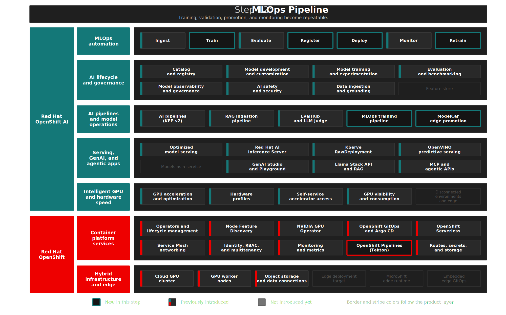

# Step 12: MLOps Training Pipeline
**"From Notebook to Production"** — Automate the face recognition training workflow as a Kubeflow Pipeline with MLflow tracking, evaluation gates, Model Registry integration, and conditional deployment.

## Overview

Step 11 was the notebook inner loop; this step is the **outer loop** — automation, quality gates, MLflow experiment tracking, registry-backed promotion, and TrustyAI monitoring inside `enterprise-mlops`. **Red Hat OpenShift AI 3.4** provides **Kubeflow Pipelines (KFP v2)**, **Model Registry**, **TrustyAI**, and **MLflow** so the workflow runs unattended with governance. Pipelines are versioned, tracked, and managed — reducing user error from experimentation through production. Drift monitoring tracks model behavior over time, catching degradation before users do.

MLflow is treated as a RHOAI 3.4 Technology Preview capability in this foundation slice. Step 02 enables the `mlflowoperator` component, and this step manages the schema-verified `MLflow` server plus the `enterprise-mlops` `MLflowConfig` through GitOps. The training pipeline logs a run after the quality gate passes, including metrics, parameters, tags, and compact artifacts through the MLflow SDK with Kubernetes namespace authentication. The server exposes only the `enterprise-mlops` namespace by selecting its stable Kubernetes namespace-name label.

This step demonstrates RHOAI's **AI pipelines** and **Model observability and governance** capabilities: automating the full ML lifecycle — from training through evaluation to production deployment — with TrustyAI drift and bias monitoring in production.

## Architecture



### What Gets Deployed

```text
MLOps Training Pipeline (KFP v2, 8 Steps)
├── 1. prepare_dataset     → Download photos + unknowns from MinIO, auto-annotate, split train/val
├── 2. train_model         → YOLO11 training with GPU auto-detect and CPU fallback, ONNX export
├── 3. evaluate_model      → mAP50 quality gate (compare with previous version)
├── 4. log_mlflow_run      → Log experiment run, metrics, params, tags, compact artifacts
├── 5. register_model      → Upload ONNX to MinIO, register in Model Registry
├── 6. deploy_model        → Restart KServe predictor pod
├── 7. setup_monitoring    → Upload baseline to TrustyAI, configure drift metrics
├── 8. package_modelcar *  → Trigger Tekton pipeline: build ModelCar OCI, push, update Git
│      (* optional, release_to_edge=True)
└── Infrastructure
    ├── face-pipeline-workspace PVC → Shared storage between pipeline steps
    ├── MLflow                      → Technology Preview tracking server and MLOps workspace config
    ├── TrustyAIService             → Fairness and drift monitoring
    └── modelcar-release Pipeline   → Tekton pipeline for edge model promotion
```

| Component | Purpose | Namespace |
|-----------|---------|-----------|
| `prepare_dataset` | Download bounded adnan + unknown photo samples from MinIO, optionally add HuggingFace portraits, auto-annotate, split train/val | `enterprise-mlops` |
| `train_model` | YOLO11 training with GPU auto-detect and CPU fallback, ONNX export | `enterprise-mlops` |
| `evaluate_model` | mAP50 computation, compare with previous version, quality gate | `enterprise-mlops` |
| `log_mlflow_run` | Create a `face-recognition` MLflow experiment run and log metrics, params, tags, and compact artifacts | `enterprise-mlops` |
| `register_model` | Upload ONNX to MinIO, register in Model Registry with metrics | `enterprise-mlops` |
| `deploy_model` | Restart KServe predictor pod, link ISVC to Registry | `enterprise-mlops` |
| `setup_monitoring` | Upload baseline to TrustyAI, configure SPD + drift metrics | `enterprise-mlops` |
| **TrustyAIService** | Fairness and drift monitoring, visible in RHOAI Dashboard | `enterprise-mlops` |
| **MLflow** | Technology Preview tracking server plus `enterprise-mlops` workspace artifact configuration | cluster-scoped server, `enterprise-mlops` config |
| **face-pipeline-workspace** PVC | Shared storage between pipeline steps | `enterprise-mlops` |

Pipeline code: [`steps/step-12-mlops-pipeline/kfp/`](kfp/)

Manifests: [`gitops/step-12-mlops-pipeline/base/`](../../gitops/step-12-mlops-pipeline/base/)

<details>
<summary>RHOAI and OCP Features in This Step</summary>

| | Feature | Status |
|---|---|---|
| RHOAI | AI pipelines (KFP v2 training pipeline) | Used |
| RHOAI | Catalog and registry (Model Registry) | Used |
| RHOAI | Model observability and governance (TrustyAI drift/bias) | Used |
| RHOAI | MLflow tracking server | Technology Preview; managed by GitOps after CRD/schema verification |
| OCP | OpenShift Pipelines (Tekton — ModelCar build) | Introduced |

<details>
</details>

<summary>Design Decisions</summary>

> **Project-local DSPA** (`dspa-mlops`). Enterprise MLOps owns its own pipeline server so predictive training runs are separated from the Enterprise RAG DSPA.

> **DSPA object storage uses the in-cluster MinIO service.** The pipeline server points at `minio.minio-storage.svc.cluster.local:9000` so the GitOps manifest stays portable across clusters. Generated OpenShift route hostnames are intentionally kept out of committed DSPA specs.

> **Threshold-based quality gate with Registry context.** The evaluate step computes mAP50 and compares it against a configurable threshold (default 0.7). It also queries the Model Registry for the previous version's mAP50 for informational logging. If the new model's mAP50 is below the threshold, the pipeline fails and deployment is skipped. Inspired by the [AI500 MLOps Jukebox](https://github.com/rhoai-mlops/jukebox) pattern.

> **Shared PVC** (not KFP artifacts) for inter-component data. The training dataset and model files are too large for KFP artifact passing. The shared PVC pattern follows [step-07 RAG pipeline](../step-07-rag/kfp/).

> **TrustyAI adapter pattern for CV models.** Vision model I/O (1.2M float tensors) cannot be used directly by TrustyAI's fairness algorithms, which require scalar columns. The `trustyai-adapter` Deployment receives post-processed detection results from inference clients and transforms them into tabular metrics (`image_type`, `num_detections`) that TrustyAI computes SPD on. This approach avoids relying on the KServe inference logger path for this computer vision demo. See [RHOAI 3.4 Monitoring](https://docs.redhat.com/en/documentation/red_hat_openshift_ai_self-managed/3.4/html/monitoring_your_ai_systems/).

> **External Model Registry route** with auth token. The internal service has a NetworkPolicy blocking cross-namespace access. Pipeline components use the HTTPS route.

> **MLflow client identity and preflight.** The `log_mlflow_run` component uses the MLflow SDK with `MLFLOW_TRACKING_AUTH=kubernetes-namespaced` against the in-cluster MLflow service root. The pipeline runner ServiceAccount has namespace `edit` through `face-pipeline-mlflow-client`, which lets MLflow authorize run creation and artifact logging for the `enterprise-mlops` workspace. `run-training-pipeline.sh` pre-creates the `face-recognition` experiment through the authenticated MLflow route so first-run setup is explicit.

> **Tekton for ModelCar builds, not KFP.** Building OCI images requires `buildah` with elevated security context — inappropriate for the DSPA pipeline environment. Tekton tasks run in dedicated pods with the required capabilities. The KFP `package_modelcar` component bridges the two by creating a Tekton PipelineRun via the Kubernetes API and polling for completion.

> **`pip_index_urls=["https://pypi.org/simple"]`** on all components that require packages outside the Red Hat index. The RHOAI base image (`rhai/base-image-cpu-rhel9:3.4.0`) configures pip to use Red Hat's Python index, which lacks `ultralytics`, `onnxruntime`, `onnxslim`, and other ML packages. Adding `pip_index_urls` in the `@component` decorator tells KFP to use PyPI instead. This also resolves the KFP SDK version mismatch (base image has 2.15.2, compiled pipeline requests 2.16.0).

</details>

<details>
<summary>Deploy</summary>

**Prerequisites:**

- Steps 01-04 deployed (GPU infra, RHOAI, MinIO, Model Registry)
- Step 12 GitOps-managed `dspa-mlops` pipeline server available in `enterprise-mlops`
- Step 11 deployed (face-recognition InferenceService + workbench with training photos)
- Training photos uploaded to MinIO (done automatically if step 11 workbench was used)

```bash
./steps/step-12-mlops-pipeline/deploy.sh     # ArgoCD app: pipeline PVC + RBAC + TrustyAI
./steps/step-12-mlops-pipeline/validate.sh   # Infrastructure checks + latest training run freshness
```

This creates the project-local DSPA, pipeline PVC, RBAC, TrustyAI resources, and MLflow Technology Preview resources via ArgoCD.
The MLflow server uses a local SQLite metadata store and a 10 GiB PVC for the demo service. The `enterprise-mlops` workspace has an `MLflowConfig` that points at the project S3 artifact connection, so new runs from that namespace use the project artifact root while the SDK writes compact evidence artifacts directly to MinIO.
By default, `deploy.sh` also submits a short smoke training run: 1 epoch, quality threshold `0.0`, 40 user photos, 40 unknown photos, and no HuggingFace portrait download. Override `PIPELINE_EPOCHS`, `PIPELINE_MAP_THRESHOLD`, `PIPELINE_MAX_USER_PHOTOS`, `PIPELINE_MAX_UNKNOWN_PHOTOS`, and `PIPELINE_NUM_HF_PORTRAITS` when you want a longer validation run.

#### Run the Pipeline

```bash
./steps/step-12-mlops-pipeline/run-training-pipeline.sh
```

Options:

```bash
./run-training-pipeline.sh --version=v2.0 --epochs=20 --threshold=0.8 \
  --max-user-photos=221 --max-unknown-photos=620 --num-hf-portraits=200
```

| Parameter | Default | Description |
|-----------|---------|-------------|
| `--version` | timestamp | Model version string |
| `--epochs` | 100 | Training epochs |
| `--threshold` | 0.7 | Minimum mAP50 for deployment |
| `--max-user-photos` | 40 | Maximum known-face photos used in this run |
| `--max-unknown-photos` | 40 | Maximum MinIO unknown-face photos used in this run |
| `--num-hf-portraits` | 0 | Optional HuggingFace portrait samples added as unknown faces |

Monitor the run in the RHOAI Dashboard: **Data Science Projects** → **enterprise-mlops** → **Pipelines**.

</details>

<details>
<summary>What to Verify After Deployment</summary>

```bash
# Pipeline PVC created
oc get pvc face-pipeline-workspace -n enterprise-mlops

# DSPA is running
oc get dspa dspa-mlops -n enterprise-mlops

# Validate
./steps/step-12-mlops-pipeline/validate.sh
```

`validate.sh` checks the MLflow tracking API for the latest Step 12 `face-recognition` run, then checks the DSPA run history for the latest `train-*` KFP run. Both freshness checks warn when older than `DEMO_FRESHNESS_HOURS` (default 24h).

</details>

## The Demo

> In this demo, we automate the face recognition training workflow as a Kubeflow Pipeline on Red Hat OpenShift AI — showing how model training, evaluation, registration, deployment, and monitoring happen unattended with built-in quality gates.

### The Need for Automation

> We trained a face recognition model in a notebook — great for experimentation. But real production ML requires automation, governance, and quality gates. Every retrain cycle should be reproducible, every model version traceable, and no model should reach production without passing evaluation.

1. Open the RHOAI Dashboard: **Data Science Projects** → **enterprise-mlops** → **Pipelines**
2. Run `./run-training-pipeline.sh`
3. Show the DAG visualization as steps execute

**Expect:** 7 green steps completing in sequence, including `log_mlflow_run` after evaluation. The default deploy smoke run is intentionally small; a fuller GPU-backed run can increase epochs and sample counts. With `release_to_edge=True`, an 8th step triggers the Tekton ModelCar pipeline.

> This is the same training workflow from Step 11, but fully automated as a Kubeflow Pipeline on Red Hat OpenShift AI. Each step runs in its own container with explicit resource limits. Data flows between steps via a shared PVC, while MLflow records the model version, evaluation metrics, and compact evidence artifacts for review.

### MLflow Tracking Evidence

> A production MLOps workflow needs a durable record of what happened, not just a completed DAG. RHOAI 3.4 adds MLflow as the experiment tracking layer, so training and evaluation evidence can be inspected outside the transient pipeline pod.

1. After the pipeline completes, open the RHOAI Dashboard
2. Open **MLflow** and select the `enterprise-mlops` workspace
3. Open the `face-recognition` experiment and inspect the latest run

**Expect:** A finished run named `face-recognition-<version>` with `mAP50`, `mAP50_95`, `adnan_mAP50`, model parameters, demo tags, and compact artifacts such as `results.json` and `run-context.json`.

> The pipeline now leaves a product-native experiment trail. MLflow becomes the searchable memory for training quality, while Model Registry remains the promotion and deployment record.

### Model Registry Integration

> The pipeline trained a new model and it passed the quality gate. Now we see where it ends up — the RHOAI Model Registry provides a versioned catalog of every model that was ever produced, with metrics attached.

1. After the pipeline completes, open the **Model Registry** in the RHOAI Dashboard
2. Show the new model version with mAP50 metadata

**Expect:** A new version of "face-recognition" with accuracy metrics attached.

> The model is automatically registered with its accuracy metrics. Every version is traceable — you know exactly which pipeline run produced it, what threshold it passed, and what data it was trained on. This is the governance that Red Hat OpenShift AI provides out of the box.

### The Quality Gate

> What happens when a model doesn't meet the bar? The pipeline should protect production from regressions — a model that's worse than the current one should never deploy.

1. Re-run with `--threshold=0.99`:

```bash
./run-training-pipeline.sh --threshold=0.99
```

2. Watch the pipeline progress in the Dashboard

**Expect:** Step 3 (evaluate) turns red. Steps 4-7 never execute. The old model stays in production and no successful MLflow run is logged for the failed candidate.

> The quality gate caught a model that doesn't meet the bar. The old model stays in production, untouched. This is governance built into the pipeline — Red Hat OpenShift AI won't deploy a model that's worse than what you already have.

## Model Monitoring with TrustyAI

As Red Hat's AI adoption guide emphasizes: *"Production AI requires ongoing oversight. Deploy models with appropriate guardrails: content filters, output validation, and safety boundaries that reflect your policies and risk tolerance."* TrustyAI provides this oversight layer on Red Hat OpenShift AI.

The pipeline deploys **TrustyAI** and configures bias monitoring for the face-recognition model:

- **SPD Fairness metric** (`trustyai_spd`) — measures whether the model detects known faces at the same rate as unknown faces. Visible in **RHOAI Dashboard > AI hub > Deployments > face-recognition > Model bias** tab.
- **Drift detection** (`trustyai_meanshift`) — detects distribution shifts in inference data vs training baseline.
- **Endpoint performance** — request count, latency visible in the **Endpoint performance** tab.

### Architecture: TrustyAI Adapter Pattern

TrustyAI's fairness algorithms require **tabular data**, but the YOLO model has tensor I/O (`[1,3,640,640]` image in, `[1,6,8400]` detections out). We use a **post-processing adapter** that transforms detection results into tabular metrics:

```text
Inference Client (Notebook/Streamlit)
  │
  ├── 1. Send image → OVMS (KServe v2) → YOLO detections
  │
  └── 2. POST /report → trustyai-adapter (fire-and-forget)
                              │
                              └── Transform to tabular:
                                    Input:  image_type (0=known, 1=unknown_only)
                                    Output: num_detections (face count)
                                         │
                                         └── POST /data/upload → TrustyAI
                                                                    │
                                                                    └── trustyai_spd → Prometheus → Dashboard
```

The adapter runs as a standalone Deployment (`trustyai-adapter`) in `enterprise-mlops`. Inference clients (`remote_infer.py`, edge `inference.py`) call `report_to_trustyai()` after each inference — fire-and-forget with 1s timeout.

### Setup

```bash
./steps/step-12-mlops-pipeline/setup-trustyai-metrics.sh
```

This script:
1. Triggers the adapter's `/bootstrap` endpoint (uploads TRAINING baseline + prediction samples)
2. Patches TrustyAI's internal CSV to tag predictions as `_trustyai_unlabeled` (required for SPD computation)
3. Sets `recordedInferences=true` in TrustyAI metadata
4. Configures scheduled SPD and drift metrics
5. Verifies `trustyai_spd` appears in Prometheus

> **Known Limitation (RHOAI 3.4):** TrustyAI's KServe inference logger uses HTTPS to forward payloads, but the `inferenceservice-config` ConfigMap is actively reconciled by the RHOAI operator, preventing `caBundle`/`tlsSkipVerify` settings from being persisted (per RHOAI 3.4 docs Section 2.5). The adapter pattern bypasses this by receiving data directly from clients instead of relying on the KServe logger path.

## ModelCar Release Pipeline (Edge Promotion)

After the KFP training pipeline registers a model, you can promote it to the edge fleet using the **Tekton `modelcar-release` pipeline**. This bridges data science (KFP) and CI/CD (Tekton):

```text
KFP Training Pipeline                Tekton modelcar-release Pipeline
┌──────────────────────────┐         ┌──────────────────────────────────┐
│ 1. Prepare Dataset       │         │ 1. build-modelcar                │
│ 2. Train (GPU or CPU)    │         │    Download ONNX from MinIO      │
│ 3. Evaluate (quality gate│         │    buildah ModelCar OCI image    │
│ 4. Log MLflow run        │         │    Push to quay.io               │
│ 5. Register (MinIO + MR) │──────>  │ 2. update-gitops                 │
│ 6. Deploy (central OCP)  │ trigger │    Update storageUri tag in Git   │
│ 7. Monitoring            │         │    ArgoCD on MicroShift syncs     │
│ 8. Package ModelCar *    │         │                                  │
└──────────────────────────┘         └──────────────────────────────────┘
  * optional (release_to_edge=True)
```

### Run Standalone (Tekton)

```bash
oc create -f - <<EOF
apiVersion: tekton.dev/v1
kind: PipelineRun
metadata:
  generateName: modelcar-release-
  namespace: enterprise-mlops
spec:
  pipelineRef:
    name: modelcar-release
  params:
    - name: model-version
      value: v5
  workspaces:
    - name: shared-workspace
      volumeClaimTemplate:
        spec:
          accessModes: ["ReadWriteOnce"]
          resources:
            requests:
              storage: 1Gi
EOF
```

### Run from KFP (Integrated)

Set `release_to_edge=True` when running the training pipeline:

```bash
./run-training-pipeline.sh --release-to-edge --modelcar-version=v5
```

The KFP `package_modelcar` component creates a Tekton PipelineRun and waits for completion.

### Prerequisites

- **OpenShift Pipelines operator** installed (Tekton)
- **`quay-push-credentials`** secret in `enterprise-mlops` (docker-registry type with quay.io auth)
- **`github-push-credentials`** secret in `enterprise-mlops` (generic with `username` + `token` keys)

Tekton source manifests: [`steps/step-12-mlops-pipeline/tekton/`](tekton/)

ArgoCD-managed copies (synced to cluster): [`gitops/step-13b-edge-ai-microshift/base/`](../../gitops/step-13b-edge-ai-microshift/base/) via the `step-13b-edge-ai-microshift` ArgoCD Application.

## Key Takeaways

**For business stakeholders:**

- Improve repeatability from experimentation to production
- Keep model quality gates and promotion decisions on one platform
- Reuse existing controls for governance, monitoring, and operations

**For technical teams:**

- Automate dataset prep, training, evaluation, registration, and deployment in one workflow
- Use pipeline quality gates to prevent regressions from reaching production
- Extend the same model lifecycle toward release and edge promotion paths

<details>
<summary>Troubleshooting</summary>

### Pipeline fails at "train_model" with "No matching distribution found for ultralytics"

**Root Cause:** The RHOAI base image uses Red Hat's Python package index which doesn't include `ultralytics`.

**Solution:** Ensure `pip_index_urls=["https://pypi.org/simple"]` is set in the `@component` decorator. See `kfp/components/train_model.py` for the pattern.

### Pipeline fails at "evaluate_model" with threshold error

**This is expected behavior** when the model doesn't meet the quality bar. Lower the threshold or improve training data:

```bash
./run-training-pipeline.sh --threshold=0.5
```

### Pipeline fails at "evaluate_model" with "No module named 'onnxruntime'"

**Root Cause:** `onnxruntime` was missing from `packages_to_install` in evaluate_model. YOLO ONNX inference requires it.

**Solution:** Add `"onnxruntime>=1.17.0"` to the component's `packages_to_install`.

### TrustyAIService stuck in "Progressing" / "Pending deletion"

**Root Cause:** A `foregroundDeletion` finalizer can get stuck if the ArgoCD Application is deleted and recreated while the TrustyAIService is being reconciled.

**Solution:**
```bash
oc patch trustyaiservice trustyai-service -n enterprise-mlops --type json \
  -p '[{"op": "remove", "path": "/metadata/finalizers"}]'
```
ArgoCD will recreate the resource from Git automatically.

### Pipeline fails at "prepare_dataset" with S3 credentials error

**Root Cause:** The `dspa-minio-credentials` secret doesn't have the correct keys.

**Solution:**
```bash
oc get secret dspa-minio-credentials -n enterprise-mlops -o yaml
```

### Pipeline fails at "deploy_model" with permission error

**Root Cause:** The pipeline ServiceAccount lacks pod delete permission.

**Solution:**
```bash
oc apply -f gitops/step-12-mlops-pipeline/base/pipeline-rbac.yaml
```

</details>

## References

- [RHOAI 3.4 — Working with AI Pipelines](https://docs.redhat.com/en/documentation/red_hat_openshift_ai_self-managed/3.4/html/working_with_ai_pipelines/)
- [RHOAI 3.4 — Working with MLflow](https://docs.redhat.com/en/documentation/red_hat_openshift_ai_self-managed/3.4/html/working_with_mlflow/)
- [RHOAI 3.4 — Managing Model Registries](https://docs.redhat.com/en/documentation/red_hat_openshift_ai_self-managed/3.4/html/managing_model_registries/)
- [RHOAI 3.4 — Monitoring your AI Systems](https://docs.redhat.com/en/documentation/red_hat_openshift_ai_self-managed/3.4/html/monitoring_your_ai_systems/)
- [Fine-tune AI pipelines in RHOAI 3.4](https://developers.redhat.com/articles/2026/02/26/fine-tune-ai-pipelines-red-hat-openshift-ai)
- [AI500 MLOps Enablement (Jukebox)](https://github.com/rhoai-mlops/jukebox)
- [KFP Pipelines Components](https://github.com/red-hat-data-services/pipelines-components)
- [Red Hat OpenShift AI — Product Page](https://www.redhat.com/en/products/ai/openshift-ai)
- [Red Hat OpenShift AI — Datasheet](https://www.redhat.com/en/resources/red-hat-openshift-ai-hybrid-cloud-datasheet)
- [Get started with AI for enterprise organizations — Red Hat](https://www.redhat.com/en/resources/artificial-intelligence-for-enterprise-beginners-guide-ebook)

> **See also:** [Step 07 — RAG Pipeline](../step-07-rag/README.md) (KFP patterns), [Step 11 — Face Recognition](../step-11-face-recognition/README.md) (notebook-based training), [Step 04 — Model Registry](../step-04-model-registry/README.md) (governance), [Step 13b — Edge AI on MicroShift](../step-13b-edge-ai-microshift/README.md) (ArgoCD consumes the ModelCar tag updates)

## Next Steps

- **Step 13**: [Edge AI](../step-13-edge-ai/README.md) — Deploy the face recognition model to a simulated edge environment with a live camera app
